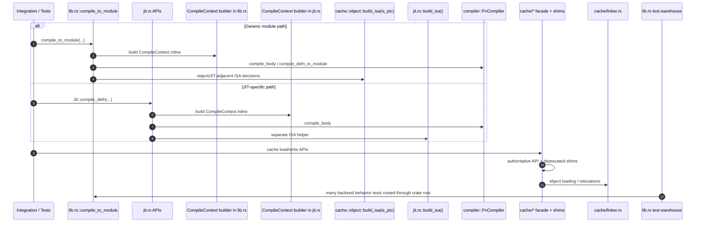
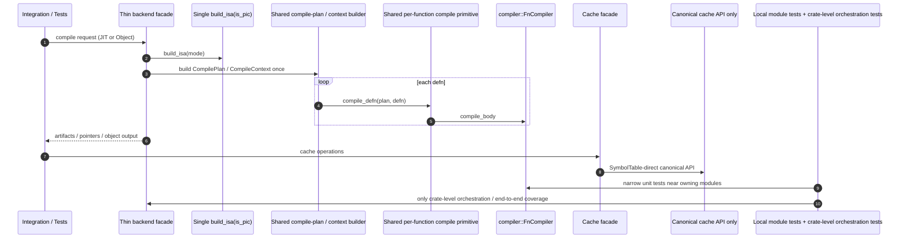

# Backend Crate Audit

> **Sprint 63 supersession note (2026-05-02).** This audit is a point-in-time assessment, NOT ongoing ground truth. Target-direction sections are superseded by Decisions 38, 39, 40, 41, 42 (see `design/arch/decisions/`). Current-state sections remain authoritative as historical observation of the codebase at the audit date. Per substance-scoping §1.5, audits are point-in-time opinions; `/review` is the continuous-audit role going forward, evaluating implementation against the post-Sprint-63 canonical set rather than against this audit's target-direction.


**Module**: `crates/cranelisp-backend/src/` (20 files, 18,538 lines)
**Date**: 2026-04-23
**Scope**: Clarity, simplicity, lack of duplicated code and code-paths, maintainability, extensibility, test locality

## Module Overview

The backend crate owns Cranelift code generation, JIT lifecycle, object-file emission, cache metadata/object handling, a minimal in-process linker, and value/display helpers. The architecture is pointed in the right direction: `FnCompiler<M>` gives one generic codegen core for JIT and object output, `heap.rs` cleanly contains layout knowledge, and the crate has strong behavior coverage.

The main maintainability problem is not raw correctness. It is **authority drift**: the crate still carries multiple front doors, multiple “single sources of truth”, several migration shims, and a few very large control-flow-heavy functions. That combination makes extension expensive because a contributor must first rediscover which path is canonical.

### What is working well

- `heap.rs` is a strong boundary: layout offsets and RC primitives are centralized.
- `operators.rs` is relatively compact, readable, and well-tested.
- The compiler is at least split by concern (`apply`, `control_flow`, `match_codegen`, `vec_codegen`, etc.), which is much better than a single codegen blob.
- Tests are numerous; the problem is mostly **placement and locality**, not absence.

## Architecture Illustration

### Current state



### Potential streamlined target state



### File Metrics

| File | Lines | Responsibility | Tests |
|---|---:|---|---:|
| `src/lib.rs` | 4655 | Crate facade, generic `compile_to_module`, capability traits, large test harness | 64 |
| `src/compiler/control_flow.rs` | 1948 | `let`, `if`, lambdas, par-bind, closure/drop glue paths | 0 |
| `src/compiler/mod.rs` | 1560 | `FnCompiler`, compile context, dispatch, scope/RC helpers | 0 |
| `src/compiler/vec_codegen.rs` | 1315 | Vec literals, vec ops, COW paths, element inc/dec helpers | 0 |
| `src/jit.rs` | 1241 | JIT setup, intrinsic registration, per-defn compilation, reclaim tests | 11 |
| `src/cache/linker.rs` | 1009 | In-process object loader, relocations, GOT slot handling | 6 |
| `src/display.rs` | 831 | Value/type formatting and display helpers | 21 |
| `src/compiler/apply.rs` | 743 | Call lowering, resolved-call dispatch, closure calls, bind lowering | 0 |
| `src/cache/serialize.rs` | 734 | Cache metadata serialization/deserialization | 13 |
| `src/cache/object.rs` | 707 | Object-module compilation and cache write packets | 10 |
| `src/cache/mod.rs` | 653 | Cache facade, paths, load helpers, compatibility surface | 16 |
| `src/compiler/match_codegen.rs` | 581 | Pattern-match lowering | 0 |
| `src/operators.rs` | 531 | Inline primitive lowering and trait→primitive mapping | 13 |
| `src/heap.rs` | 501 | Heap layouts, load/store helpers, RC emission, liveness helper | 4 |
| `src/compiler/literals.rs` | 465 | Literal lowering, constructors/operators as values | 0 |
| `src/cache/manifest.rs` | 419 | Manifest hashing and freshness checks | 12 |
| `src/compiler/trace_codegen.rs` | 396 | Trace wrapper lowering | 0 |
| `src/exe.rs` | 231 | Startup object generation for linked executables | 5 |
| `src/codegen_types.rs` | 9 | Compatibility re-exports | 0 |
| `src/got.rs` | 9 | Compatibility re-export | 0 |

## Findings

### HIGH-1: The crate still has overlapping compilation entrypoints and duplicated “single source of truth” code
**Files**: `crates/cranelisp-backend/src/lib.rs:405-650`, `crates/cranelisp-backend/src/lib.rs:661-721`, `crates/cranelisp-backend/src/jit.rs:36-64`, `crates/cranelisp-backend/src/jit.rs:480-563`, `crates/cranelisp-backend/src/jit.rs:598-626`, `crates/cranelisp-backend/src/cache/object.rs:135-163`
**Severity**: High (duplication, consistency)

The crate has converged at the `FnCompiler` level, but not yet at the **backend entrypoint** level.

Two examples:

```rust
// jit.rs:36-64
pub fn build_isa() -> Result<Arc<dyn cranelift::codegen::isa::TargetIsa>, CranelispError> {
    // ... use_colocated_libcalls = false
    // ... is_pic = false
}

// cache/object.rs:135-163
pub fn build_isa(is_pic: bool) -> Result<Arc<dyn cranelift_codegen::isa::TargetIsa>, CranelispError> {
    // ... use_colocated_libcalls = false
    // ... is_pic = parameter
}
```

```rust
// lib.rs
pub fn compile_to_module<M, C, L>(...) -> Result<CompilationResult, CranelispError> { ... }
fn compile_defn_in_module<M, C, L>(...) -> Result<FunctionArtifacts, CranelispError> { ... }

// jit.rs
pub fn compile_defn<C, L>(&mut self, defn: &Defn, compile_ctx: CompileContext<'_, C, L>)
    -> Result<CompileArtifacts, CranelispError> { ... }
pub fn build_compile_context<'a, C, L>(&self, ...) -> CompileContext<'a, C, L> { ... }
```

These paths are similar enough that behavior can drift, but different enough that contributors must keep both in their heads. The ISA duplication is especially telling because the crate root already re-exports `cache::object::build_isa` as the intended authority.

**Impact**:
- Any change to signature construction, disassembly capture, intrinsic requirements, or finalization behavior risks being applied to one path but not the other.
- “Single source of truth” claims are harder to trust when there are visibly two implementations.
- Extending the crate (new module type, new backend mode, new artifact capture) is more expensive because the contributor must decide which front door to modify.

**Recommendation**:
1. Make one ISA helper authoritative: keep `cache::object::build_isa(is_pic)` and delete/converge `jit.rs::build_isa()` onto it.
2. Extract a single per-function compilation primitive used by both `compile_to_module` and `Jit::compile_defn`.
3. Likewise centralize `CompileContext` construction instead of manually rebuilding it in both `lib.rs` and `jit.rs`.
4. Decide whether `Jit::compile_defn` remains a public API or becomes a thin wrapper over the generic module path.

This is the highest-leverage cleanup because it removes duplicated **code paths**, not just duplicated lines.

### HIGH-2: Core compiler logic is concentrated in a handful of very large files and overlong functions
**Files**: `crates/cranelisp-backend/src/compiler/control_flow.rs:395-618`, `crates/cranelisp-backend/src/compiler/control_flow.rs:979-1127`, `crates/cranelisp-backend/src/compiler/mod.rs:581-696`, `crates/cranelisp-backend/src/compiler/apply.rs:118-271`, `crates/cranelisp-backend/src/compiler/vec_codegen.rs:240-348`, `crates/cranelisp-backend/src/compiler/vec_codegen.rs:388-479`, `crates/cranelisp-backend/src/compiler/vec_codegen.rs:795-960`
**Severity**: High (complexity, maintainability)

The crate is modular at the file level, but several files are still mini-monoliths:

- `compiler/control_flow.rs` — 1,948 lines
- `compiler/mod.rs` — 1,560 lines
- `compiler/vec_codegen.rs` — 1,315 lines
- `compiler/apply.rs` — 743 lines

And the hot functions are large enough to violate the project’s own `src/CLAUDE.md` guidance (~100 lines max):

- `compile_par_bind_continuation` — 223 lines
- `compile_lambda_body` — 148 lines
- `compile_body` — 115 lines
- `compile_resolved_call` — 153 lines
- `build_adt_drop_glue_fn` — 165 lines
- `compile_vec_set_cow` — 108 lines

These functions also encode multiple protocols at once: builder setup, ownership rules, capture loading, branching structure, and cleanup. Example: `compile_par_bind_continuation` both declares a function, builds an inner compiler, loads captures, loads result-buffer slots, manages scope/RC, and allocates the continuation closure.

**Impact**:
- Small feature work tends to become “surgery inside a state machine”.
- Review cost is high because there are too many invariants in one place.
- Extension points are unclear: adding a new container op or closure behavior often means threading more special cases through already-long functions.

**Recommendation**:
1. Split long functions by protocol boundary, not by arbitrary line count. Examples:
   - `compile_par_bind_continuation` → function declaration, inner-body setup, result-buffer binding, closure materialization.
   - `compile_resolved_call` → builtin lowering, trait-method lowering, sig-dispatch lowering, auto-curry lowering.
   - `vec_codegen` → shared COW branch skeleton + operation-specific mutation hooks.
2. Move repeated builder/setup patterns into helpers that return small structs, not tuples.
3. Prefer new submodules over further growth of `control_flow.rs` and `vec_codegen.rs`.

The file split is already halfway there; the next step is to make the functions match the module structure.

### HIGH-3: Helper duplication is reappearing inside the compiler, especially around lookup and extern-call emission
**Files**: `crates/cranelisp-backend/src/compiler/mod.rs:64-136`, `crates/cranelisp-backend/src/compiler/mod.rs:142-213`, `crates/cranelisp-backend/src/compiler/control_flow.rs:206-229`, `crates/cranelisp-backend/src/compiler/vec_codegen.rs:1093-1176`, `crates/cranelisp-backend/src/compiler/vec_codegen.rs:240-348`, `crates/cranelisp-backend/src/compiler/vec_codegen.rs:388-479`
**Severity**: High (duplication, extensibility)

There are several small duplication families that are individually understandable, but collectively point to a pattern: new behavior is being added by copying nearby code instead of extracting reusable primitives.

Examples:

```rust
// compiler/mod.rs
pub fn resolve_got_target<C, L>(...) -> Option<(ModuleFullPath, usize)> { ... }
pub fn resolve_func_arity<C, L>(...) -> Option<usize> { ... }
```

Both functions walk import chains, handle qualified names, then do a global fallback scan. Only the payload differs.

```rust
// control_flow.rs + vec_codegen.rs
fn emit_extern_call_1(...)
fn emit_extern_call_2(...)
fn emit_extern_call_3(...)
fn emit_extern_call_4(...)
```

These are the same signature-building and call-emission pattern repeated by arity.

`compile_vec_set_cow` and `compile_vec_push_cow` also share the same broad COW structure: test uniqueness, branch to in-place fast path vs copy/grow fallback, then merge.

**Impact**:
- New lookup rules or import-resolution fixes must be updated in multiple walkers.
- New extern arities encourage more helper cloning (`emit_extern_call_5`, etc.).
- Container/codegen growth will continue to copy the vec COW pattern unless a reusable skeleton exists.

**Recommendation**:
1. Extract a single symbol-table walker parameterized by “what to read from the resolved `ModuleEntry`”.
2. Replace `emit_extern_call_1/2/3/4` with one helper that takes `&[Value]` and builds the signature from `args.len()`.
3. Extract a shared “COW branch skeleton” for vec mutation operations: uniqueness check, fast path callback, fallback callback, merge block.

This is the most important **local** deduplication target.

### MED-1: The cache layer still carries visible migration residue and deprecated compatibility surface
**Files**: `crates/cranelisp-backend/src/cache/mod.rs:14-30`, `crates/cranelisp-backend/src/cache/mod.rs:72-81`, `crates/cranelisp-backend/src/cache/serialize.rs:1-21`, `crates/cranelisp-backend/src/cache/object.rs:166-179`, `crates/cranelisp-backend/src/got.rs:1-8`, `crates/cranelisp-backend/src/codegen_types.rs:1-9`
**Severity**: Medium (clarity, consistency)

The cache subsystem is carrying a meaningful amount of temporary compatibility scaffolding. A quick scan finds roughly **30 deprecated/back-compat markers** in the crate, concentrated in cache files.

Examples include:

- deprecated re-exports in `cache/mod.rs`
- deprecated `CacheMetadata` envelope retained in `cache/object.rs`
- compatibility re-export modules `got.rs` and `codegen_types.rs`
- doc-comments explicitly saying “Wave 2b parallel migration” and “remove later”

None of this is individually catastrophic, but it materially increases the mental model: readers must understand both the new API and the preserved old one.

**Impact**:
- New contributors can easily extend the wrong API surface.
- Temporary compatibility layers tend to become permanent when no deletion sprint is scheduled.
- Documentation and code comments now spend effort explaining migration state rather than current architecture.

**Recommendation**:
1. Schedule a deletion pass whose success criterion is removal of deprecated cache exports and compatibility re-export modules.
2. Add a single prominent note in the cache facade: “new work must use `SymbolTable`-direct cache APIs only”.
3. Treat any new use of `CacheMetadata`, `got.rs`, or `codegen_types.rs` as a review failure unless it is part of deletion work.

### MED-2: Test coverage is strong overall, but the tests are poorly localized to the code they protect
**Files**: `crates/cranelisp-backend/src/lib.rs:724-4655`, plus compiler files with zero local tests
**Severity**: Medium (quality assurance, maintainability)

The backend is not under-tested. It is **mis-located**.

Key numbers:
- `src/lib.rs` is 4,655 lines total.
- The first `#[cfg(test)]` block begins at line 724, so roughly **3,932 lines** are test code.
- `src/lib.rs` alone contains **64 tests**.
- Meanwhile the seven main compiler files (`compiler/*.rs`) total **7,008 lines** and have **0 local unit tests**.

That means most evidence for compiler behavior is far away from the implementation that owns it.

**Impact**:
- Discoverability is poor: when changing `vec_codegen.rs`, the nearest tests are often not in that file.
- `lib.rs` becomes both a public API file and an integration-test warehouse.
- Contributors are nudged toward adding another large end-to-end test instead of a narrow behavior test.

**Recommendation**:
1. Move narrow compiler-behavior tests next to the owning module.
2. Keep only genuinely crate-level orchestration tests in `lib.rs`.
3. Move end-to-end and cross-module scenarios to `tests/` where possible.

This will improve maintainability even if total test count stays unchanged.

## Agent Guidance / Apparent Traps

- **Do not add another backend front door.** If a new feature needs JIT and object support, extend the shared path first and wrap it second.
- **Treat `cache::object::build_isa(is_pic)` as the authority.** Do not update `jit.rs::build_isa()` except as part of convergence/deletion.
- **Do not add `emit_extern_call_5`.** Replace the arity ladder with a slice-based helper.
- **Do not extend deprecated cache surfaces.** If work touches `CacheMetadata`, `got.rs`, or `codegen_types.rs`, first ask whether the change should instead accelerate their deletion.
- **Do not add more backend behavior tests to `lib.rs` by default.** Prefer local unit tests in the owning module; reserve `lib.rs` for crate-wide orchestration coverage.
- **When adding a new container/codegen feature, look for an existing branch skeleton first.** Vec COW and closure/continuation setup are already close to extraction points; copying them again will compound the current trap.

## Prioritized Improvement Plan

### Phase 1: Converge duplicate code paths
- Unify ISA construction behind one helper.
- Extract a shared per-function compilation primitive used by both `compile_to_module` and `Jit::compile_defn`.
- Centralize `CompileContext` construction.

**Expected payoff**: highest impact on clarity and future extensibility.

### Phase 2: Carve down the compiler hot spots
- Split `control_flow.rs` and `vec_codegen.rs` by protocol boundary.
- Extract reusable helpers for closure setup, continuation setup, and COW branch structure.
- Keep functions near the project’s ~100-line guidance.

**Expected payoff**: reduces review difficulty and feature-risk in the most active code.

### Phase 3: Remove local duplication families
- Replace the duplicate symbol-table walkers with one generic resolver.
- Replace arity-specific extern-call helpers with one variadic helper.
- Consolidate vec mutation common paths.

**Expected payoff**: cheaper future feature additions and fewer sync bugs.

### Phase 4: Delete migration residue and rebalance tests
- Remove deprecated cache shims and compatibility re-exports.
- Move narrow tests out of `lib.rs` and into owning modules.
- Leave only crate-level orchestration tests in the crate root.

**Expected payoff**: cleaner API surface and better test discoverability.

## Verification

After implementing the remediation plan:

```bash
cargo check -p cranelisp-backend
cargo nextest run -p cranelisp-backend
rg -n "pub fn build_isa" crates/cranelisp-backend/src
rg -n "emit_extern_call_[1-9]" crates/cranelisp-backend/src/compiler
rg -n "deprecated|back-compat|Wave 2b parallel migration" crates/cranelisp-backend/src
```

Success signals:
- a single authoritative ISA implementation remains,
- arity-specific extern helpers are gone or reduced to one shared helper,
- deprecated compatibility markers materially decrease,
- core compiler behavior tests live next to their owning modules.
