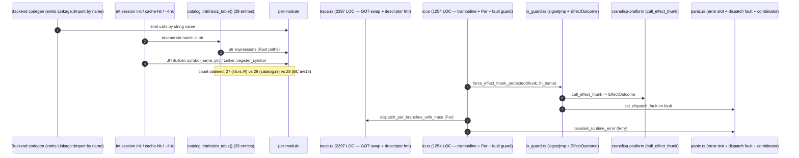

# Intrinsics Crate Audit

> **Point-in-time supersession note (2026-06-14).** This audit is a point-in-time
> structural assessment under `/review` audit discipline, NOT ongoing ground truth.
> It audits `crates/cranelisp-intrinsics/` as it actually stands post-D43 (the
> `cranelisp-runtime` split into `cranelisp-primitives` + `cranelisp-intrinsics`)
> and post-D40-trace-retraction (the 12 `cranelisp_trace_*` bodies relocated INTO
> intrinsics per the 2026-06-04 user ruling; the `io_trace` ring-buffer half is
> int-owned). It is filed under FIXME `design/arch/fixmes/0101-…` (the runtime+platform
> audit charter, re-scoped at S82 to the three successor crates). Per substance-scoping
> §1.5, audits are point-in-time opinions; the canonical as-designed surface is
> `bounded-contexts.md` §4b (invariants 1–14) + `design/arch/tracing.md` + the
> crate-root `//!` rustdoc. Findings list **proposed** FIXMEs for `/sprint` to file
> in Wave 3; this audit files none itself.

**Module**: `crates/cranelisp-intrinsics/src/` (14 files, 8,446 lines)
**Date**: 2026-06-14
**Scope**: Drift vs BC §4b (emitted-call ABI guardrail / per-module externs; trace bodies + descriptor; `IoObserver` registration; Decision-0048 dispatch asymmetry); hidden coupling; duplication; monolith candidates; as-designed-vs-as-built divergence. Clarity, simplicity, maintainability, extensibility, test locality.

## Module Overview

`cranelisp-intrinsics` is the **backend-emitted-call target** crate: runtime support code (allocator, RC, drop glue, string/vec runtime, IO trampoline, IVar fork-join cells, panic sentinel, `(trace …)` runtime, the `catch-runtime-error` combinator, platform-Effect fault guard, IO-observation extension point, layout-hash gate) called by JIT-emitted IR or by the IO trampoline, never from user code, never in any symbol table or GOT. The ABI is keyed on `#[export_name]`/`#[no_mangle]` linker strings; `int` resolves each name to a fn pointer at session init via `JITBuilder::symbol`, and `--link` resolves the same names against the archive.

The crate is in good structural health. `unsafe` is uniformly `// SAFETY:`-justified, the consuming convention (Decision 24) is honoured at the extern boundary, RC ordering (Decision 13: atomic_rmw + acquire fence on free) is consistent, and test coverage is dense (~170 unit tests, every module carrying a local `#[cfg(test)] mod tests` — a marked improvement over the backend crate's `lib.rs`-warehouse anti-pattern). There are **no Blocker findings** and **no `unsafe`-soundness Blockers**.

The maintainability problem is not correctness. It is **documentation drift**: the implementation has run *ahead* of the BC §4b canonical text on every recently-landed invariant (11 catalog, 13 combinator+ferry, 14 fault guard), so the single-source-of-truth surface now describes the crate as it was *planned*, not as it *is*. The most acute instance is a **three-way disagreement on the catalog's entry count** across the three documents that all claim to describe it. Secondarily, two files (`trace.rs` 2,297; `io.rs` 1,254) are mini-monoliths with overlong functions, and a family of heap-access primitives is re-implemented per-module rather than single-sourced.

### What is working well

- **Test locality is excellent.** Unlike the backend crate (MED-2 in the 2026-04-23 audit — 64 tests warehoused in `lib.rs`, 0 in the compiler files), every intrinsics module carries its own `#[cfg(test)] mod tests`. This is the positive pattern the backend audit recommended.
- **`unsafe` discipline is exemplary.** Every `unsafe` block carries a `// SAFETY:` comment; no `unsafe impl Send`/`Sync` anywhere; raw-pointer access is encapsulated behind per-module read/write helpers.
- **The catalog tests are a genuine ABI guardrail.** `catalog.rs`'s `name_set_is_exactly_the_expected_29`, `every_ptr_is_non_null`, and `arity_matches_historical_signature` pin the emitted-call name-agreement contract (BC §6) with positive+negative coverage — exactly the single-owner the BC asked for.
- **The fork-join error-slot ferry is implemented and tested** (`ivar.rs` `reraise_ferried_error`; `io.rs` `dispatch_par_branches_with_trace` worker-take/join-set), closing what BC §4b invariant 13 still records as a "pre-existing defect / owed".

## Architecture Illustration

### Current state



### Potential streamlined target state

```mermaid
sequenceDiagram
    autonumber
    participant Backend as Backend codegen
    participant Int as int session init / cache-hit / --link
    participant Catalog as catalog::intrinsics_table() (ONE counted source of truth)
    participant Heap as heap_access (single read_i64/write_i64/tag-read helpers)
    participant TraceCore as trace/ submodule (swap | enter-exit | descriptor-fmt | drop)
    participant IOCore as io/ submodule (trampoline-loop | par | effect-arm)
    participant Panic as panic.rs

    Backend->>Catalog: emit by name; read enumeration
    Int->>Catalog: JITBuilder::symbol / register_symbol / archive
    Note over Catalog: entry count single-sourced; BC + rustdoc cite the test's constant
    TraceCore->>Heap: heap reads via shared encapsulation
    IOCore->>Heap: heap reads via shared encapsulation
    Panic->>Panic: error slot + dispatch fault + combinator (unchanged)
```

### File Metrics

| File | Lines | Responsibility | Tests |
|---|---:|---|---:|
| `src/trace.rs` | 2297 | `(trace …)` runtime: 11 `cranelisp_trace_*` externs + `cranelisp_trace_format`, GOT-swap, `TRACE_STACK`/`THIS_THREAD_ID`/`TRACE_BODY_RUNNING`/`SWAPPED_GOT_BASES`, `DisplayDescriptor` ABI + pure formatter, `consume_trace_call`, nested-trace guard | ~40 |
| `src/io.rs` | 1254 | `cranelisp_run_io` IO trampoline state machine, Par dispatch (`dispatch_par_branches_with_trace`), continuation calls, Effect fault-guard wiring, fn-name read, error-slot ferry | ~25 |
| `src/drop.rs` | 1052 | `consume_*` drop-glue (SList/Sexp/Vec/IO-tree/closure), `dec_shallow_io` (Decision 29) | ~30 |
| `src/vec_runtime.rs` | 732 | Vec layout-ABI consts + `vec_new`/`vec_set_copy`/`vec_push_copy`/`vec_push_grow`/`vec_drop` (COW paths) | ~15 |
| `src/ivar.rs` | 531 | IVar lenient-eval cells + spark/force/dealloc + fork-join error-slot ferry | ~10 |
| `src/alloc.rs` | 473 | Heap allocator (base-pointer Decision 11), RC header, stats counters, `cranelisp_alloc_with_tag` | ~10 |
| `src/panic.rs` | 411 | Error slot (`take`/`set_runtime_error`), `DispatchFault` slot, `runtime_panic`, `catch-runtime-error` combinator | ~15 |
| `src/io_observer.rs` | 312 | IO-observation extension point (Decision 40): `IoEvent`/`IoEventTag`, `register_io_observer`, `emit`, `trace_anchor` | ~6 |
| `src/heap_string.rs` | 272 | `HeapString` layout-ABI consts + alloc/read + ferry-decode | ~7 |
| `src/io_guard.rs` | 245 | Effect-force fault guard (FIXME 0327): `force_effect_thunk_protected`, sigsetjmp/signal handlers, `EffectOutcome` | 0 (via io.rs) |
| `src/rc.rs` | 201 | RC trace logging, `consume_shallow`, `rc_underflow_check` | ~8 |
| `src/lib.rs` | 200 | Crate-root `//!` (the canonical facade), module decls, narrow root re-exports | 0 |
| `src/layout.rs` | 157 | `cranelisp_check_layout_hash` (`--link` platform layout-hash gate) | ~3 |
| `src/catalog.rs` | 309 | Published `intrinsics_table()` + `IntrinsicEntry` (BC §4b inv 11); ABI-guardrail tests | ~4 |

## Findings

### HIGH-1: Three-way disagreement on the catalog entry count — the single-source-of-truth surface contradicts itself
**Files**: `crates/cranelisp-intrinsics/src/catalog.rs:73-76`, `crates/cranelisp-intrinsics/src/catalog.rs:104-112`, `crates/cranelisp-intrinsics/src/catalog.rs:205-208`, `crates/cranelisp-intrinsics/src/lib.rs:128-129`, `design/arch/bounded-contexts.md` §4b invariants 11/12/13
**Severity**: High (single-source-of-truth — Principle 7; ABI documentation correctness)

The catalog is the single owner of the emitted-call ABI name-agreement contract (BC §4b inv 12 — "the catalog + its tests are the single owner … closing the prior no-owner gap"). Three documents that all describe its size disagree:

- **`catalog.rs`** (module `//!` + the `intrinsics_table()` rustdoc + the `EXPECTED_NAMES`/`name_set_is_exactly_the_expected_29` test): **29 entries** — "16 core + 12 trace + `catch-runtime-error`". This matches the actual table literal (verified: 29 `IntrinsicEntry` rows, test asserts `len()==29`).
- **`lib.rs` crate-root `//!`** (line 128): **"27 backend-emitted-call targets (15 core + the 12 `cranelisp_trace_*` family)"**. This is the *canonical facade surface* per BC §4b "Per-surface documentation" — and it is wrong by 2: it omits `catch-runtime-error` and miscounts the core set as 15 (the table has 16 core: it includes `cranelisp_ivar_dealloc`, which `catalog.rs:108-109` explicitly flags as the verbatim-relocated set "plus `cranelisp_ivar_dealloc`").
- **`bounded-contexts.md` §4b**: invariant 11 says the trace addendum takes the table "from 15 to 27 entries"; invariant 12 repeats "the catalog grows 15→27"; invariant 13 says `catch-runtime-error` makes "the catalog grow by one beyond the trace addendum" (→ 28). BC never reaches 29 and is internally inconsistent (27 vs 28).

So the count is variously 27, 28, or 29 depending on which sentence you read, in the very surface whose job is to be the single owner of this contract. The `catalog.rs` number (29) is correct against source; `lib.rs` and BC are stale.

**Impact**:
- The canonical facade (`lib.rs` `//!`) under-describes the public ABI surface — a reader trusting it would not know `catch-runtime-error` or `cranelisp_ivar_dealloc` are catalog members.
- Future catalog growth (e.g. `discover-tests` ever joining, or a new trace accessor) has no authoritative prior count to increment from — each editor will pick a different base.
- The BC, which other crates' design docs cite, propagates the wrong number outward.

**Recommendation / proposed FIXME**:
1. `target: /dev` (intrinsics) — correct the `lib.rs:128` `//!` to "29 backend-emitted-call targets (16 core + 12 `cranelisp_trace_*` + `catch-runtime-error`)". Better: have the rustdoc cite the **test constant** (`catalog::tests::EXPECTED_NAMES`) as the authoritative count rather than restating a literal number that drifts.
2. `target: /arch` — reconcile BC §4b invariants 11/12/13 to a single count of 29 and strike the contradictory "15→27" / "grows by one beyond" arithmetic; these are leftover TARGET-STATE phrasings (see HIGH-2).

### HIGH-2: BC §4b invariants 11, 13, 14 are stale-against-shipped-code — they describe landed features as "TARGET-STATED / pending implementation / owed"
**Files**: `design/arch/bounded-contexts.md` §4b invariants 11 (TARGET-STATED, "does not exist in source today"), 13 (combinator + ferry "pending implementation"; ferry "owed … pre-existing defect"), 14 (fault guard "pending implementation"); as-built in `crates/cranelisp-intrinsics/src/catalog.rs`, `panic.rs:108,173`, `ivar.rs:208-280`, `io.rs:217-231,538-566`, `io_guard.rs`
**Severity**: High (design-doc staleness against shipped code — `/review` Quality-checks "design-doc staleness"; Principle 7)

BC §4b is the canonical as-designed surface (the facade retired S74 W3 → BC + rustdoc). On three invariants it lags the implementation by one or more sprints:

- **Invariant 11** ("the catalog … TARGET-STATED; implementation pulled forward to S76"; "**The catalog does not exist in source today**"). It exists: `catalog.rs` is 309 lines with `intrinsics_table()`, `IntrinsicEntry`, and four guardrail tests; `public-api.txt:30,227` records it.
- **Invariant 13** (`catch-runtime-error` + the fork-join ferry, "test-discovery design, 2026-06-06 — **pending implementation**"; the ferry "**owed on the join paths** … As-built, **neither** fork-join boundary ferries the slot … a **pre-existing defect**"). Both shipped: `panic.rs:173` `catch_runtime_error` (`#[export_name = "catch-runtime-error"]`), `panic.rs:108` `set_runtime_error` (the named ferry companion), `ivar.rs:274 reraise_ferried_error` + worker-side `take_runtime_error()` at `ivar.rs:208`, and `io.rs:538/566` worker-take/join-set in `dispatch_par_branches_with_trace`. The "neither boundary ferries" sentence is now factually false.
- **Invariant 14** (the platform-Effect fault guard, "S81 / FIXME 0327 — **pending implementation**", incl. the W-G DLL-local-catch correction). Shipped: `io_guard.rs` `force_effect_thunk_protected` (sigsetjmp + `EffectOutcome` read), wired into the `IO_TAG_EFFECT` arm at `io.rs:217-231`, with `panic.rs` `DispatchFault`/`set_dispatch_fault`/`take_dispatch_fault` the int-compose carrier.

**Impact**:
- A reader auditing soundness against the BC would believe the ferry is an open defect and `catch-runtime-error` un-built, and might re-do landed work or file duplicate defects.
- The BC's "pre-existing defect violating spec §12.4.3" language (inv 13) is the kind of statement `/qa` reads to decide whether a failing-test repro is owed. It now points at a closed gap.
- Three invariants carrying stale TARGET/pending markers erodes trust that *any* BC §4b invariant reflects as-built.

**Recommendation / proposed FIXME**:
1. `target: /arch` — sweep BC §4b invariants 11/13/14: strike "TARGET-STATED"/"pending implementation"/"does not exist in source today"/"owed … neither boundary ferries … pre-existing defect"; restate as the as-built contract (the catalog exists with 29 entries; the combinator + ferry + fault guard are landed and unit-tested). Where a residual gap remains (e.g. the ferry's interaction with the platform-Effect guard, or a missing e2e), name it precisely rather than describing the whole feature as un-built.
2. `target: /qa` — confirm whether the spec §12.4.3 observational-equivalence repro the BC promised ("`/qa` repro filed when the design is actioned") was ever filed; if the ferry is now correct, the repro should be a passing regression guard, not an open failing defect.

### HIGH-3: `trace.rs` (2,297 LOC) and `io.rs` (1,254 LOC) are mini-monoliths with overlong functions
**Files**: `crates/cranelisp-intrinsics/src/trace.rs` (whole file; `cranelisp_trace_swap_got` ~293-419 ≈126 LOC; `render_adt` ~1006-1088); `crates/cranelisp-intrinsics/src/io.rs` (`run_io_trampoline_inner` ~131-376 ≈245 LOC; `dispatch_par_branches_with_trace` ~476-571)
**Severity**: High (complexity has a budget — Principle 6; maintainability) — *but see note: lower-risk than the backend equivalents*

`trace.rs` at 2,297 lines is the single largest file in the crate (27% of the whole crate) and bundles at least five distinct protocols: GOT-swap role management (`swap_got`/`restore_got` + `THIS_THREAD_ID`/`TRACE_THREAD_ID` role-CAS + `SWAPPED_GOT_BASES`), the call-frame stack (`enter`/`exit`/`collect`), the five field accessors, the `consume_trace_call` drop walk, and the entirely-separate pure `DisplayDescriptor`-driven value formatter (`trace_format` + `render_value`/`render_adt`/`follow_self_rel`/`read_blob_str`). The descriptor formatter in particular is **pure and has zero shared state** with the GOT-swap machinery — it is a natural submodule boundary.

`io.rs`'s `run_io_trampoline_inner` is a single 245-line state machine (Pure/Effect/Bind/Par arms), the longest function in the crate and well over the project's ~100-line `src/CLAUDE.md` guidance — the same finding the backend audit raised against `compile_par_bind_continuation` (223 LOC).

**Note on severity calibration.** Unlike the backend monoliths, these files are densely unit-tested locally (~40 / ~25 tests respectively) and the protocols, while many, are individually coherent. This is High for *file size and function length against the project's own guidance*, not for tangled correctness risk. The risk is extension cost: adding a trace accessor or an IO node means surgery inside a long file/function.

**Recommendation / proposed FIXME** (`target: /dev` intrinsics, Suggestion-leaning-Important):
1. Split `trace.rs` into a `trace/` submodule by protocol: `trace/swap.rs` (GOT-swap + role), `trace/stack.rs` (enter/exit/collect + `TRACE_STACK`), `trace/accessors.rs` (the 5 field accessors + `consume_trace_call`), `trace/format.rs` (the pure descriptor formatter + `DisplayDescriptor`). The formatter split is the highest-leverage (pure, self-contained).
2. Decompose `run_io_trampoline_inner` by node arm (Pure/Effect/Bind/Par) — extract the Effect-fault-guard arm and the Par-dispatch arm into named helpers, leaving the loop a dispatcher.

### MED-1: Heap-access primitives are re-implemented per-module rather than single-sourced
**Files**: `crates/cranelisp-intrinsics/src/drop.rs:67` (`read_i64`), `trace.rs:188,196` (`write_i64`/`read_i64`), `vec_runtime.rs:63` (`read_len` + siblings), plus inline `unsafe { *((base as *const u8).add(off) as *const i64) }` in `io.rs`, `ivar.rs`, `panic.rs`, `alloc.rs`; the `NULLARY_TAG_THRESHOLD` guard inlined at ~19 non-test sites
**Severity**: Medium (duplication — Principle 7; `/review` "repeated patterns ≥3 sites")

Three families recur:

1. **`read_i64`/`write_i64` at a heap offset** — defined independently in `drop.rs` and `trace.rs`, and open-coded inline in `io.rs`, `ivar.rs`, `panic.rs`, `alloc.rs`. This is the exact "duplicate heap classification / layout-read scattered across modules" pattern the `/review` audit-vigilance list flags from `sketch/audits/codegen.md`.
2. **Atomic RC dec (Release store + Acquire fence on free)** — open-coded in `trace.rs`, `drop.rs`, `ivar.rs`, `rc.rs`. `rc.rs::consume_shallow` is the canonical shallow dec, but the *inline* dec sequences elsewhere do not route through it.
3. **`if ptr < NULLARY_TAG_THRESHOLD … return`** nullary-tag guard — inlined at ~19 sites.

The subagent survey characterised these as "intentional per-module encapsulation". That is defensible for the *consuming* RC sequences (each owns distinct ownership semantics), but **not** for the bare `read_i64`/`write_i64`-at-offset primitive, which is mechanically identical everywhere and is precisely the single-source-of-truth case Principle 7 and BC §4b invariant 2 ("representation containment … only `alloc.rs`, `heap_string.rs`, `vec_runtime.rs` define the layout constants") want centralised. Note invariant 2 already names *three* layout-owning modules; the read/write *accessor* over those constants has no such single owner.

**Impact**:
- A change to the heap header convention (Decision 11 base-pointer) must be applied at every open-coded read site rather than one helper.
- New intrinsics copy the nearest inline read rather than calling a shared primitive — the same accretion the backend audit's HIGH-3 warned about (`emit_extern_call_1/2/3/4`).

**Recommendation / proposed FIXME** (`target: /dev` intrinsics):
1. Extract a single `pub(crate)` `heap_access` module (or fold into an existing layout module) owning `read_i64(base, off)` / `write_i64(base, off, v)` / `read_tag(ptr)` / the `is_nullary(ptr)` guard, and route the open-coded sites through it. Keep the `unsafe` boundary in that one module (improves the "find all unsafe in one place" property the unsafe-audit rules want).
2. Leave the *consuming* RC sequences per-module (legitimately distinct), but document why in a one-line comment so the distinction is legible.

### MED-2: `IntrinsicEntry::is_runtime` is a public field with no consumer — speculative surface
**Files**: `crates/cranelisp-intrinsics/src/catalog.rs:96-100` (field + "no dispatch consumer today"), `public-api.txt:19,211`
**Severity**: Medium (premature abstraction — Principle 6; public-surface drift — `/review` "every pub requires justification")

`IntrinsicEntry::is_runtime` is `pub` on the published catalog and its own rustdoc admits "Classificatory metadata only — no dispatch consumer today; retained because the catalog design needs the runtime-vs-primitive split it encodes". A crate-wide grep confirms: the field is read only by `catalog.rs`'s own `is_runtime_classification` test and mentioned in two doc comments — **no production consumer** in backend, int, or platform reads it. It is a public-ABI field (it appears twice in `public-api.txt`, once per re-export path) carried for a future that has not arrived.

**Impact**:
- Public surface carries an item with no second concrete user (the `/review` premature-abstraction trigger — abstractions without a second user are speculative).
- Every catalog entry must supply a value for a field nobody reads, and the classification test pins a contract (`runtime/` + ivar + trace are true; vec COW + `catch-runtime-error` false) that exists only to validate itself.

**Recommendation / proposed FIXME** (`target: /arch` — it is a public-ABI question):
- Either name the prospective consumer in the field's rustdoc and a BC §4b sentence (justifying the `pub`), or drop the field until a consumer materialises (the catalog can re-derive the `runtime/` split from the name prefix, as the test already does). Decision routes to `/arch` because it touches `public-api.txt`.

### LOW-1: Dead private stub `dispatch_par_branches` (no-trace variant)
**Files**: `crates/cranelisp-intrinsics/src/io.rs:468-474`
**Severity**: Low (dead code)

`dispatch_par_branches(branch_ptrs)` (the non-`_with_trace` variant) is a private fn whose body just forwards to `dispatch_par_branches_with_trace(branch_ptrs, 0)`. Its doc comment says it "remains for any direct callers who prefer not [to trace]", but a crate-wide grep finds **zero callers** — only `_with_trace` is used (the trampoline calls it at `io.rs:320`). It is dead code with a justifying comment for a caller that does not exist.

**Recommendation / proposed FIXME** (`target: /dev` intrinsics): delete it (and the matching `IoEventTag` doc references in `io_observer.rs:59,63` if they only describe this dead path), or wire the no-trace fast path if there is a real perf case. This mirrors the backend audit's "remove dead/duplicate paths" theme.

### LOW-2: `io_observer::emit` transmutes a data pointer to a fn pointer — a non-guaranteed (if portable) cast
**Files**: `crates/cranelisp-intrinsics/src/io_observer.rs:127-133,162-172`
**Severity**: Low (unsafe-idiom — `/review` unsafe-audit "prefer safe abstractions")

`OBSERVER_SLOT` is `AtomicPtr<()>` storing a transmuted `IoObserver` fn pointer; `emit` does `std::mem::transmute::<*mut (), IoObserver>(raw)`. The `// SAFETY:` note ("function pointers are pointer-sized on every supported platform") is true in practice but Rust does **not** guarantee that a `transmute` between a *data* pointer (`*mut ()`) and a *fn* pointer is well-defined — it works on all current targets but is on the boundary of what the reference blesses. The cleaner idiom for an atomically-swappable fn pointer is to store the address as `usize` via `AtomicUsize` and reconstitute with an `as`-cast through a fn-pointer type, or to gate the observer behind a `Mutex<Option<IoObserver>>` (cold path; registration is not hot). The hot path is one `Acquire` load + null check, so a `Mutex` would only touch the cold *register* side and the *delivery* read.

**Note**: this passes the unsafe-audit rules (it has a SAFETY comment and is contained to one module), so it is Low, not a Blocker. The SAFETY comment's *justification quality* is the issue — it asserts portability, not Rust-language soundness.

**Recommendation / proposed FIXME** (`target: /dev` intrinsics, Suggestion): replace the data↔fn transmute with the `usize`-via-`AtomicUsize` idiom (or document that the data↔fn transmute is a deliberate, target-validated FFI assumption in the Principle-14 family alongside Decision 11's pointer-size assumption).

### LOW-3: `is_runtime_classification` test encodes the name→classification rule the field exists to avoid hard-coding
**Files**: `crates/cranelisp-intrinsics/src/catalog.rs:289-308`
**Severity**: Low (test couples to the very derivation it guards)

The `is_runtime_classification` test computes `want = name.starts_with("runtime/") || …ivar… || …trace…` and asserts the stored `is_runtime` matches it. This demonstrates that `is_runtime` is fully derivable from the name prefix — reinforcing MED-2 (the stored field carries no information the name does not). Folding into MED-2's remediation; recorded separately because it is the concrete evidence.

## Hidden Coupling

- **Trace ⇄ panic** (legitimate, but worth naming): `panic::catch_runtime_error` calls `trace::clear_trace_guard_on_panic()` (`panic.rs:197`) so a panic crossing a tracing body does not leave the trace guard stuck. This is correct and documented (0258 NOTE-2), but it is a cross-module thread-local dependency (panic's `RUNTIME_ERROR` slot interacting with trace's `TRACE_BODY_RUNNING`) that a future refactor of either module must preserve. Recommend a one-line cross-reference comment in `trace.rs` at the guard definition pointing back to the panic-cleanup site.
- **io ⇄ io_guard ⇄ panic ⇄ platform**: the Effect arm threads through four units (`io` reads fn-name + calls `io_guard::force_effect_thunk_protected` → `platform::call_effect_thunk` → `panic::set_dispatch_fault`). This is the FIXME-0327 funnel and is correctly the single force site, but the `ForceOutcome`/`EffectOutcome`/`DispatchFault` triple is a three-type relay that only makes sense read end-to-end. The crate-root `//!` documents the int-compose half; a sequence note in `io_guard.rs` would help.
- **`cranelisp_ivar_dealloc`** is in the table (`catalog.rs:134`) and in `public-api.txt`, but is the one core entry *absent from the BC's count narrative* (the "verbatim relocated set" was 15; this is the +1 making 16). This is the mechanical root of the HIGH-1 count drift — worth calling out so the reconciliation does not drop it again.

## As-Designed vs As-Built Divergence (summary)

| BC §4b says | Source is | Finding |
|---|---|---|
| inv 11: catalog TARGET-STATED, "does not exist in source today", 15→27 | `catalog.rs` exists, 29 entries, tested | HIGH-2 (+ HIGH-1 count) |
| inv 13: `catch-runtime-error` + ferry "pending"; ferry "owed … neither boundary ferries … pre-existing defect" | combinator landed (`panic.rs:173`); ferry landed + tested (`ivar.rs`, `io.rs`) | HIGH-2 |
| inv 14: fault guard "pending implementation" (incl. DLL-local-catch) | landed (`io_guard.rs` + `io.rs:217-231`), `EffectOutcome` read | HIGH-2 |
| lib.rs `//!`: "27 (15 core + 12 trace)" | 29 (16 core + 12 trace + combinator) | HIGH-1 |
| inv 9 / `JITBuilder::symbol` narrowing (intrinsics-only, Import-dispatch) | honoured — catalog is a flat slice, no `SymbolTable`/GOT | no finding (convergent) |
| inv 2: representation containment (3 layout-const owners) | constants contained; but read/write *accessor* not single-sourced | MED-1 |
| inv 6: consuming convention at extern boundary | honoured (Decision 24 tests throughout) | no finding (convergent) |
| inv 10: no `FQTypeName`/`TypeName` at surface | honoured (`public-api.txt` clean) | no finding (convergent) |

The Decision-0048 dispatch asymmetry, the consuming convention, the no-types-at-surface rule, and the `JITBuilder::symbol` narrowing are all **convergent** (as-built matches as-designed). The divergence is concentrated in the *recently-landed* invariants whose BC text was never updated from its TARGET-STATE drafting.

## Agent Guidance / Apparent Traps

- **The BC §4b "pending/owed/TARGET-STATED" markers on invariants 11/13/14 are stale — the features are built.** Do not re-implement the catalog, the combinator, the ferry, or the fault guard; do not file the "ferry pre-existing defect" repro as a new failing test (it is closed). Read source, not the BC, for as-built status until HIGH-2 lands.
- **The catalog entry count is 29.** Trust `catalog.rs`'s test constant, not the `lib.rs` `//!` (27) or the BC (27/28).
- **Do not open-code another heap `read_i64`-at-offset.** Look for the shared accessor first (or, until MED-1 lands, note that you are adding to the duplication family).
- **Do not add another `dispatch_par_branches`-style "kept for future callers" stub.** The existing one is dead (LOW-1).
- **`is_runtime` has no reader** — do not build dispatch logic on it without first establishing the consumer (MED-2).

## Prioritized Improvement Plan

### Phase 1: Reconcile the documentation surface (highest leverage, lowest risk)
- HIGH-1: single-source the catalog entry count (cite the test constant; fix `lib.rs:128`).
- HIGH-2: sweep BC §4b invariants 11/13/14 from TARGET/pending to as-built (`/arch`).
- Confirm the §12.4.3 ferry repro status with `/qa`.

**Expected payoff**: restores trust in the canonical surface; prevents duplicate-implementation and duplicate-defect-filing.

### Phase 2: Carve down the monoliths
- HIGH-3: split `trace.rs` into a `trace/` submodule (formatter first — pure, self-contained); decompose `io.rs::run_io_trampoline_inner` by node arm.

**Expected payoff**: reduces extension cost in the two largest, most protocol-dense files.

### Phase 3: Remove local duplication + dead/speculative surface
- MED-1: extract a single `heap_access` read/write module; route open-coded sites through it.
- MED-2 / LOW-3: name the `is_runtime` consumer or drop the field.
- LOW-1: delete the dead `dispatch_par_branches` stub.
- LOW-2: replace (or formally bless) the data↔fn transmute in `io_observer::emit`.

**Expected payoff**: cheaper future intrinsics; smaller `unsafe` surface; cleaner public ABI.

## Proposed FIXMEs (for `/sprint` to file in Wave 3 — this audit files none)

| # | Target | Severity | Summary |
|---|---|---|---|
| P1 | `/dev` (intrinsics) | High | Fix `lib.rs:128` catalog count to 29; cite the test constant as authority (HIGH-1) |
| P2 | `/arch` | High | Reconcile BC §4b inv 11/12/13 count to 29; strike "15→27"/"grows by one" (HIGH-1/2) |
| P3 | `/arch` | High | Sweep BC §4b inv 11/13/14 from TARGET/pending/owed to as-built (HIGH-2) |
| P4 | `/qa` | Important | Confirm/convert the spec §12.4.3 fork-join ferry repro (BC inv 13 "owed") — should be a passing guard now (HIGH-2) |
| P5 | `/dev` (intrinsics) | Important | Split `trace.rs` into `trace/` submodule (formatter first); decompose `io.rs::run_io_trampoline_inner` by arm (HIGH-3) |
| P6 | `/dev` (intrinsics) | Medium | Extract single `heap_access` read/write/tag/nullary-guard module; route open-coded sites (MED-1) |
| P7 | `/arch` | Medium | Justify or drop the unused `IntrinsicEntry::is_runtime` public field (MED-2/LOW-3) |
| P8 | `/dev` (intrinsics) | Low | Delete dead `dispatch_par_branches` stub (LOW-1) |
| P9 | `/dev` (intrinsics) | Low | Replace or formally bless the data↔fn transmute in `io_observer::emit` (LOW-2) |

## Verification

After implementing the remediation plan:

```bash
cargo check -p cranelisp-intrinsics
cargo nextest run -p cranelisp-intrinsics
rg -n "27 backend-emitted|15 core" crates/cranelisp-intrinsics/src/lib.rs   # should be empty (count fixed)
rg -n "TARGET-STATED|pending implementation|does not exist in source" design/arch/bounded-contexts.md   # inv 11/13/14 should no longer hit
rg -n "fn read_i64|fn write_i64" crates/cranelisp-intrinsics/src           # should collapse toward one module
rg -n "fn dispatch_par_branches\b" crates/cranelisp-intrinsics/src         # dead stub gone
```

Success signals:
- the catalog count agrees across `catalog.rs`, `lib.rs`, and BC §4b (29);
- BC §4b invariants 11/13/14 describe as-built state, not TARGET state;
- heap read/write primitives have a single owner;
- the dead Par stub is gone;
- the crate's strong test-locality and `unsafe`-discipline posture is preserved.
