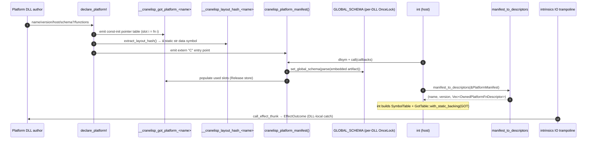

# Platform Crate Audit

> **Point-in-time assessment (2026-06-14).** This audit is a structural snapshot of `crates/cranelisp-platform/` as it stands at the head of `main` after the S71 ADT-marshaling redesign, the S76 three-exports rework (FIXMEs 0286/0287/0288/0293), and the S81 fault-guarded dispatch funnel (FIXME 0327, ABI v5). It is NOT ongoing ground truth: `/review` is the continuous-audit role going forward, and the as-designed reference is `design/arch/bounded-contexts.md` §5 (the 9 platform invariants) + `design/arch/platform-interface.md` (the three-exports / schema / GOT model). Closes the platform half of FIXME 0101.
>
> **Read-only pass.** No source, test, or git state was modified. Findings list *proposed* FIXMEs for `/sprint` Wave 3 to file; this audit files none itself.

**Module**: `crates/cranelisp-platform/src/` (3 files, 3,816 lines source; +866 lines integration tests)
**Date**: 2026-06-14
**Scope**: Clarity, simplicity, lack of duplicated code and code-paths, maintainability, extensibility, test locality, FFI/`unsafe` discipline, as-designed-vs-as-built divergence

## Module Overview

`cranelisp-platform` is the shared C-ABI **contract crate** that sits between the cranelisp host binary and every out-of-tree platform DLL. It is the only implementation crate with an explicitly external audience (DLL authors) and accordingly carries its facade in source rustdoc (Principle 15 exception; `facades/platform.md` retired S71). It owns: the `#[repr(C)]` boundary types (`PlatformManifest`, `PlatformFn`, `HostCallbacks`, `EffectOutcome`), the `#[repr(transparent)]` CL\* wrapper family (`CLInt`/`CLBool`/`CLFloat`/`CLString`/`CLIO`/`CLAdt`/`CLOwned`), the layout constants (`ABI_VERSION`, `HEAP_HEADER_SIZE`, `IO_TAG_*`, `IO_EFFECT_*`), the `declare_platform!` macro (the three-exports emitter), the host-side manifest→descriptor bridge (`manifest_to_descriptors`), and the schema **parser** (`schema.rs`). It depends on exactly one crate (`cranelisp-types`) — the DAG is clean (Principle 3 upheld).

The crate is in good structural health. It is small, its `unsafe` is well-encapsulated behind the wrapper family with `// SAFETY:` justification on essentially every block, its public surface is disciplined, and it carries no inline `FIXME`/`TODO`/`deprecated` work-markers. There are **no HIGH findings** in the sense the 4-crate-2026-04-23 pass used the term (no overlapping front doors, no god functions, no stringly-typed dispatch, no scattered `unsafe`).

The maintainability problems that do exist are of two kinds: **(a) doc-vs-source drift** — the master design doc `design/platform/platform.md` §3 describes a crate two major reworks out of date; and **(b) migration residue** — a "wired-or-panic" R1 gate (`null_alloc_with_tag`) and its rustdoc still speak as though the host has not yet wired `alloc_with_tag`, but it has (S76). Neither is a correctness defect; both raise the cost of a contributor building an accurate mental model.

### What is working well

- **`unsafe` containment is exemplary.** All raw-pointer arithmetic is inside the CL\* wrapper methods and the three `unsafe fn`s (`call_effect_thunk`, `HostContext::init`, `manifest_to_descriptors`). A reader finds the entire `unsafe` risk surface by reading `lib.rs` + `adt.rs`. Every block carries a `// SAFETY:` comment that names the invariant it relies on (heap layout, allocator contract, FFI guarantee).
- **The DLL-local fault catch (ABI v5, FIXME 0327 Option A) is correctly placed.** The `catch_unwind` is monomorphised into the DLL at the `CLIO::effect*` call site, so a panic in a platform closure is caught by the DLL's own runtime and ferried back as a `#[repr(C)] EffectOutcome` value — the only sound design across the cdylib-static-runtime boundary. The reasoning is documented at `lib.rs:748-783` and `EffectOutcome`'s rustdoc.
- **The three-exports model is fully realized in the macro.** `declare_platform!` emits `__cranelisp_got_platform_<name>`, the manifest, and (optionally) `__cranelisp_layout_hash_<name>` — exactly the BC §5 / platform-interface.md §1 contract.
- **Public surface is clean.** Every `pub` item is part of the external-author contract or the host bridge; the `public-api.txt` baseline matches the rustdoc-as-facade. The S69/S71 audit dispositions (F1–F9) are recorded inline in rustdoc, so a contributor sees why speculative items (`CLOwned::into_inner`, `impl Default for HostContext`) are absent.
- **The schema parser is small, total, and frontend-independent** — a deliberate 3-token-kind replication that keeps platform off the frontend DAG edge (Principle 3), with the rationale documented at `schema.rs:50-57`.

## Architecture Illustration

### Current state



### File Metrics

| File | Lines | Source | Tests | Responsibility |
|---|---:|---:|---:|---|
| `src/lib.rs` | 2,541 | ~1,779 | ~762 (24 tests) | Crate facade + rustdoc; CL\* wrapper family (`CLInt`/`Bool`/`Float`/`String`/`IO`/`Owned`); `#[repr(C)]` contract types (`PlatformFn`, `HostCallbacks`, `PlatformManifest`, `EffectOutcome`); constants; `HostContext`; `manifest_to_descriptors`; `extract_layout_hash`; `declare_platform!` + `__declare_platform_body!` macros; global allocator statics |
| `src/schema.rs` | 775 | ~660 | ~115 (8 tests) | `/platform-schema` artifact parser: `Schema`/`TypeShape`/`Ctor`/`Field`/`FieldType`/`ParseLoc`/`SchemaParseError`; tiny S-expr lexer/parser; field-offset + field-type lookups |
| `src/adt.rs` | 500 | ~370 (incl. rustdoc) | ~130 (6 tests) | `CLAdt<T>` heap-ADT wrapper; `CLAdtType` marker trait; `CLTypeWitness` + `ExpectedFieldType`; `GLOBAL_SCHEMA` OnceLock + `set_global_schema`; `read_field`/`own_field`/`read_tag`/`construct`; name→offset resolution |

Test files (`tests/`, not source): `worked_examples.rs` (214), `macro_expansion.rs` (158), `baseline.rs` (167), `cl_adt_sums.rs` (127), `cl_adt_products.rs` (112), `macro_full_arm_compile.rs` (88) — 866 lines, integration coverage of the macro and ADT marshaling.

### Public surface census

- 19 `pub struct`, 5 `pub trait`, 3 `pub enum`, 17 free `pub fn`, 9 constants, 1 macro, 2 re-exports (`SchedulingClass`, `PlatformError`).
- `unsafe`: 3 `unsafe fn`, 4 `unsafe impl` (incl. `unsafe impl Send/Sync for PlatformFn`), ~65 `unsafe`-keyword occurrences total (the rest are blocks inside the wrapper methods).
- `.unwrap()` outside `#[cfg(test)]`: **2**, both in `schema.rs` (lines 289, 463), both guarded peek-after-known-non-empty in the parser — defensible but flagged below (LOW).
- `panic!` outside tests: **4**, all intentional documented contract gates (`null_alloc_with_tag` R1 gate; `global_schema` no-schema guard; `check_witness` mismatch; `resolve_field` lookup-miss). No `unreachable!`/`todo!`/`unimplemented!`.
- Inline `FIXME`/`TODO`/`deprecated` work-markers: **0**. (~40 "FIXME NNNN" mentions are rustdoc provenance references, not work markers.)

## As-designed vs as-built (BC §5 nine invariants + platform-interface.md three-exports)

| Invariant (BC §5) | As-built status |
|---|---|
| **1** — fn pointers in `SymbolTable.got()` by `got_slot`; GotTable wraps DLL GOT in place; `got_slot = manifest index` | **Implemented** in the macro (`__CRANELISP_PLATFORM_GOT` const-init + populate; manifest order = slot order). Host-side wrap is int's, out of scope here. Residue: `PlatformFn.ptr` still carries the fn pointer redundantly (see MED-2). |
| **2** — stable C ABI; layout change bumps `ABI_VERSION`; int refuses mismatch | **Implemented**. `ABI_VERSION = 5`; the bump-rule enumeration is in `ABI_VERSION` rustdoc; refusal is int's. Tested (`abi_version_is_5`, `manifest_to_descriptors_utf8...`). |
| **3** — heap closures via GOT, not raw code pointers (Decision 0031 — forward commitment) | **Future work**, correctly absent. `HostCallbacks` carries only `alloc` + `alloc_with_tag`; the rustdoc documents the future `rc_inc`/`rc_dec`/`invoke_closure` widening. |
| **4** — marshaling tags shared with intrinsics; one `i64` repr per CLType | **Implemented**. CL\* wrappers store alloc-base `i64`s matching the intrinsics heap layout; constants derived from `cranelisp_types::HeapHeader::SIZE` (no duplication). |
| **5** — `HostContext` initialised once per session; Send/Sync projections as specified | **Implemented**. `HostContext::new()`/`init()`; the four Send/Sync dispositions match `public-api.txt` exactly (`PlatformFn` explicit `unsafe impl`, the rest auto-projected). |
| **6** — no DLL unloading mid-session; `Box::leak`s bounded by it | **Implemented**. The macro leaks descriptor arrays + param-name arrays; `EffectOutcome` fault-cause is `String::leak`'d — all bounded by the no-unload invariant, documented at each leak site. |
| **7** — `scheduling_class` declared by DLL, consumed by trampoline | **Implemented**. `PlatformFn.scheduling_class: u32` round-trips to typed `SchedulingClass` via `manifest_to_descriptors`; tested for all three classes + unknown-→-Sequential negative guard. |
| **8** — FQTypeName migration zero-hit (Decision 0047) | **Holds**. Type sigs are S-expr strings; resolution is int-side. |
| **9** — fault-guarded dispatch funnel; DLL-local catch; `EffectOutcome` C-ABI value (ABI v4→v5) | **Implemented** on the platform side. `EffectOutcome` `#[repr(C)]`; `call_effect_thunk` returns it; `IO_TAG_EFFECT` node widened to 32 bytes with reserved fn-name field; DLL-local `catch_unwind` in the thunk wrapper. Tested (`effect_thunk_panic_yields_fault_cause`, `effect_node_is_32_bytes...`). |

**Three-exports model (platform-interface.md §1):** GOT export ✅, manifest export ✅, schema+layout-hash export ✅ — all emitted by `declare_platform!` (arm 1 with `schema:`, arm 2 without). The S71 schema *declaration* dialect (`LazyLock<Schema>`-as-DSL, marker auto-emission, `GetSchema`, `AnyAdt`, `validate_schema`) is retired in source — only the schema *parser* survives, repointed at the generated-artifact grammar. The retirement is complete and consistent across `lib.rs`, `adt.rs`, `schema.rs` rustdoc.

**Verdict:** the as-built crate **conforms to all nine BC §5 invariants and the three-exports model.** The divergences are not contract violations — they are documentation staleness (one design doc) and one residual field. This is a notably clean conformance result for a crate that absorbed three major reworks since the last (never-performed) audit.

## Findings

### MED-1: The master design doc `design/platform/platform.md` §3 describes a crate two reworks out of date
**Files**: `design/platform/platform.md:7`, `:23`, `:47`, `:56-75`, `:97`, `:157`, `:195`, `:214`, `:438`, `:550`
**Severity**: Medium (design-doc staleness against shipped code) — route to `/design`

`platform.md` §3 "Current state" reads:

- "A single-file crate, 940 lines." — as-built is **3 files, 3,816 source lines**.
- "`ABI_VERSION = 1`" (lines 47, 97, 157) — as-built is **5**.
- A source-section table (lines 56-75) keyed to a 940-line single file with line ranges that no longer exist.
- `derive_jit_name()` (line 23, 72) and `platform_fn_ptr` (line 195) as live surface — both **retired** (the doc's own §13 line 509 correctly notes `platform_fn_ptr` is gone; §3 contradicts §13).
- `JITBuilder::symbol`-based dispatch (line 214) — retired by the GOT-indirect model.
- The CL\* family description omits `CLAdt`, `EffectOutcome`, the schema parser, and the entire ADT-marshaling surface (S71+S76).

The doc is internally inconsistent: later sections (§9a dispatch funnel, §13 FIXME sweep) are current, while §3 + the surface list + the ABI version are pre-S71. A reader who trusts §3 builds a wrong model (single-file, v1, jit_name dispatch) that the audit and the source both contradict.

**Recommendation**: `/design` rewrites `platform.md` §3 against the as-built three-file shape (this audit's File Metrics table is a ready input), updates `ABI_VERSION` to 5 with the v1→v5 history, deletes the `derive_jit_name`/`platform_fn_ptr`/`JITBuilder::symbol` references from the live-surface sections, and adds the `CLAdt`/`schema.rs`/`EffectOutcome` surface. The §3 narrative should point at this audit + the crate-root `//!` as the canonical per-item surface rather than re-deriving it.

**Proposed FIXME**: `target: /design` — "Refresh platform.md §3 + ABI/surface sections against as-built (3 files, ABI v5, GOT-indirect, ADT marshaling)."

### MED-2: `null_alloc_with_tag` R1 "wired-or-panic" gate + its rustdoc speak as though `alloc_with_tag` is unwired — but it has been wired since S76
**Files**: `crates/cranelisp-platform/src/lib.rs:436-459` (`null_alloc_with_tag` + rustdoc), `:425-433` (`HostCallbacks::alloc_with_tag` rustdoc "Wired-or-panic (R1 gate) ... until populated by the host-wiring sprint (FIXME 0229)"), `:888-920` (`GLOBAL_ALLOC_WITH_TAG` fallback), `:1239-1245` (`HostContext::init` comment "Until the host wires this (FIXME 0229)"), the `t25_null_alloc_with_tag_panic_message_contract` test (`:2333-2356`)
**Severity**: Medium (migration residue — clarity/consistency) — route to `/dev`

The crate carries an R1 "wired-or-panic" gate from S71: `null_alloc_with_tag` panics with a message naming **FIXME 0229** and "not yet wired by the host ... host-wiring sprint scope." Per the BC §5 disposition and the platform-interface landing, **FIXME 0229 is resolved — `alloc_with_tag` was wired by the host in S76** (the BC §5 "Current shape (ABI v3)" rustdoc at `lib.rs:387-394` correctly says "`alloc_with_tag` is wired to the real host intrinsic"). The crate now contradicts itself: one rustdoc block says wired, three other sites (the gate fn, its rustdoc, the `HostCallbacks::alloc_with_tag` rustdoc, the `init` comment) say "not yet wired ... will be removed in the host-wiring sprint."

The gate is not dead code — it is still the correct fallback when a host (or a `cranelisp-platform` unit test) never calls `HostContext::init` with a real `alloc_with_tag`. But its message and rustdoc misdescribe the project state: they name a resolved FIXME and a sprint that has happened, and promise removal that did not occur (the gate is in fact a permanent safety fallback, not a temporary scaffold). This is the "temporary compatibility layer becomes permanent when no deletion sprint is scheduled" pattern the 2026-04-23 backend audit (MED-1) flagged.

**Recommendation**: `/dev` reframes the R1 gate from "temporary wired-or-panic scaffold (FIXME 0229, will be removed)" to "permanent uninitialized-host fallback." Specifically: rewrite `null_alloc_with_tag`'s panic message and rustdoc to drop "not yet wired by the host / host-wiring sprint scope / FIXME 0229 / will be removed" and instead say "fires only when no host has called `HostContext::init` (e.g. a `cranelisp-platform` unit test exercising a construction path); install a synthetic callback via `HostContext::init`." Update the `HostCallbacks::alloc_with_tag` rustdoc + the `init` comment likewise. The `t25_..._panic_message_contract` test (which asserts the message contains "FIXME 0229") changes with it — it currently pins the stale message, so it must be updated in the same change-set (a unit test guarding a stale string).

**Proposed FIXME**: `target: /dev` — "Reframe `null_alloc_with_tag` R1 gate from temporary-scaffold to permanent uninitialized-host fallback; drop resolved-FIXME-0229 / host-wiring-sprint language; update `t25` message contract."

### MED-3: Schema grammar is replicated across two crates (platform parser + backend generator) with no shared corpus pinning their agreement
**Files**: `crates/cranelisp-platform/src/schema.rs` (the parser + `render_field_type`), `crates/cranelisp-backend/src/schema.rs` (`generate_schema`, per the rustdoc cross-references at `schema.rs:24-25`, `lib.rs:88`)
**Severity**: Medium (hidden coupling / extensibility) — route to `/arch`

The `/platform-schema` artifact grammar is a contract between two crates that **may not depend on each other**: `cranelisp-backend::generate_schema` emits it; `cranelisp-platform::Schema::parse` consumes it. The platform-side parser is a deliberate replication (it cannot use the frontend reader — Principle 3). This is the right architectural call, but it creates a classic two-sides-of-one-grammar coupling: a change to the generator's emit (a new `FieldType` shape, a tag-encoding tweak, a key-canonicalization change) must be mirrored in the parser, and **nothing structurally pins their agreement.** The crates' test suites are independent; the parser tests use hand-written artifact literals, not generator output, so a generator change that diverges from the parser would pass both crates' tests and only surface at DLL load (or, worse, as a silent mis-offset read).

The platform-interface.md §2.2 q-schema-grammar residue ("settle which dialect the generator emits and the parser consumes") names this risk; the rustdoc claims the two "agree by construction," but "by construction" here means "by a human keeping two hand-written implementations in sync," not by a shared definition. The layout-hash gate catches *deployment* drift (DLL built against an edited `.cl`), but it does NOT catch *grammar* drift (generator and parser disagreeing on the artifact format) — both sides would compute over their own reading.

**Recommendation**: `/arch` decides where the agreement is pinned. Options: (a) a shared round-trip test corpus — a set of canonical artifacts checked by both `generate_schema` (emits exactly this) and `Schema::parse` (parses exactly this) — living in `tests/` and exercised by both crates' integration suites; (b) the grammar promoted to a tiny shared definition both crates derive from; (c) the e2e `shapes` fixture (the FIXME-0289 successor) made the binding cross-check. Option (a) is the lowest-cost durable guard and matches the project's "small repro = small CLIF" instinct. This is the most important *latent* risk in the crate even though no defect is observed today.

**Proposed FIXME**: `target: /arch` — "Pin platform-schema grammar agreement between backend `generate_schema` and platform `Schema::parse` via a shared round-trip corpus (or shared definition); grammar drift currently escapes both crates' tests + the layout-hash gate."

### MED-4: `lib.rs` is a 2,541-line file mixing five concerns; the macro body is the natural extraction candidate
**Files**: `crates/cranelisp-platform/src/lib.rs` (whole), esp. `:1453-1779` (`declare_platform!` + `__declare_platform_body!`)
**Severity**: Medium (file-level concentration) — route to `/dev` (or `/design` for the call)

`lib.rs` carries five distinct concerns in one file: (1) the CL\* wrapper value family; (2) the `#[repr(C)]` contract types; (3) the layout constants; (4) the global-allocator statics + `HostContext`; (5) the `declare_platform!`/`__declare_platform_body!` macro pair + `extract_layout_hash`. At 2,541 lines (≈1,779 source) it is the crate's monolith. This is far milder than the backend audit's `control_flow.rs` (1,948 lines of dense codegen) — most of `lib.rs`'s bulk is rustdoc (which is appropriate for a contract crate where rustdoc IS the facade) and the wrapper family is naturally cohesive. But the **macro pair (~330 lines)** is a self-contained concern that already has a sibling-module precedent (`schema.rs`, `adt.rs` are split out). Extracting `declare_platform!` + `__declare_platform_body!` + `extract_layout_hash` into `src/macros.rs` (or `src/declare.rs`) would: (a) shrink `lib.rs` to the type/wrapper/const surface; (b) co-locate the GOT-emit + layout-hash-extract logic with the macro that uses them; (c) make the three-exports emitter findable by name. No HIGH because there is no overlong *function* (the macro arms are declarative) and no duplicated code path — this is a placement opportunity, not a debt.

**Recommendation**: `/dev` (with `/design` blessing) extracts the macro pair + `extract_layout_hash` into a sibling module. Leave the wrapper family + contract types + constants in `lib.rs` (they are the facade and benefit from co-location with the crate-root `//!`). This is opportunistic; defer if Wave 3 has higher-leverage work.

**Proposed FIXME**: `target: /dev` — "Extract `declare_platform!`/`__declare_platform_body!`/`extract_layout_hash` into a sibling module to shrink `lib.rs` and co-locate the three-exports emitter."

### LOW-1: Three process-global mutable statics in a crate documented as "owns no runtime state"
**Files**: `crates/cranelisp-platform/src/lib.rs:884-891` (`GLOBAL_ALLOC`, `GLOBAL_ALLOC_WITH_TAG`), `crates/cranelisp-platform/src/adt.rs:90` (`GLOBAL_SCHEMA`)
**Severity**: Low (consistency / model accuracy) — route to `/design`

BC §5 states the crate "owns no runtime state and no cadence." In practice the crate holds three process-global statics: two `AtomicPtr` allocator slots (`GLOBAL_ALLOC`, `GLOBAL_ALLOC_WITH_TAG`) and one `OnceLock<Schema>` (`GLOBAL_SCHEMA`). These are sound and intentional — each DLL is its own compilation unit, so the statics are per-DLL, write-once at `HostContext::init` / `set_global_schema`, and the no-unload invariant (6) bounds their lifetime. But "owns no runtime state" is literally inaccurate; the honest statement is "owns no *session-coordinated* state — only per-DLL write-once globals set at load." The drift is harmless but a future reader reconciling the BC statement against the source will trip on it (the same way `platform.md §438`'s "no shared mutable state beyond two write-once `AtomicPtr`s" now undercounts — there are three globals, and `GLOBAL_SCHEMA` is a `OnceLock`, not an `AtomicPtr`).

**Recommendation**: `/design` refines the BC §5 "owns no runtime state" phrasing to "owns no session-coordinated state; the only state is per-DLL write-once globals (`GLOBAL_ALLOC`, `GLOBAL_ALLOC_WITH_TAG`, `GLOBAL_SCHEMA`) set at DLL load and bounded by invariant 6." Update `platform.md:438` likewise (count = 3, one is a `OnceLock`).

**Proposed FIXME**: `target: /design` — "Correct BC §5 + platform.md 'owns no runtime state' to name the three per-DLL write-once globals."

### LOW-2: Two `.unwrap()` in the schema parser hot path; defensible but flag-worthy in a contract crate
**Files**: `crates/cranelisp-platform/src/schema.rs:289`, `:463`
**Severity**: Low (production-path `unwrap`) — route to `/dev`

Both are `(parser.peek().unwrap() as char)` building the `found` field of a parse-error after a successful `peek()` guard immediately above — so they cannot panic in practice (the surrounding `match parser.peek()` already established `Some`). They are correct. But in the project's discipline (`/review` quality checks: `.unwrap()` in non-test paths warrants `expect("...")` or restructuring), a contract crate that parses machine-generated input is exactly where a defensive `expect("peek succeeded above")` or a small refactor to thread the peeked byte through is cheap insurance against a future edit that moves the guard.

**Recommendation**: `/dev` replaces the two `.unwrap()`s with `.expect("byte present — guarded by the peek above")` or restructures `parse_atom`/`Schema::parse` to carry the already-peeked byte. Trivial; bundle with any other `schema.rs` touch.

**Proposed FIXME**: `target: /dev` — "Replace two guarded `.unwrap()`s in `schema.rs` parser with `expect()`/threaded byte (production-path unwrap hygiene)."

### LOW-3: `CLAdtType` marker types are hand-authored with no ergonomic generator; the S71 auto-emission retired without a replacement
**Files**: `crates/cranelisp-platform/src/adt.rs:55-77` (`CLAdtType` rustdoc)
**Severity**: Low (ergonomics / future ext) — route to `/design` (note only)

Under S71 the `declare_platform!` schema arm auto-emitted the `CLAdtType` marker structs from the declaration DSL. The S76 rework retired the DSL; the rustdoc now says the author "writes the marker directly — a few lines, no generated declaration — or a future ergonomic layer generates them." So a platform that marshals N ADTs now requires N hand-written `impl CLAdtType` blocks with the FQ name string repeated as a `&'static str` const — a stringly-typed binding between the marker and the schema/sig that no compiler checks (a typo in `TYPE_NAME` surfaces only as a runtime schema-lookup-miss panic). This is acceptable for the current zero-platform state but is a known ergonomic + safety gap the design explicitly defers. Worth recording so it is not lost when the first ADT-marshaling platform (the `shapes` fixture) lands.

**Recommendation**: `/design` records the marker-ergonomics gap as a deliberate deferral in `platform.md` (or the platform-interface §5.5 residue), naming the stringly-typed `TYPE_NAME` risk so the `shapes` fixture work (FIXME-0289 successor) considers whether a derive/macro layer is warranted before there are many markers to maintain.

**Proposed FIXME**: `target: /design` — "Record the hand-authored `CLAdtType` marker ergonomics + stringly-typed `TYPE_NAME` gap as a deferred decision; revisit when the first ADT-marshaling platform lands."

## Cross-check against open platform FIXMEs

The FIXME landscape this audit was asked to cross-check (0229–0235 residuals, 0289 e2e) has **moved on**: all of 0229–0235 and 0289 are resolved-and-deleted (the platform-interface implementation landed across S76–S81; `schema_literal`, `validate_schema`, `jit_name`, `derive_jit_name` are all gone from source — the audit confirms this directly). The audit therefore **corroborates the cascade closure**: the S71 declaration dialect is fully retired, ABI is at v5, dispatch is GOT-indirect, and `alloc_with_tag` is wired. No open FIXME from that set is contradicted by the as-built.

Two platform-area FIXMEs remain live and this audit touches neither's resolution (they are out of audit scope) but notes them:

- **0353** (`target: /platform`, open) — ResourceSerial token-serialization *runtime* behaviour is un-witnessed (two GAP stubs from the S82 0135 harvest). This audit corroborates the *placement* half: the platform crate correctly writes the token onto the Effect node at `IO_EFFECT_RESOURCE_OFFSET` (tested, `resource_serial_token_lands_on_effect_node`); the missing coverage is the trampoline's serialization *decision*, which is intrinsics/backend, not platform. The platform side of the GAP is covered.
- **0101** (deferred → `/sprint`) — the audit-pass scheduler this very document discharges (platform half). It can be marked platform-complete once this audit lands; the runtime half (primitives + intrinsics per the D43 re-scope) remains.

The S83-incoming `resource-serial-sleep-ms` fixture fn for `cranelisp-test-capture` (named in the audit charter) is a **test-capture / fixture surface** addition supporting 0353's e2e witness — it lands in a *downstream* platform-DLL crate, not in `cranelisp-platform` itself. This audit flags it only as an area: the contract crate needs no change for it (the token placement + scheduling-class round-trip it relies on are already present and tested). Do not pre-empt that work.

## Agent Guidance / Apparent Traps

- **`platform.md §3` is lying to you.** It describes a 940-line single-file, ABI-v1, `jit_name`-dispatch crate that no longer exists. Read the crate-root `//!` rustdoc + this audit's File Metrics for the real shape; trust §9a/§13 of `platform.md`, distrust §3 until MED-1 is resolved.
- **The R1 `null_alloc_with_tag` gate is permanent, not temporary.** Its message says "not yet wired ... will be removed" — that is stale (MED-2). `alloc_with_tag` IS wired by the host. The gate is the uninitialized-host fallback (and the unit-test escape hatch); do not "complete" it by deleting it.
- **Do not add a fn name to a platform for dispatch.** Dispatch is GOT-indirect by `got_slot = manifest index`. `PlatformFn.ptr` is a residual coordinate (MED-2-adjacent); the GOT is the source of truth (BC §5 inv. 1). Do not reintroduce `jit_name`/`derive_jit_name`.
- **The schema grammar lives in two crates.** If you change `cranelisp-backend::generate_schema`'s emit, you MUST mirror it in `cranelisp-platform::schema.rs` — and nothing tests the agreement yet (MED-3). Add to the shared corpus when MED-3's FIXME lands.
- **Keep `unsafe` in the wrapper family.** The crate's `unsafe` containment is its best property. New raw-pointer work belongs inside a CL\* wrapper method with a `// SAFETY:` comment, not at a call site.
- **Bump `ABI_VERSION` on any `#[repr(C)]` or layout-const change** and regenerate `public-api.txt` in the same change-set (baseline-diff discipline). The bump-rule enumeration is in `ABI_VERSION`'s rustdoc.

## Prioritized Improvement Plan (for `/sprint` Wave 3 disposition)

### Phase 1: Documentation truth (no source risk)
- MED-1: refresh `platform.md §3` + ABI/surface sections against as-built. (`/design`)
- LOW-1: correct the "owns no runtime state" phrasing in BC §5 + `platform.md:438`. (`/design`)
- LOW-3: record the `CLAdtType` marker-ergonomics deferral. (`/design`)

**Payoff**: removes the single biggest contributor-confusion source (a design doc two reworks stale) at zero source risk.

### Phase 2: Migration-residue cleanup
- MED-2: reframe the R1 gate from temporary-scaffold to permanent fallback; update the `t25` message contract in the same change-set. (`/dev`)
- LOW-2: replace the two guarded `schema.rs` `.unwrap()`s with `expect()`. (`/dev`)

**Payoff**: the crate stops contradicting itself about whether `alloc_with_tag` is wired; production-path `unwrap` hygiene.

### Phase 3: Structural durability
- MED-3: pin the platform-schema grammar agreement (shared round-trip corpus). (`/arch`)
- MED-4: extract the `declare_platform!` macro pair into a sibling module. (`/dev`, opportunistic)

**Payoff**: closes the only latent correctness risk (generator/parser grammar drift escaping both test suites) and improves `lib.rs` discoverability.

## Verification

After any remediation lands, the audit's structural assertions can be re-checked:

```bash
# No work-marker FIXMEs reappear (only numbered-FIXME provenance refs allowed):
rg -n "FIXME\(/|TODO|unimplemented!|todo!" crates/cranelisp-platform/src
# R1 gate no longer names a resolved FIXME as pending (after MED-2):
rg -n "not yet wired|host-wiring sprint|will be removed" crates/cranelisp-platform/src
# jit_name / derive_jit_name stay retired:
rg -n "jit_name|derive_jit_name|platform_fn_ptr|validate_schema|schema_literal" crates/cranelisp-platform/src
# ABI version matches the design doc (after MED-1):
rg -n "ABI_VERSION" crates/cranelisp-platform/src/lib.rs design/platform/platform.md
# unsafe stays contained to lib.rs + adt.rs (schema.rs has no raw-pointer unsafe):
rg -c "unsafe" crates/cranelisp-platform/src/*.rs
```

Success signals: zero work-marker FIXMEs; the R1 gate reads as a permanent fallback; `jit_name`/`platform_fn_ptr`/`validate_schema`/`schema_literal` absent from source; `ABI_VERSION` agrees between source and `platform.md`; `unsafe` confined to `lib.rs` + `adt.rs`.

## Summary

`cranelisp-platform` is a structurally healthy contract crate that has cleanly absorbed three major reworks (S71 ADT marshaling, S76 three-exports, S81 dispatch funnel) and **conforms to all nine BC §5 invariants and the three-exports model**. There are **no HIGH findings**. The findings are **4 MEDIUM** (one design-doc two reworks stale; one self-contradicting migration-residue gate; one cross-crate schema-grammar coupling with no shared corpus; one file-concentration extraction opportunity) and **3 LOW** (a "no runtime state" inaccuracy, two guarded production-path `unwrap`s, a marker-ergonomics deferral). The crate's `unsafe` discipline is exemplary and is its most important property to preserve. The top remediation leverage is documentation truth (MED-1) at zero source risk, followed by the latent generator/parser grammar-drift guard (MED-3).
