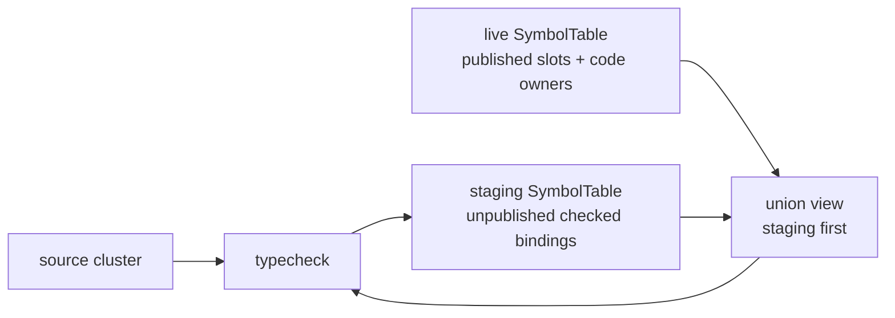
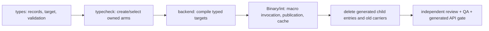
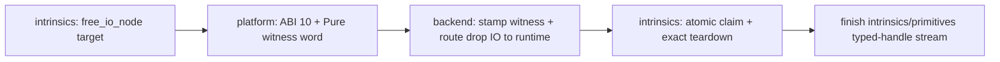

# Unified symbol lifecycle — staged/live boundary review

> **Purpose:** present lifecycle-boundary decisions and exact public Rust API
> packets that require user review.
>
> **Status:** §10 IMPLEMENTED; GENERATED BASELINE CONFIRMED. §11 IMPLEMENTED,
> INDEPENDENTLY REVIEWED AND BASELINE-CONFIRMED 2026-09-03. The user approved Decision 3
> on 2026-09-02: integration chooses semantic commit policy and a table-owned
> module transaction applies staged-to-live publication atomically while
> returning displaced compiled-code owners. Section 10's exact additive
> callable-docstring method was approved on 2026-09-03, and the user separately confirmed its exact
> generated `cranelisp-types/public-api.txt` line later that day. Independent
> review and root integration are not recorded as complete here. The user also
> approved §11's exact owner-conserving compiled-staging transaction on
> 2026-09-03. Its Rust implementation, regenerated baseline, independent review
> and QA correction evidence are complete; the user confirmed the exact
> generated delta on 2026-09-03. The user subsequently approved §11's
> no-surface semantic amendment: `ChangeAbi` may explicitly retire a live
> slotted binding to absence when its key is wholly absent from staging.
> Implementation of that amendment remains part of the current C6 work; it
> changes no signature or generated baseline line. Section 13 records the
> exact fallible root session constructor and private receipt custody approved
> by the user on 2026-09-04; implementation and independent review remain in
> the current Binary/int wave.
>
> **Canonical technical detail:** `symbol-table-lifecycle.md`. Accepted outcomes
> must be folded there before this temporary brief is removed.

## 1. Approved foundation

Two decisions are settled:

1. A callable is represented through `Binding -> Decl -> Callable -> Life`.
2. A live callable's lifecycle and slot claim change only through
   `SymbolTable`-owned transitions. Consumers choose the semantic outcome;
   types validates and applies it.

The cache consequence is also known: implementing the new serialized shape
invalidates schema-24 sidecars and rebuilds them as schema 25. That is not a
separate decision and does not change the platform C ABI.

That foundation decision did not itself approve an exact public API. Subsequent
accepted lifecycle packets live in `symbol-table-lifecycle.md`; this document's
§10 method is implemented and its exact generated baseline line is
user-confirmed. Independent review and root integration remain separate.

## 2. What the consumer inventory found

The worktree currently exposes 29 `SymbolTable` mutation/validation methods.
They came from migrating call sites incrementally, not from a completed facade
derivation.

The inventory produces four immediate conclusions:

- `settle_template` and `settle_concrete` have no production consumer outside
  `cranelisp-types`; only the checked settlement operations are used across a
  crate boundary. The lower-level pair should become private.
- `install_binding` is safe only as a non-callable installer. The worktree now
  rejects `Callable` and `TraitMethod` values, so it is not a lifecycle escape
  hatch. Its final name remains open.
- Typecheck's staged authoring needs are represented: declare, refine a
  provisional scheme, settle a checked body, publish callee/ownership facts,
  install born-settled declarations, and roll back an unpublished trait impl.
- Integration's live-publication needs are not represented. It still requires
  raw symbol-map access to commit staging, preserve/reallocate slots, attach
  compiled owners, load cached owners, and retain code during retirement or
  failure.

The current method list is therefore both too broad in one place and
incomplete in the most important publication seam.

## 3. Why staging and live publication are different operations

Typecheck does not edit the live table while checking a cluster. It writes an
unpublished staging table and reads a staging-first union over staging plus
live state:



After successful checking, the prepared-turn target performs one ordered
publication:

1. Compare each staged callable with its live predecessor and classify it as
   new, ABI-preserving, ABI-changing, or slotless.
2. Apply `publish_staged` to the isolated prepared view, deriving and
   validating the final slot plan before codegen.
3. Compile the exact concrete-body batch against those final slots and the
   canonical live GOT slab.
4. Publish the owner-free delta, its complete ABI decisions, and the exact
   symbol-keyed compiled-owner set through the §11 transaction.
5. Move every displaced owner returned by that transaction into integration's
   retention pool.

Classification and transaction timing belong to integration. Slot movement,
lifecycle replacement, and binding an owner to its concrete body belong to the
table. The final operation must therefore be one types-owned transaction, not
`publish_staged` followed by a fallible per-symbol owner loop.

## 4. Decision 3 — a table-owned publication transaction

The proposal is:

> Integration supplies the semantic commit decision for each staged binding.
> A `SymbolTable`-owned module transaction consumes the staging table, validates
> the complete candidate, applies every slot move atomically, publishes the
> bindings, and returns every displaced compiled-code owner to integration.

Conceptually:

```text
live_table.commit_staged(staging_table, caller_decisions)
    -> published keys and slots
    -> retired-slot records
    -> displaced code owners that integration must retain
```

This is not a proposed Rust signature or name.

The caller decisions describe policy, not mechanics:

```text
New                  -> mint a fresh slot when the new Life requires one
ABI-preserving       -> reuse the prior slot
ABI-changing         -> mint fresh; tombstone the prior slot
Concrete-to-template -> publish slotless; tombstone the prior slot
Non-callable         -> replace only where non-callable collision rules permit
```

Types checks that the requested policy matches the actual old and new states.
For example, `ABI-preserving` cannot reuse a missing slot, and a template
cannot receive a slot merely because the caller requested one.

### Why module-atomic rather than one binding at a time

A checked cluster may contain mutually recursive definitions. Backend codegen
must see one coherent slot map for the whole cluster, and failure must not leave
half the bindings published. The existing integration commit is already a
module-level operation. Moving that operation behind the table boundary
preserves its atomicity instead of replacing it with a sequence of public
per-binding inserts.

### What the operation returns

The table owns indices and lifecycle state, but integration owns executable
memory retention. The outcome must therefore return, rather than drop:

- old `Code` owners displaced by ABI-preserving recompilation;
- frozen owners displaced by ABI-changing replacement;
- owners displaced when a concrete callable becomes a template; and
- the old slot/new slot pairing needed for transaction reporting and GOT
  tracing.

Returning these values keeps the dependency direction intact: `cranelisp-types`
does not know about the integration retention pool, while integration cannot
lose an owner by replacing a private binding.

## 5. Compiled-code publication

Backend writes the finalized function pointer into the callable's GOT slot. It
cannot construct the `Code::Jit` owner because integration owns the `Arc<Jit>`;
the cache-hit path similarly constructs `Code::Linker` in integration.

The minimum types-owned operation is therefore conceptually:

```text
publish compiled owner for this concrete Body
    -> return the previously attached owner, if any
```

It must:

- accept only `Life::Concrete` with a backend `Body` realization;
- preserve every other callable field and the slot;
- return the displaced owner instead of dropping it; and
- return the submitted owner to the caller on rejection, so an error cannot
  silently free executable memory that a GOT row may already address.

The same operation serves fresh JIT compilation, recompilation and cache-hit
linker restoration. Separate `write_jit_code` and `write_linker_code` methods
would duplicate the lifecycle rule.

### No new revision-token mechanism

The previous brief suggested an expected body-revision token. The consumer
census does not justify one: the scheduler already serializes a module's
typecheck, commit, codegen and publication phases, and the integration caller
holds the new JIT/linker owner throughout publication. A second revision
protocol would duplicate that sequencing and add another failure branch.

The publication operation still validates the current `Life`. If later
evidence shows same-module mutation can race this phase, architecture must
revisit the scheduler or add a freshness capability then; it should not add
one speculatively now.

## 6. Broken and retired callables

The worktree's current `mark_broken` changes `Concrete -> Broken` but returns
nothing. A concrete `Body` may contain the only `Code` owner keeping its machine
pages mapped, so consuming that transition without returning the owner can
free code that existing frames or closures still reference.

The enforced transition must instead return a retention outcome containing
the slot and displaced owner. Integration then:

1. retains the displaced owner;
2. compiles and retains the trap stub plus its message;
3. patches the retained slot to the stub; and
4. records user-facing provenance.

`Life::Broken` itself prevents ordinary backend enumeration. The trap stub's
owner may remain in integration's existing session-lifetime retention pool;
it does not need another serialized lifecycle field.

The same ownership rule applies to ABI retirement: types records the retired
slot and returns the displaced owner; integration decides how long executable
memory remains retained.

## 7. Resulting facade families

The facade should be reviewed as five cohesive capability families, not as the
current flat list of 29 methods:

| Family | Consumer workflow | Boundary invariant |
|---|---|---|
| Read and validate | typecheck, backend, cache, integration | No mutable binding or raw slot allocator escapes. |
| Staged authoring | typecheck | Only legal `Declared`, checked `Template` and checked `Concrete` states are formed. |
| Born-settled registration | ADT synthesis, primitives, platform, monomorphisation | Origin, realization, concreteness and slot policy agree at installation. |
| Live publication | integration | A whole staged cluster commits atomically; displaced owners are returned. |
| Unpublished transaction support | trait-impl checking | Opaque retain/stage tokens roll back without exposing bindings or slots. |

This grouping does not imply five giant methods. Distinct invariants should
remain distinct operations; shared invariants should not be repeated in
per-caller variants.

## 8. Effect on the current worktree proposal

The later exact API packet must:

- make `settle_template` and `settle_concrete` private;
- retain checked source settlement and the genuinely used born-settled paths;
- retain `install_binding` only as a non-callable operation, with a clearer
  final name considered;
- replace raw staging drain/insertion with one module publication transaction;
- add one realization-neutral compiled-owner publication operation;
- reshape broken/retirement outcomes so compiled owners cannot be dropped;
- remove standalone operations subsumed by module publication; and
- show every remaining method against at least one production consumer.

`Group`/`OverloadedCallable`, same-name candidate selection,
`instantiate_demands`, and platform ABI work remain separate decisions.

## 9. Decision outcome

**Approved by the user on 2026-09-02:** integration chooses commit policy,
while a table-owned module transaction atomically publishes the staged cluster,
applies slot transitions, and returns displaced compiled-code owners.

## 10. C6 `set-doc` metadata facade — IMPLEMENTED + BASELINE-CONFIRMED 2026-09-03

### Problem and exact proposal

The existing agent operation `set-doc solve Solve the grid.` replaces the
authoritative docstring of the current module's local user-defined function and
then regenerates its backing source. After the unified lifecycle made the
symbol map private, `src/agent/pull.rs::apply_docstring_edit` can no longer
perform its former raw mutable-map access. Reconstructing or republishing the
callable would wrongly turn a metadata edit into a lifecycle, slot and compiled-
owner transition.

The smallest additive facade is:

```rust
impl<C: CodeStore, L: LinkerStore> SymbolTable<C, L> {
    pub fn set_plain_callable_docstring(
        &mut self,
        name: &Symbol,
        docstring: String,
    ) -> Result<(), LifecycleError>;
}
```

The name is intentionally explicit: `set` matches the existing `set-doc`
operation and `set_value_use` mutation vocabulary; `plain_callable` states the
durably recordable `CallableOrigin::Plain` boundary; `docstring` distinguishes
this metadata from module preambles and other presentation fields. The method
belongs on the fully generic `SymbolTable<C, L>` impl because it neither reads
nor changes compiled-code or linker storage. `name` is borrowed like the other
point mutations; `docstring` moves the one owned value into the table.

### Accepted and refused targets

Success requires a canonical local `Binding` whose declaration is
`Decl::Callable` and whose origin is `CallableOrigin::Plain`. It sets
`callable.docstring = Some(docstring)` and preserves, byte-for-byte at the
field boundary, the callable's `Life`, scheme, parameter names, sequence and
origin; the binding's visibility; every per-spelling candidate; every slot,
realization, compiled owner, AST, callee, value-use and ownership payload; and
the table's tombstones and GOT contents. Replacing an existing `Some` is
allowed. No clear-to-`None` operation is added because `set-doc` does not expose
one.

Docstrings are lifecycle-orthogonal. The method therefore accepts all four
states that the existing origin/state validator permits for `Plain`:
`Declared`, `Template`, `Concrete` and `Broken`. This preserves the former
`DefKind::UserFn` behavior and permits documentation of generic, compiled and
broken user functions; a broken callable keeps its slot and failure provenance.
There is no other legal Plain lifecycle state: `Inline` and `HostPromised` are
valid only for non-Plain origins and do not widen this operation.

Refusal uses the existing public error vocabulary and leaves both binding data
and its private revision unchanged:

- no canonical binding at `name`, including a candidate-only/import spelling:
  `LifecycleError::MissingBinding { symbol: name.clone() }`;
- a canonical non-callable declaration:
  `LifecycleError::NotCallable { symbol: name.clone() }`;
- a callable with any non-Plain origin:
  `LifecycleError::WrongState { symbol: name.clone(), expected: "plain callable" }`.

No additional error variant or public carrier is required. On success the
method calls the existing table-owned `note_symbol_mutation(name)` exactly once,
after the field update. This invalidates any stale opaque transaction token in
the same way as another authoritative symbol mutation; refusals do not advance
the revision.

### Ownership, compatibility and verification

`cranelisp-types` owns and produces the method.
`src/agent/pull.rs::apply_docstring_edit` is its sole production consumer and
maps the typed refusal back to the existing honest `set-doc` messages before
regenerating source only on success. The binary already depends on
`cranelisp-types`, so no dependency edge or re-export is added.

This is an additive, source-compatible Rust API change. It changes an existing
serde-carried `Option<String>` value but no serialized shape, so
`CACHE_SCHEMA_VERSION` remains 25; ordinary regenerated-source hashing handles
the next load. It changes no emitted symbol, GOT layout, platform ABI or
executable-bundle interface. The generated cargo-public-api 0.52 addition,
confirmed separately by the user on 2026-09-03, is exactly one line:

```text
pub fn cranelisp_types::SymbolTable<C, L>::set_plain_callable_docstring(&mut self, &cranelisp_types::Symbol, alloc::string::String) -> core::result::Result<(), cranelisp_types::LifecycleError>
```

Implementation evidence must include types-owned unit
coverage for all four legal Plain lifecycle states and exact preservation of
the complete binding/candidate/lifecycle payload, including a compiled concrete
owner and a broken slot/provenance. Missing, candidate-only, non-callable and
non-Plain refusals must assert no data or revision mutation. The existing agent
positive, missing and non-user-function tests then consume the facade unchanged
in meaning, and the root all-features check proves the feature-gated caller.
The generated one-line baseline diff has received that separate user
confirmation. Independent review and root integration remain outstanding.

### Rejected widenings

- Restoring raw map access or adding a generic mutable binding/callable getter
  would reopen every lifecycle and candidate invariant.
- Reconstructing the callable through declaration, settlement or live
  publication funnels could replace its slot, owner or lifecycle payload and
  assigns commit policy to a metadata consumer.
- A generic callable-docstring edit would let primitives, constructors,
  accessors, clauses and methods appear updated in-session even where source
  regeneration cannot persist that edit, violating `set-doc`'s honest-failure
  behavior.
- Taking `Option<String>` or adding a clear method creates behavior the feature
  does not require.
- Separate methods per lifecycle state duplicate one orthogonal metadata rule
  and increase the public surface without changing safety.
- An integration-owned docstring side map would cease to be the authoritative
  serialized/source-regenerated record and could diverge from introspection.

**Decisions recorded:** the user approved the exact method, behavior and errors
on 2026-09-03, authorizing implementation, and separately confirmed the exact
generated `cranelisp-types/public-api.txt` line later that day. This records no
independent review or root-integration completion.

## 11. Prepared compiled publication — IMPLEMENTED + REVIEWED + BASELINE-CONFIRMED 2026-09-03

### Boundary defect and selected design

The prepared-turn integration exposed a transaction gap in A1. An owner-free
`publish_staged` followed by one `publish_compiled_owner` call per compiled
symbol can make the live table visible before every new owner is attached. A
late refusal then leaves a partially published cluster, and dropping the
rejected owner can invalidate a pointer which backend has already stored in
the canonical GOT.

The user approved a distinct compiled-publication transaction. The existing
`publish_staged` remains owner-free and its signature is unchanged: it is still
the planning and non-compiled publication operation, and it continues to
reject a staging table which already carries compiled owners. Its shared
decision planner also owns the later approved explicit retirement-to-absence
semantics below. Prepared codegen submits its owners separately, keyed by the
canonical staged symbol. `HashMap` makes duplicate keys unrepresentable; the
table validates exact key-set agreement with the staged concrete-body
projection before changing live state.

Allowing owner-bearing input through `publish_staged` was rejected. That method
consumes staging and returns only `LifecycleError`, so refusal could drop the
submitted owners. Returning owner-bearing staging would break the approved
signature and would merge unpublished authoring with compiled publication.

### Exact approved API

```rust
#[must_use = "rejected compiled owners must be recovered with into_parts"]
pub struct CompiledPublicationRejection<C: CodeStore = ()> { /* private */ }

impl<C: CodeStore> CompiledPublicationRejection<C> {
    pub fn reason(&self) -> &LifecycleError;
    pub fn into_parts(
        self,
    ) -> (LifecycleError, HashMap<Symbol, C>);
}

impl<C: CodeStore> SymbolTable<C, ()> {
    pub fn publish_compiled_staged(
        &mut self,
        staging: SymbolTable<C, ()>,
        decisions: &[StagedPublicationDecision],
        compiled_owners: HashMap<Symbol, C>,
    ) -> Result<Vec<PublicationRecord<C>>, CompiledPublicationRejection<C>>;
}
```

`CompiledPublicationRejection` has private fields and no general constructor.
It exists only to preserve ownership across refusal; it does not create a
second lifecycle or expose mutable table state. `cranelisp-types` produces and
owns both additions. The binary integration layer is their sole production
consumer and already depends on `cranelisp-types`.

### Approved decision semantics and rustdoc forecast

`StagedPublicationDecision` retains its two existing variants and field shape.
`PreserveAbi { symbol }` remains a two-slot replacement only.
`ChangeAbi { symbol }` means “retire the live callable's prior ABI generation”:

- if staging carries a slotted replacement at `symbol`, retire the prior slot
  and mint the replacement a fresh slot;
- if the key is wholly absent from staging, remove the live binding with no
  replacement; and
- omission alone never deletes a live binding. The absent-key transition is
  requested only by an explicit `ChangeAbi` decision.

The source rustdoc changes, without changing an item signature, to describe
`StagedPublicationDecision` as the semantic choice for a publication affecting
a slotted live callable; describe `ChangeAbi` as replacement-or-absence; and
describe `PublicationRecord` as the facts from one committed publication
action rather than only a staged binding becoming live. `publish_staged` and
`publish_compiled_staged` state the explicit absent-key permission and the
unchanged omission rule. No third variant or retirement carrier is added.

### Atomicity and owner conservation

Before any live-table mutation, `publish_compiled_staged` must perform every
validation already owned by `publish_staged`: same-module input, lifecycle
validity, no staging tombstones or compiled owners, legal collisions, unique
and complete ABI decisions, and a valid complete resulting slot map. It must
also validate that:

- every `compiled_owners` key names a staged `Life::Concrete` /
  `Realization::Body` binding;
- every staged concrete body has exactly one keyed owner; and
- no template, declaration, inline body, host promise, trait method, group or
  non-callable declaration has an owner row.

Success applies the complete candidate in one table swap. Each submitted owner
moves into its keyed concrete body in that same swap. The returned
`PublicationRecord`s own every displaced prior owner and the old/new slot
facts; integration must move those owners into its retention pool before the
records drop. There is no reachable live concrete body without its submitted
owner and no per-symbol publication loop.

An absent-key `ChangeAbi` participates in that same cloned plan. It accepts
only a live slot-carrying callable at a key with no staging entry, removes the
binding, preserves the frozen GOT pointer, and records the prior slot as the
existing `RetireReason::AbiChanging`. Its publication record carries
`prior_slot: Some(_)`, `published_slot: None`, and the displaced owner. Removed
keys are not members of the submitted compiled-owner set, which remains
exactly the staged concrete-body set. `PreserveAbi` to absence; a missing,
non-callable or slotless target; duplicate decisions; and a resulting locally
dangling candidate are typed refusals of the whole plan.

Refusal leaves all live binding, candidate, lifecycle, slot-claim, tombstone,
sequence, written-impl and mutation-revision state unchanged. `into_parts`
returns the `LifecycleError` and the complete submitted owner map, including
on a failure detected after another row has been inspected. The transaction
must not use `unwrap`, `expect`, `unreachable!` or a panic as its invariant
mechanism; a dynamically inconsistent key or state is an owner-conserving
typed refusal.

### GOT commit and rollback

The GOT remains the single home of code pointers and is not written by this
method. Backend still finalizes the complete batch before its first pointer
store, and it writes the final slots derived in the prepared view. Integration
must snapshot every touched cell before codegen: a reused slot records its
prior pointer and a fresh slot records null.

Backend success is the pointer commit point. If compiled publication then
refuses, integration must recover the complete owner map, keep those owners
alive while restoring every touched GOT cell to its snapshot, and only then
release or session-retain them. This ordered compensation prevents a restored
cell from referring to released pages and restores fresh slots to null. The
error is propagated as an internal compiler error; it is not converted to an
`unwrap` or an unreachable-state panic. The existing per-module cadence
continues to exclude another same-module prepare or publish between the
validated plan, codegen and this rollback.

On success, submitted owners reside in live bindings before the prepared
batch owner can drop. ABI-changing and concrete-to-template prior owners reside
in the returned records before their old bindings are displaced. GOT tracing
occurs from the returned old/new slot facts after the successful table swap;
tracing never owns or repairs lifecycle state.

### Compatibility and evidence

This is an additive Rust API change. The carriers contain only runtime values,
add no serde field, and do not change `CACHE_SCHEMA_VERSION` 25. There is no
platform C-ABI, GOT-layout, emitted-symbol, executable-bundle or Cargo
dependency-edge change. The forecast `cranelisp-types/public-api.txt` delta is
the `CompiledPublicationRejection` type, its two methods and auto-trait lines,
plus the one `publish_compiled_staged` method line. The generated baseline must
return to the user for the separate post-implementation confirmation gate.

Types-owned evidence must cover the preserve/change/template and mixed-cluster
success cases; exact owner-key coverage; wrong-module, lifecycle, collision,
decision, slot-exhaustion and owner-set refusals; multi-row late refusal with
zero partial publication; complete owner recovery with a drop spy; and
preservation of candidates, tombstones, structural metadata and revision.
Integration evidence must cover a two-body successful turn with a non-null GOT
cell and live owner for each body, old-owner retention before displacement,
and injected refusal which restores every touched GOT cell while the returned
owners remain live. Existing two-body codegen-failure evidence continues to
prove backend writes no GOT cell before whole-batch finalization.

The types realization and independent review are complete. The full
`cranelisp-types` suite is green at 262/262. QA's two correction controls,
`compiled_staged_publication_rejects_staging_tombstone_without_live_mutation`
and
`compiled_staged_publication_rejects_declared_life_without_live_mutation`,
prove that the two previously omitted staged-state refusals return every
submitted owner while preserving the live binding, owner, slot, revision,
tombstones, candidates and symbol set. The broader refusal matrix and
late-multi-row drop-spy control remain green.

**Decision and delivery recorded:** the user approved this exact method,
rejection carrier, owner-key contract and GOT rollback obligation on
2026-09-03. Implementation, independent review, QA correction and baseline
generation are complete. The user separately confirmed the exact generated
`cranelisp-types/public-api.txt` delta on 2026-09-03.

**Semantic amendment recorded:** the user approved the exact absent-key
`ChangeAbi` behavior, refusal rules, owner/slot disposition and omission rule
on 2026-09-03. It is an acceptance-set extension of the existing public
operation: there is no new item, variant, field, signature, re-export or
consumer edge, so the forecast generated `public-api.txt` delta is empty. It
changes no serialized shape (`CACHE_SCHEMA_VERSION` remains 25), GOT layout,
backend API or platform interface. Types evidence must add mixed
replacement-plus-removal success, late-refusal atomicity and owner return,
dangling-candidate refusal, and remove-then-recreate fresh-slot coverage.

## 12. Macro-checkpoint composition — APPROVED ARCHITECTURE 2026-09-03

The later macro-turn investigation does not add another lifecycle facade. A
source-ordered `defmacro` is one module-local prepared publication: int builds
and typechecks its parent and complete clause set, closes and codegenerates the
full expansion-time dependency/generated-realization closure, and calls the
already-approved `publish_compiled_staged` exactly once for the defining
module with the parent, clauses, and defining-module generated-realization
rows. The int-private
prepared commit owns every per-symbol and per-batch code owner until that call
succeeds or its GOT compensation has completed.

Macro redefinition derives clause retirement from typed parent identity, never
from a spelling scan. Given an old active count `N` and staged count `M`, int
uses its canonical `(group, clause_index) -> Symbol` constructor for `M..N`
and may request absent-key `ChangeAbi` only after each target is verified as a
private, slotted `CallableOrigin::MacroClause` belonging to that staged parent.
The one publication therefore replaces the parent and active clauses and
removes every surplus clause row atomically. Removed owners enter the ordinary
retention pool; their old GOT pointers remain frozen behind tombstoned slots.
Cache validation enforces both directions of the parent active-set to clause
binding relation and treats a missing, surplus or mismatched row as stale.

A dependency module is a separate compiler transaction and may publish
independently before the defining-module checkpoint resumes. There is no
cross-module publication set or rollback promise. A successful macro
checkpoint is immediately committed and is not undone by a later source form;
the fully expanded non-macro forms retain their separate, cluster-atomic HM
publication.

The later §18 dependent cure begins only after macro publication. It is not
part of checkpoint success, and its refusal or failure reports without putting
the committed macro back into candidate state.

Only committed clauses may be invoked. The superseded alternatives—an
unpublished-candidate call, temporary or allocator-unreachable GOT cells kept
live for invocation, a `MacroObservationFence`, a fresh-`TraitImpl` enrolment
path, and a multi-table publication carrier—are not part of C6. Any GOT cells
touched by a failed defining-module batch are restored while its recovered
owners are still held, as §11 already requires; no provisional cells survive
for execution.

This composition adds **no** `cranelisp-types`, typecheck, or backend public
item beyond §11. It uses the approved `ChangeAbi` semantic extension with no
generated-baseline line, changes no cache schema, and changes no backend or
platform interface. The current `PreparedMacroTurn` implementation stack is therefore
temporary interior machinery to remove, not evidence for another public
surface.

## 13. Fallible session bootstrap and checkpoint-effect custody — APPROVED 2026-09-04

### Exact approved root library API

Session construction is the error boundary for bootstrap lifecycle settlement.
The root library changes its binary-facing constructor from an infallible
return to this exact signature:

```rust
pub fn CompilerSession::new(
    settings: SessionSettings,
    project_root: PathBuf,
    entry_module_name: &str,
) -> Result<CompilerSession, CranelispError>;
```

Bootstrap remains owned by Binary/int. Its fallible symbol-lifecycle operations
propagate to the constructor, where Binary/int adds the session/bootstrap
context and projects them into the existing `CranelispError` vocabulary. The
binary consumer in `src/main.rs` propagates that result through its existing
`run(...) -> Result<(), CranelispError>` boundary. A bootstrap inconsistency is
therefore a typed startup failure, never an `unwrap`, `expect`, `unreachable!`
or panic. Neither `LifecycleError` nor a new error type becomes part of the
root library's binary-facing constructor contract.

This is a breaking Rust signature change across the root library-to-binary
boundary. That boundary is internal to the Binary/int bounded context and has
no `public-api.txt` baseline; its verification is compilation of the binary
consumer plus the session/bootstrap tests. The user approved the exact change
on 2026-09-04.

### Private checkpoint-effect custody

A successful macro checkpoint can precede a later `Done`, dependency `Gap`, or
error outcome. Binary/int represents the already-committed redefinition facts
as one move-only, stack-owned `PublicationReceipt`. Each orchestration entry
that can receive it must settle it exactly once on all three outcomes. Eval and
dependent-recheck frames carry the receipt only on their own call stacks;
pool-driven replacement settles it locally.

The receipt contains no symbol table, compiler world, prepared candidate,
dependency request, retry cursor, or source continuation. It does not enter a
scheduler mailbox or shared-state map and is not restart state. A dependency
retry retains only the existing source continuation; it does not replay the
committed checkpoint. `PublicationReceipt` is private to Binary/int and does
not cross a crate boundary.

### Nested Additive recheck ruling

Dependent recheck is itself an Additive compile and may publish a macro before
a later form fails. That nested publication must be cured, but curing it from
inside the active dependent transaction would recursively re-enter the same
reverse-dependency walk against a half-completed `TransactionWalk`.

The settlement driver is therefore one iterative, stack-owned drain:

```text
apply_redefinition_outcomes(initial receipt)
  pending: VecDeque<RedefinitionOutcome> <- move initial outcomes
  while outcome := pending.pop_front()
    current := run_transaction(outcome)       // never calls apply recursively
    finish current walk and report
    pending.extend(move current.publications) // only after current finishes
  drive collected T1 full-cure targets
```

`apply_redefinition_outcomes` consumes a `PublicationReceipt`, not a borrowed
slice or cloned vector. Its `VecDeque` owns each outcome until that outcome is
settled. The receipt and the movement of its outcomes remain non-`Clone`; a
`.to_vec()` copy is not an admissible handoff. The queue is local to this call,
and an outcome appended while transaction A is running cannot start
transaction B until A has completed its SCC walk, stale marking, and report.
This preserves the existing rule that per-symbol transactions settle before
the collected T1 full-cure phase.

`run_transaction` returns one private `TransactionRun { report,
publications }`. Its `TransactionWalk` owns the nested receipt accumulated from
all SCCs. `process_scc` borrows a successful recheck receipt long enough to
derive that SCC's propagation result, then moves the same receipt into the
walk; on recheck error it marks the current units broken and still moves the
receipt. Neither function invokes the outer settlement driver.

`recheck_units_for_transaction` owns one receipt across all dependency retries
and returns a private attempt containing both its terminal `Result` and that
receipt. It moves every attempt receipt into this accumulator before
interpreting `Done`, `Gap`, or error. Consequently a dependency registration
or wait failure cannot lose a macro already committed earlier in the recheck.
Gap state remains the existing source continuation plus generation-started
bit; no receipt enters that continuation, and a committed checkpoint is not
replayed.

Only a complete pool-driven `Replace` route may acknowledge its receipt
locally, because replacement already owns its module/dependent handling. An
Additive caller must move every effectful receipt into the iterative driver.
The retained public compatibility wrapper around `cluster::process_cluster`
may consume a provably inert, genuinely-new Additive receipt, but must return a
typed refusal rather than acknowledge an Additive receipt containing a
redefinition, broken-state recovery, per-symbol ABI cure, or T1 cure. There is
no general-purpose `acknowledge` escape hatch.

This shape is preferred to passing the outer queue by mutable reference through
`run_transaction`, `process_scc`, and recheck. The latter is smaller in carrier
count but exposes partially drained outer state to the active transaction and
makes the required "finish A before starting B" order a calling convention.
The returned nested receipt makes that order structural while adding only two
private stack carriers.

Required Binary/int unit evidence:

- `additive_recheck_error_defers_committed_macro_outcome_until_transaction_end`
  proves a macro committed before a later recheck error is settled once after
  the current transaction reports the failing unit broken;
- `additive_recheck_gap_moves_receipt_without_replaying_macro` proves a receipt
  survives a dependency retry and contributes one outcome;
- `nested_additive_outcomes_drain_fifo_at_transaction_depth_one` records
  transaction start/end events and proves B starts after A ends, with maximum
  active depth one and every committed outcome observed once;
- `overlapping_nested_cures_settle_each_publication_once` covers two outer
  outcomes whose affected closures overlap and distinguishes publication
  events from repeated graph visits;
- `effectful_additive_receipt_cannot_be_acknowledged` exercises the public
  compatibility wrapper's typed refusal, while a genuinely-new inert receipt
  remains admissible; and
- `pool_replace_receipt_is_acknowledged_only_after_complete_generation`
  proves the one local-acknowledgement route does not become an Additive escape.

### Compatibility statement

The approved correction changes no public API in `cranelisp-types`,
`cranelisp-typecheck`, `cranelisp-backend`, `cranelisp-frontend`,
`cranelisp-primitives`, `cranelisp-intrinsics`, `cranelisp-platform`, or
`cranelisp-exe-bundle`. It adds no dependency edge, platform ABI or interface,
cache field, serialization shape, GOT layout, emitted symbol, or cache-schema
version. In particular, it neither amends §11's publication transaction nor
exports `PublicationReceipt`.

## 14. Declaration-family aggregation — API APPROVED 2026-09-04

The user approved one ownership model for multi-signature functions and
macros: one authored declaration creates one module binding, and that binding
owns its complete ordered arm roster. Multi-signature variants and macro
clauses may retain separate compiled bodies and slots, but they are not second
language bindings under generated `Symbol` keys.

This supersedes the worktree's public `Group`/`GroupKind` target and the use of
`CallableOrigin::{Clause, MacroClause}` to relate separately indexed child
bindings to a parent. It does not merge the two semantics: HM selects a typed
variant of an overloaded callable; expansion selects a syntax clause of a
macro. Their common mechanism is limited to aggregate ownership, typed arm
identity, whole-family validation and atomic publication.

Before source changes, architecture returned one exact inter-crate packet
containing:

- replacement `Decl` variants and declaration/arm record definitions;
- the typed arm identity carried by overload selection and macro expansion;
- table-owned read, staging, publication and compiled-owner operations;
- every removal involving `Group`, `GroupKind`, `OverloadVariant`,
  `MacroClauseInfo` and the two child `CallableOrigin` variants;
- affected types, typecheck, backend and Binary/int consumers;
- cache-schema and migration consequences;
- the exact forecast `public-api.txt` changes; and
- proof that no platform ABI or language interface changes.

The user approved that base packet and implementation began. The generated
post-implementation baselines remain a second user gate. Implementation then
exposed the construction gap recorded below; the user approved its exact
amendment. No improvised bridge or namespace filter is authorized merely to
keep the migration compiling.

### 14.1 Exact proposal — APPROVED 2026-09-04

This is the pre-implementation public-API packet. It is deliberately one
cohesive breaking wave: retaining any of the old generated-symbol carriers
would keep the parent/child representation alive behind the new declaration
records and force the same crates to be revisited.

#### Declaration shape

`Callable` remains the record for a directly named callable, but its executable
fields move into a reusable `CallableArm`. The authored declaration owns
documentation and source order; the arm owns the scheme, parameter names and
lifecycle:

```rust
#[non_exhaustive]
pub struct Callable<C: CodeStore = ()> {
    pub docstring: Option<String>,
    pub seq: u64,
    pub origin: CallableOrigin,
    pub arm: CallableArm<C>,
}

#[non_exhaustive]
pub struct CallableArm<C: CodeStore = ()> {
    pub scheme: Scheme,
    pub param_names: Vec<Symbol>,
    pub life: Life<C>,
}
```

The same arm record is then owned directly by the two family declarations:

```rust
#[derive(Debug, Clone, Copy, PartialEq, Eq, PartialOrd, Ord, Hash, Serialize, Deserialize)]
pub struct CallableArmId(u32); // opaque outside cranelisp-types

#[non_exhaustive]
pub struct OverloadedCallable<C: CodeStore = ()> {
    pub docstring: Option<String>,
    pub seq: u64,
    pub arms: Vec<OverloadArm<C>>,
}

#[non_exhaustive]
pub struct OverloadArm<C: CodeStore = ()> {
    pub id: CallableArmId,
    pub callable: CallableArm<C>,
}

#[non_exhaustive]
pub struct MacroDeclaration<C: CodeStore = ()> {
    pub docstring: Option<String>,
    pub seq: u64,
    pub macro_sexp: Sexp,
    pub clauses: Vec<MacroClause<C>>,
}

#[non_exhaustive]
pub struct MacroClause<C: CodeStore = ()> {
    pub id: CallableArmId,
    pub params: Vec<MacroParam>,
    pub rest_param: Option<Symbol>,
    pub callable: CallableArm<C>,
}

pub enum Decl<C: CodeStore = ()> {
    Callable(Callable<C>),
    Overloaded(OverloadedCallable<C>),
    Macro(MacroDeclaration<C>),
    TraitMethod(TraitMethodRecord),
    Type(TypeRecord),
    Trait(TraitRecord),
    ImplShell(ImplShell),
    SpecialForm(SpecialFormRecord),
}
```

`CallableArmId` is local to one family generation and is the checked source
ordinal. Its public surface is only
`CallableArmId::from_ordinal(usize) -> Result<Self, LifecycleError>` and
`ordinal(self) -> usize`; its numeric field remains private. Family validation
requires IDs to be unique, contiguous and equal to roster position. Reordering
therefore creates a new target roster, which is safe because all target
carriers for the new generation are produced from that same roster. During an
ABI-preserving publication, overload slots and old owners are matched by the
alpha-normalized complete `Scheme`, not by ordinal; already-emitted callers
continue to address the preserved matching slot. Macro order is semantic, so a
moved clause is correctly treated as a changed arm.

There is no family-level `scheme` or `param_names`: each overload arm has its
own complete scheme and parameter roster, and a macro is not assigned a dummy
value type. There is likewise no arm-level docstring or `seq` to drift from the
one authored declaration.

`CallableOrigin::Clause { group }` and
`CallableOrigin::MacroClause { group }` disappear. Nesting is the parent link;
duplicating it as a symbol-valued field would recreate two sources of truth.
The other `CallableOrigin` variants remain on directly named callables.

#### Typed execution target

Generated names stop being cross-crate identity. The replacement is:

```rust
#[derive(Debug, Clone, PartialEq, Eq, PartialOrd, Ord, Hash, Serialize, Deserialize)]
#[non_exhaustive]
pub enum CallableTarget {
    Binding(FQSymbol),
    OverloadArm {
        owner: FQSymbol,
        arm: CallableArmId,
    },
    MacroClause {
        owner: FQSymbol,
        clause: CallableArmId,
    },
}
```

`Binding` targets cover ordinary named callables and the existing named
monomorphised-realization records. The two family variants can be obtained
only from a table projection or a family roster; a table lookup validates that
the target kind, owner and ID agree.

Construction of already-settled records uses these exact additions:

```rust
impl<C: CodeStore> CallableArm<C> {
    pub fn new(scheme: Scheme, param_names: Vec<Symbol>, life: Life<C>) -> Self;
}

impl<C: CodeStore> OverloadedCallable<C> {
    pub fn new(
        docstring: Option<String>,
        seq: u64,
        arms: Vec<CallableArm<C>>,
    ) -> Result<Self, LifecycleError>;
}

impl<C: CodeStore> MacroClause<C> {
    pub fn new(
        id: CallableArmId,
        params: Vec<MacroParam>,
        rest_param: Option<Symbol>,
        callable: CallableArm<C>,
    ) -> Self;
}

impl<C: CodeStore> MacroDeclaration<C> {
    pub fn new(
        docstring: Option<String>,
        seq: u64,
        macro_sexp: Sexp,
        clauses: Vec<MacroClause<C>>,
    ) -> Result<Self, LifecycleError>;
}

#[derive(Debug, Clone)]
#[non_exhaustive]
pub struct CallableArmDraft {
    pub scheme: Scheme,
    pub param_names: Vec<Symbol>,
    pub settlement: CallableArmSettlement,
}

#[derive(Debug, Clone)]
#[non_exhaustive]
pub enum CallableArmSettlement {
    Template {
        body: TemplateBody,
        kind: TemplateKind,
        callees: Vec<FQSymbol>,
    },
    ConcreteBody {
        ast: DefnVariant,
        view: MonoDefnVariant,
        callees: Vec<FQSymbol>,
    },
}

impl CallableArmDraft {
    pub fn template(
        scheme: Scheme,
        param_names: Vec<Symbol>,
        body: TemplateBody,
        kind: TemplateKind,
        callees: Vec<FQSymbol>,
    ) -> Self;

    pub fn concrete_body(
        scheme: Scheme,
        param_names: Vec<Symbol>,
        ast: DefnVariant,
        view: MonoDefnVariant,
        callees: Vec<FQSymbol>,
    ) -> Self;
}

#[derive(Debug, Clone)]
#[non_exhaustive]
pub struct MacroClauseDraft {
    pub params: Vec<MacroParam>,
    pub rest_param: Option<Symbol>,
    pub callable: CallableArmDraft,
}

impl MacroClauseDraft {
    pub fn new(
        params: Vec<MacroParam>,
        rest_param: Option<Symbol>,
        callable: CallableArmDraft,
    ) -> Self;
}

impl<C: CodeStore, L: LinkerStore> SymbolTable<C, L> {
    pub fn install_overloaded(
        &mut self,
        name: Symbol,
        docstring: Option<String>,
        seq: u64,
        arms: Vec<CallableArmDraft>,
        visibility: Visibility,
    ) -> Result<(), LifecycleError>;

    pub fn install_macro(
        &mut self,
        name: Symbol,
        docstring: Option<String>,
        seq: u64,
        macro_sexp: Sexp,
        clauses: Vec<MacroClauseDraft>,
        visibility: Visibility,
    ) -> Result<(), LifecycleError>;

    pub fn publish_body_ownership(
        &mut self,
        target: &CallableTarget,
        summary: ModeSummary,
        view: MonoDefnVariant,
    ) -> Result<(), LifecycleError>;
}
```

`install_binding` continues to accept only non-callable declarations and is
extended to reject `Overloaded` and `Macro` as well as `Callable` and
`TraitMethod`. The two family installers are the only fresh-install routes for
either family. They accept only an absent canonical binding and atomically:

1. validate every draft and the complete roster;
2. derive every generation-local `CallableArmId` from roster position;
3. mint distinct slots for concrete bodies while accounting for all claims
   already in the receiving table and all earlier drafts in the same call;
4. construct the complete `OverloadedCallable` or `MacroDeclaration`; and
5. install the one authored binding only after every preceding step succeeds.

Any failure leaves the table, its slot claims and its mutation revision
unchanged. A draft cannot carry `Declared`, `Broken`, compiled code, a slot or
an `InstanceLink`; those states are not inputs to fresh family settlement.
`ConcreteBody` always starts with `code: None`, `minted_from: None`,
`value_use: false` and `mode_summary: None`. Replacement of a live family
remains possible only through the staged-publication transaction.

The prior proposal accepted an already-built declaration in
`install_overloaded`/`install_macro`. That shape was incomplete: outside
`cranelisp-types`, a caller cannot build a concrete `CallableArm` because the
checked `CallableSlot` constructor and allocator are deliberately table-owned;
making either public would split slot authority and permit duplicate
pre-install claims. The drafts above carry settled semantic inputs but no slot,
and the atomic table operation closes that construction gap without creating
an arm-level mutation API or generated child bindings.

`publish_body_ownership` changes its existing first parameter from `&Symbol`
to `&CallableTarget`. It is the one post-settlement update required by the
ownership pass: it may update only an uncompiled `Concrete Body`, and updates
the arm's `Life::Concrete.mode_summary` and its matching codegen view together.
It is not a general family or arm mutator. Overloaded functions remain illegal
as first-class values, so the existing name-based `set_value_use` needs no
family extension.

This packet does **not** fold monomorphised realization records into their
template binding. That is a different storage question: they are concrete
cache/codegen realizations shared by direct and overloaded templates, rather
than sibling declarations selected under one source name. This wave does,
however, stop `InstanceLink` and `MonoDemand` from assuming that every
template is a top-level symbol, so a later storage-only nesting would not
require another typecheck/backend carrier change:

```rust
pub struct InstanceLink {
    pub template: CallableTarget, // Binding or OverloadArm; MacroClause rejected
    pub args: Vec<ConcreteType>,
}

pub struct MonoDemand {
    pub template: CallableTarget, // same admissible subset
    pub args: Vec<ConcreteType>,
    pub site: Span,
}
```

`ResolvedCall::SigDispatch` changes from a mangled JIT spelling to the selected
typed target:

```rust
ResolvedCall::SigDispatch { target: CallableTarget }
```

The backend may derive a private Cranelift/JIT/object label from a target. That
label is not inserted into `SymbolTable.symbols`, cannot be resolved, imported,
exported or searched, and is never returned as the language identity of the
arm.

#### Read and codegen facade

Language-name enumeration remains unchanged: `get`, `public_symbols` and
`all_symbols` return the one binding stored under the authored name. The old
`defined_symbols` name is removed because it conflates language symbols with
executable bodies. Its exact replacement is:

```rust
impl<C: CodeStore, L: LinkerStore> SymbolTable<C, L> {
    pub fn callable_target(&self, target: &CallableTarget)
        -> Option<&CallableArm<C>>;

    pub fn codegen_targets(&self)
        -> impl Iterator<Item = (CallableTarget, &CallableArm<C>)>;
}
```

`Binding::callable()` continues to mean “this declaration is one directly
named callable” and returns `Option<&Callable<C>>`. It does not guess an arm
from an overloaded or macro declaration. Introspection that wants a family
matches `Decl::Overloaded` or `Decl::Macro` and reads its roster.

The backend public boundary changes exactly once:

```rust
pub fn compile_to_module<M, C, L>(
    module_path: ModuleFullPath,
    targets: &[CallableTarget],
    symbol_tables: &DashMap<ModuleFullPath, SymbolTable<C, L>>,
    module: &mut M,
    capture_clif: bool,
) -> Result<CompilationArtifacts, CompilationError>
where
    M: Module + CodeFinalizer,
    C: CodeStore,
    L: LinkerStore;
```

Every target must belong to `module_path`; mismatch or a non-concrete-body
target is the existing typed `CompilationError` path. `collect_compile_targets`
uses `callable_target` and synthesizes only a private emitted label for
Cranelift. Backend does not reconstruct a child symbol or scan a family.

The same trace found a second backend public carrier on the object-cache path.
`ObjectCompileInput` currently repeats the old name-based codegen model through
`defns`, `fn_slot_assignments`, `fn_to_module` and `cross_module_fns`. Production
`process_cache_packet` reads only `module_path` and the names projected from
`defns`; the other seven fields have no production reader anywhere in the
workspace. Leaving them in place would preserve a public parallel compilation
model which cannot describe owned arms. The exact cleanup in this wave is:

```rust
#[derive(Debug, Clone)]
pub struct ObjectCompileInput {
    pub module_path: ModuleFullPath,
    pub targets: Vec<CallableTarget>,
}
```

The fields `defns`, `method_resolutions`, `fn_slot_assignments`,
`fn_to_module`, `intrinsics`, `expr_types`, `next_got_slot` and
`cross_module_fns` are removed. The now-zero-consumer backend-local public
types `FnSlotInfo`, `IntrinsicTable` and `IntrinsicEntry` are removed with
them. This does not remove the live `cranelisp-intrinsics::IntrinsicEntry`,
which is a different crate and the actual intrinsic catalog consumed by JIT
and cache restore. `CacheWritePacket`, `build_cache_packet` and
`process_cache_packet` remain; they carry the two-field input and compile its
typed target roster.

#### Publication and owner conservation

ABI decisions remain keyed by the authored `Symbol`, because preservation or
rejection is a whole-binding decision. The result likewise remains one record
per binding, including non-callable bindings, but its slot/owner movements are
nested because one callable binding may own several compiled bodies:

```rust
pub struct PublicationRecord<C: CodeStore = ()> {
    pub symbol: Symbol,
    pub prior_was_callable: bool,
    pub bodies: Vec<CallablePublicationRecord<C>>,
}

#[non_exhaustive]
pub struct CallablePublicationRecord<C: CodeStore = ()> {
    pub prior_target: Option<CallableTarget>,
    pub published_target: Option<CallableTarget>,
    pub prior_slot: Option<CallableSlot>,
    pub published_slot: Option<CallableSlot>,
    pub displaced_owner: Option<C>,
}

impl<C: CodeStore> CompiledPublicationRejection<C> {
    pub fn into_parts(
        self,
    ) -> (LifecycleError, HashMap<CallableTarget, C>);
}

impl<C: CodeStore> SymbolTable<C, ()> {
    pub fn publish_compiled_staged(
        &mut self,
        staging: SymbolTable<C, ()>,
        decisions: &[StagedPublicationDecision],
        compiled_owners: HashMap<CallableTarget, C>,
    ) -> Result<Vec<PublicationRecord<C>>, CompiledPublicationRejection<C>>;

    pub fn publish_compiled_owner(
        &mut self,
        target: &CallableTarget,
        owner: C,
    ) -> Result<Option<C>, CompiledOwnerRejection<C>>;
}
```

`publish_staged` keeps its existing signature. Both publication routes validate
the complete nested family before mutation. A successful compiled publication
requires an exact owner for every staged concrete `Body` target and none for a
template, inline, host, macro parent or non-callable declaration. The outer
result contains one record per affected authored binding and one body record
per matched, added or removed execution target. A non-callable publication has
an empty `bodies` vector. A matched body has both targets, an addition only
`published_target`, and a removal only `prior_target`; this also handles an
overload reorder without pretending its old and new ordinals are the same
target. Shrinking a macro or overload family therefore returns every displaced
owner and slot without inventing removed child bindings.

For `PreserveAbi` on an unchanged overload language type, arms are paired by
alpha-normalized complete scheme and retain the corresponding slots. For
`ChangeAbi`, all prior family slots retire and every staged concrete arm gets a
fresh slot. Macro clauses are paired by equal pattern at the same ordinal;
matched clauses retain their slots, removed clauses retire theirs, and new or
changed clauses mint fresh slots. These macro rules are table mechanics, not a
language ABI promise: macro clauses can only be invoked during expansion and
the complete macro binding publishes atomically.

The stored `Life::{Template, Concrete}.callees: Vec<FQSymbol>` fields do **not**
change. They record dependency on the authored callee binding, deliberately
collapsing a selected overload arm to its family owner. That is the identity
the approved reverse-callee scan needs: redefinition, rejection and dependent
recheck operate on whole declarations, not private bodies. Macro invocation is
an expansion-time event and adds no stable runtime callee edge.

#### Removed surface and migration order

The `cranelisp-types` generated baseline is forecast to remove:

- `Group`, `GroupKind`, `OverloadVariant` and `MacroClauseInfo`, including
  their fields, constructors, variants and auto-trait lines;
- `Decl::Group`;
- `CallableOrigin::{Clause, MacroClause}` and their `group` fields;
- direct `Callable::{scheme, param_names, life}` fields, replaced by
  `Callable::arm`;
- `ResolvedCall::SigDispatch::mangled_name`;
- flat `PublicationRecord::{prior_slot, published_slot, displaced_owner}`
  fields, replaced by `PublicationRecord::bodies` and
  `CallablePublicationRecord`; and
- the old `FQSymbol` template fields and constructors on `InstanceLink` and
  `MonoDemand`, plus symbol-keyed compiled-owner method signatures, including
  the `publish_body_ownership` first parameter changing from `&Symbol` to
  `&CallableTarget`.

It is forecast to add the records, variants, fields and projections shown
above and their derived auto-trait lines, including `CallableArmDraft`,
`CallableArmSettlement` and `MacroClauseDraft`. The exact family installer
surface is the metadata-plus-drafts form above; it replaces the earlier
forecast in which callers passed a prebuilt `OverloadedCallable` or
`MacroDeclaration`.

Two further `cranelisp-types` root-surface consequences are forced by the
approved names and derives:

- the existing parsed-syntax `cranelisp_types::MacroClause` re-export becomes
  `cranelisp_types::ParsedMacroClause`, so the lifecycle-owned record can take
  the root name `cranelisp_types::MacroClause`; the parsed type remains
  `cranelisp_types::parsed::MacroClause`, and `cranelisp_frontend::MacroClause`
  continues to expose that parsed type; and
- `FQSymbol` gains the derived `PartialOrd` and `Ord` auto traits because it is
  contained by the already-proposed ordered `CallableTarget`.

`cranelisp-backend/public-api.txt` changes the second `compile_to_module`
argument from `&[Symbol]` to `&[CallableTarget]`, replaces the eight obsolete
`ObjectCompileInput` fields with `targets`, and removes `FnSlotInfo`,
`IntrinsicTable` and `IntrinsicEntry` plus their impl/auto-trait lines. No
typecheck public signature changes. The post-implementation generated
baselines return to the user before the wave can close.

Implementation order is fixed to avoid parallel representations:



The wave is not a compatibility bridge: live/staged tables never contain both
`Group` children and owned arms. Temporary generated keys may exist only in a
typecheck-local work ledger while checking a family; they must be folded into
the one staged binding before any `SymbolTable` publication, cache write,
search/index pass or backend call.

#### Compatibility and cache

This changes the serde shape of `Decl`, `Callable`, `ResolvedCall`,
`InstanceLink`, `MonoDemand` and publication-containing tables. It lands inside
the current uncommitted schema-24-to-25 migration window: schema 25 is rebuilt,
not migrated in place, and this packet must not introduce schema 26 before 25
has shipped. Cache validation rejects a duplicate arm ID, a target whose owner
or kind does not match, illegal arm lifecycle state, or a compiled-owner set
that is not exact.

There is no Cranelisp language-interface change: multi-signature dispatch and
macro first-match behavior remain as specified. There is no platform C ABI,
platform authoring interface, GOT layout, value representation, calling
convention or Cargo dependency-direction change. Private emitted function
labels may change because they are compiler artifacts; platform-visible
symbols do not.

This API approval does not approve a specification edit. The separately held
§9.2.6 clarification must be storage-neutral: it may state that `defmacro`
introduces one language binding and that clauses have no language names, but
must not prescribe `SymbolTable`, `CallableTarget`, generated labels or any
other compiler representation. Its exact wording returns through the spec gate
after this representation is implemented and verified.

**Gate:** the original §14.1 packet and its construction amendment are approved
for implementation. The user approved the `CallableArmDraft`/
`MacroClauseDraft` settlement API, revised family installer signatures,
target-based `publish_body_ownership`, parsed-clause root rename and `FQSymbol`
ordering traits on 2026-09-04. Generated baselines remain a separate
post-implementation review gate.

### 14.2 Generated reconciliation amendment — APPROVED 2026-09-05

The generated `cranelisp-types` delta matches the approved §14.1 packet. The
generated `cranelisp-backend` delta contains its approved `compile_to_module`
and `ObjectCompileInput` changes and removals, plus one public signature change
that the pre-implementation packet failed to forecast:

```rust
pub fn load_cached_object(
    linker: &mut cache::linker::Linker,
    cached: &CachedModule,
) -> Result<HashMap<CallableTarget, *const u8>, CranelispError>
```

The former return key was `String`. `cranelisp-backend::cache` produces this
map; the integration worker is its only consumer. Each returned pointer now
belongs to an exact directly named body, overload arm, or macro clause. Keeping
`String` would either expose the backend's private emitted-label grammar to the
integration layer and require a reverse map, or collapse distinct arms back to
the language-level owner name. Moving slot wiring and publication into the
backend would instead transfer live-symbol-table policy across the bounded
context and make this wave materially larger. Returning the already-approved
semantic `CallableTarget` is therefore the narrow boundary repair.

This is a Rust source-breaking return-type change. It adds no dependency edge:
both producer and consumer already depend on `cranelisp-types`. It changes no
cache schema beyond the already-open schema-25 rebuild, persisted field,
platform ABI or authoring interface, Cranelisp language interface, GOT layout,
value representation, calling convention, or public emitted label.

**Gate:** this signature was implemented before its exact public-API review,
which breached the sprint's pre-implementation gate. The user approved
retaining the exact amendment and confirmed both complete generated deltas on
2026-09-05. The canonical baselines were then regenerated: `cranelisp-types`
changed by +177/-85 lines and `cranelisp-backend` by +3/-47 lines. Independent
regeneration is byte-exact and the all-seven-crate relocation gate passes 3/3.

## 15. Ordered definition-result root API — APPROVED 2026-09-05

A single submitted REPL form can publish more than one definition, including a
macro expansion that emits ordinary definitions as well as a `defmacro`.
Representing that outcome with the former singular `EvalResult::Def` forced an
arbitrary subject choice and could hide a successfully published binding.

The user approved this exact root library surface:

```rust
EvalResult::Definitions {
    symbols: Vec<FQSymbol>,
    warnings: Vec<Warning>,
}

pub fn ty(&self) -> Option<&Type>
```

`Definitions` carries every published canonical identity once, in emitted
order. It has no singular type. The existing `Def { defined: true }` path is
retained for compatibility, while genuine multi-definition turns use the new
variant. A stack-owned private receipt survives dependency retries and records
publication outcomes; it is not stored in `SymbolTable`, scheduler state,
cache data, or introspection.

Presentation classifies each identity through its actual module entry. Thus a
zero-argument macro remains a `defmacro` in its definition echo, `/info`, and
`/sig`; only evaluating the bare macro expands it and displays the resulting
value and type. No expansion-result type is projected onto the macro binding.

This is a root lib-to-bin API change only. It changes no inter-crate public
API, cache/schema format, platform interface or ABI, and requires no generated
public-API baseline update. It also authorizes no specification edit.

## 16. IO teardown and platform stream — APPROVED 2026-09-05

The fresh post-family census isolates seven failures under FIXME 0907. They are
not a new declaration-family regression: the existing canonical drop-glue
registry deliberately refuses `primitives/IO` because `Bind` contains an
existential payload whose type cannot be recovered from `IO T`. Relaxing that
check would restore the old silent leak. The approved 0934 direction instead
records the payload's ordinary canonical `drop<T>` address while `T` is known
at construction, and lets the runtime consume the heterogeneous IO tree.

This is one braided wave because no intermediate representation is safe to
ship:



The C5 reservation pauses across P0/B5 and then resumes; it is one designed
runtime stream, not a second independent repair. C7 completes its already
designed marker/facade/fixture work while its crate is open, so the platform
surface is visited once. The backend completes its existing C4 visit before
any CLIF baseline is considered.

### 16.1 Exact inter-crate Rust API

`cranelisp-intrinsics` adds this module and closed handle surface:

```rust
pub mod handle;

#[repr(transparent)]
#[must_use]
pub struct Owned(i64);

impl Owned {
    pub unsafe fn from_abi(raw: i64) -> Owned;
    pub fn into_raw(self) -> i64;
    pub fn as_borrowed(&self) -> Borrowed<'_>;
    pub fn raw_for_read(&self) -> i64;
    pub fn is_nullary_tag(&self) -> bool;
}

#[derive(Clone, Copy)]
pub struct Borrowed<'a>(i64, PhantomData<&'a ()>);

impl<'a> Borrowed<'a> {
    pub unsafe fn from_abi(raw: i64) -> Borrowed<'static>;
    pub fn to_owned(self) -> Owned;
    pub fn raw_for_read(self) -> i64;
}
```

`Owned` has a debug-profile `Drop` bomb that detects a lost discharge but does
not panic during an unrelated unwind. It is neither `Copy` nor `Clone`; both
fields remain private. Nine existing public functions replace raw owning
`i64` parameters with `Owned`:

```rust
rc::consume_shallow(Owned)
drop::consume_slist(Owned)
drop::consume_sexp(Owned)
drop::consume_vec_with(Owned, fn(Owned))
drop::consume_vec_of_string(Owned)
drop::consume_io_tree(Owned)
drop::consume_closure(Owned)
drop::dec_shallow_io(Owned)
trace::consume_trace_call(Owned)
```

Their exported C shims remain `extern "C" fn(i64, …)`: this is a Rust API
discipline change, not a change to those symbols' calling convention. The
generated `cranelisp-intrinsics/public-api.txt` delta will return separately;
`cranelisp-primitives` is forecast byte-identical.

`cranelisp-platform` adds exactly two generated baseline lines:

```rust
pub const IO_PURE_GLUE_OFFSET: i64 = 16;
pub const fn schema_declares_type(artifact: &str, type_key: &str) -> bool;
```

It also adds the optional `adts:` key to the schema-bearing arm of
`declare_platform!`; macros are absent from the generated baseline, so this is
recorded explicitly. `adts:` declares marker types that must occur as top-level
keys in the supplied schema artifact, preserving attributes on each marker.
It is rejected by macro matching when `schema:` is absent. `CLAdtType` remains
public and hand-implementable, so existing external platforms need not adopt
the new shorthand.

### 16.2 Emitted and platform ABI

The intrinsics catalog adds one backend-callable target:

```text
runtime/free_io_node : (i64) -> ()
```

It is crate-private Rust implementation surface and therefore adds no
`cranelisp-intrinsics` baseline line. The backend adds no Rust public API.

`cranelisp_platform::ABI_VERSION` changes from 9 to 10. Only `Pure` changes:
its payload grows from `[tag, payload]` to
`[tag, payload, payload_glue]`, with the appended word at absolute byte 32.
Every in-tree platform is rebuilt; the standing bad-ABI fixture is changed to
version 9 and must refuse specifically with `AbiVersionMismatch`. There is no
v9 compatibility mode. Every other IO node, tag, payload offset and platform
function calling convention is unchanged.

No `cranelisp-types` API, cache schema, Cranelisp language interface, GOT
layout, Cargo dependency edge, or existing emitted symbol changes. The
generated Rust baselines and the complete ABI/fixture evidence return for
post-implementation confirmation before this wave closes.

**Gate:** the exact Rust, macro-authoring, emitted-ABI and platform-ABI packet
above was explicitly approved by the user on 2026-09-05. Implementation is
authorized. Generated public-API baselines and the implemented ABI/fixture
evidence remain a separate post-implementation confirmation gate.
