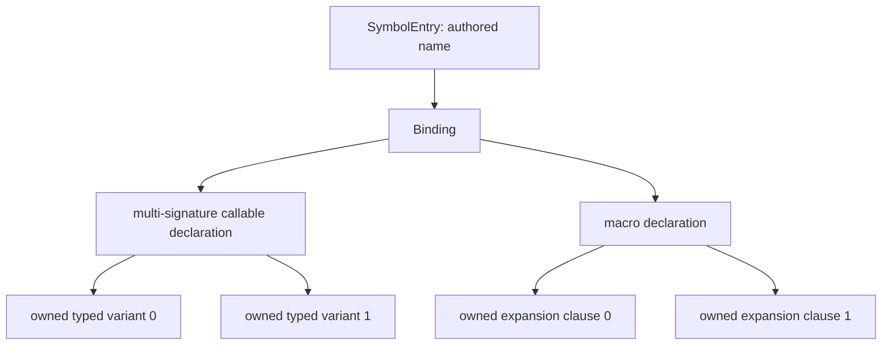

# The symbol table, clean sheet — the unified lifecycle contract

**Status:** PARTIALLY APPROVED TARGET (`/arch`; clarified by the user
**2026-09-02**). The layered `Binding -> Decl -> Callable -> Life`
representation, table-owned enforcement of lifecycle/slot transitions, and
module-atomic staged-to-live publication boundary are approved. Each visible
spelling also has one symbol-table entry containing its canonical binding (if
any) and all visible candidate references; there is no parallel trait-method
hash map. Integration chooses semantic commit policy; the table validates and
applies it, returning rather than dropping displaced compiled-code owners. The
overload/macro parent representation and the broader lifecycle-authoring
remainder remain under review. Packet B's per-spelling `NameCandidate`,
simplified `Binding`, resolution, and symbol-table candidate facade and Packet
A1's exact publication-transition facade were approved, realized, independently
reviewed and baselined on 2026-09-02. The
2026-09-01 Phase-2
direction authorized the unified model for planning, not those later details.
Originally the
S119 user-commissioned clean-sheet exercise (2026-07-27): *disregard legacy;
sketch the optimal symbol table structure that enables parsing to transition
through typechecking and monomorphisation with GOT assignment, across
poly/mono multi-sig defs, poly/mono trait impls, poly/mono primitives and
platform effects.* §§2–8 contain the proposed end-state design; §9 is the
proposed S121 migration contract. The approved layered representation remains
the one target: a crate needing a different representation returns to `arch`
rather than growing a local state vocabulary beside it.

**Executing-falsifier amendment (S121 C3, 2026-09-01).** C3's first compile
against private `symbols` proved that the stored machine had landed without
all of its authoring facade. Section 4.4 now binds the narrow checked-body,
callee, ownership and rollback funnels needed by the real Pass-2/finalize
order. Section 5.7 also adds the omitted `Decl::TraitMethod` facet: a trait
method declaration is callable syntax and dispatch metadata, but is not an
executable callable lifecycle. These are C1 completion, not a second machine.
The one new persisted facet rides the already-open schema-25 window; there is
no second schema increment and no platform-ABI change.

**Second executing-falsifier amendment (S121 C3, 2026-09-02).** The
field-accessor collision controls exposed a remaining false assumption: a
bare scope spelling is not always a storage key. A canonical accessor
`Box.v` plus its bare `v` alias may coexist with the method `HasV.v`; the impl
on `Box` is rejected, while the same method may dispatch for another target.
Section 5.7 therefore restores the already-specified trait-qualified storage
identity and adds its bare spelling to the one per-spelling candidate entry.
It does not add a trait-specific namespace or make one binding carry two
storage identities.

**Relationship to prior rulings:** `concreteness-types-first.md` §3's pinned
per-kind flip (`CallableSlot`/`CtorState` kind-field retypes) is **superseded
as a migration step** by this adoption — it was a strict waypoint of this
design and running it first would churn the same ~200 sites twice (§9). Its
invariant content (I-CONC/I-FRAME/I-EMIT, the witness-mint discipline, the
load-boundary re-check) is preserved: this machine is their representation.
The dormant `CtorState` enum (zero consumers at HEAD) deletes unwired in the
C1 change-set; `CallableSlot` + `mint_callable_slot`/`rebind` survive as the
funnel's interior and witness (§4.3).

**Verification statement.** Every factual claim about source was read at HEAD
during the S119 commission and is cited `file:line`; claims inherited from
prior documents were re-verified where load-bearing (the staging-GOT,
commit-gate, mono-registration, impl-check, and platform-loader citations
were all re-read). Re-checked 2026-09-01 (S121 Phase 3): `CallableSlot` +
`mint_callable_slot` live (`module.rs:75-78,699`), `CtorState` dormant with
zero out-of-crate consumers, `next_got_slot` still stored (`module.rs:146`),
`CACHE_SCHEMA_VERSION` at 24.

**Archive trigger:** the S121 C1-led wash lands; the contracts fold into
`module.rs` rustdoc + BC §7 + `interfaces.md`, then this file archives.

---

## 1. The two corrections, absorbed first

### 1.1 Infill-by-scan, re-evaluated against the right artefact

The §3.11 ruling-5 refutation argued from the **slab**: a null GOT pointer is
ambiguous between never-allocated and allocated-awaiting-population
(`got.rs:10-14` — workers write pre-assigned disjoint slots after allocation).
That refutation was correct about the slab and irrelevant to the proposal. The
user's model scans the **symbol table entries** for claimed slots: an entry in
a slot-carrying state claims its index whether or not the pointer is written
yet, so "allocated awaiting population" is claimed and the ambiguity does not
arise. **Conceded.**

What survives of the old argument, restated precisely: the scan's free set is
"claimed by no entry", but the safety condition for reuse is "**published** to
no caller" (Principle 22 — compiled callers and heap closures embed the raw
index; there is no un-publish event). The two sets differ exactly when an
entry **stops claiming a slot that callers still embed**. Is that reachable?
Yes — verified transitions, not hypotheticals:

1. **Concrete→template redefinition** (a fn redefined generic): the new entry
   is slot-less; the old slot is frozen with a trap pointer by the commit
   gate (`worker.rs:811-827` doc — "allocating a fresh live slot and freezing
   the old one"; `redefine.rs:399-418`). Post-freeze, no entry claims the
   slot. A scan would re-issue it to a *different* symbol, and stale closures
   would then call the wrong function — silently, which is worse than the
   trap they get today.
2. **`AbiChanging` redefinition** generally: fresh live slot, old slot frozen
   — same shape; today the freeze record lives int-side in the session
   retention pool (`redefine.rs:363` `mark_broken`;
   `design/int/session-transaction.md` §6–§7), invisible to any table scan.

So: **removal-with-live-callers is NOT impossible by construction, and the
scan model therefore needs a tombstone.** D11's
`NotDetermined { prior_slot }` is a tombstone for exactly one window — the
Pass-1→determination interstage — and expires at determination: if the
determination is "template", the slot leaves the entry and today leaves the
table's knowledge entirely. The durable answer is a **table-side retired-slot
record** (§4.3): every de-claiming transition is a *move* of the slot into it
(P22's "displacement is a move into the retention structure", applied to the
index itself, not just the `Code` Arc). With that record, claimed ∪ retired
IS the published set, the scan model is sound, and two stored artefacts
become derivable and delete: the `next_got_slot` cursor (`module.rs:146`) and
the platform loader's direct cursor write (`platform.rs:351`). Whether
allocation then infills gaps or takes max+1 becomes a policy detail with no
correctness content — the correctness lives in the claims-∪-tombstones
authority, which is re-derived from the table at every load. This is the
commission's "re-derived rather than inherited", and it is adopted (§4.3).

### 1.2 Churn discounted — the ModuleEntry-split decline, re-weighed

The §3.11 ruling-3 decline rested on two legs: resolution-vocabulary
coherence and churn. The user strikes the churn leg for the primary data
structure. Re-weighed on the coherence leg alone: the argument that survives
is **narrower than the decline it supported**. What is true (verified in
`crates/cranelisp-types/src/lifecycle.rs::Binding` and
`crates/cranelisp-types/src/lifecycle.rs::NameCandidate`) is that resolution
separates terminal declarations from candidate references and applies
visibility at the corresponding name layer. That is an
argument for keeping the resolution vocabulary SMALL and OUTERMOST; it was
never an argument for keeping today's **eight-variant flat enum**, which
mixes the three resolution states with five facet records (`TypeDef`,
`IntrinsicType`, `TraitDecl`, `TraitImpl`, `SpecialForm`) that resolution
treats identically. With churn discounted, the coherent conclusion is the
**three-arm outer layer with facets nested one level down** (§3) — the split
*in the opposite direction* from the one declined: fewer top-level variants,
not more. The kind×field dead-pairing debt conceded in ruling 3
(`Primitive`×`codegen_view`, `PlatformEffect`×`ast`/`code`,
`PrimitiveExtern`×`code`, `Macro`-parent×`codegen_view` —
`module.rs:1201-1358` fields × `module.rs:2148+` kinds) is cured here by the
lifecycle collapse (§4.2): the payloads move onto the states that use them.

---

## 2. Actors and functions (P21), and the axes they pull on

One record per name; these actors read/write it over its life:

| Actor | Function against the record |
|---|---|
| Parse/expand (frontend) | names the entity, fixes its syntactic role (defn / deftype / deftrait / defmacro / import / export) |
| Registration (typecheck pass 1) | creates the binding; provisional signature; redefinition displacement |
| Body check + generalisation (pass 2/3) | **settles** the scheme (P26 settlement point); determines concreteness class |
| Monomorphisation (pass 4) | demands instances from templates at concrete instantiations |
| GOT assignment | mints the callable slot for concrete callables; accepts manifest indices for platform effects |
| Codegen (backend) | consumes view + slot; writes the pointer into the slab |
| Session (int) | redefinition commit gate, freeze/retire, broken-marking, cache save/restore |
| Resolution (every stage) | name → binding; visibility; chain-follow; ambiguity; §8.6.4 |
| REPL introspection | read-only projections |

These pull on five distinguishable axes of the one record:

- **A. Binding axis** — terminal definition / alias / ambiguous (+ visibility).
  The only axis resolution reads.
- **B. Facet axis** — value-callable / type / trait / impl-record /
  special-form. What checking consumers dispatch on.
- **C. Origin axis** — who authored the body and what identity metadata it
  carries: plain defn, multi-sig clause, trait-impl method, minted instance,
  synthesised ctor/accessor, macro clause, Rust primitive, platform fn.
  Fixed at birth.
- **D. Lifecycle axis** — declared → settled(template | concrete) → slotted →
  compiled → retired/broken. The axis the commission wants legible; the axis
  every S82→S119 defect lived on.
- **E. Payloads** — scheme, body AST, view, slot, code, callees, summaries —
  each valid only in specific lifecycle states.

Today's structure nests these as A+B merged (flat `ModuleEntry`,
`module.rs:1192`), C+D merged per-kind (`DefKind` with `UserFnState` /
`CtorState` / `PrimitiveBody` / raw platform slot as four *different* partial
state vocabularies), and E flat on `Def` regardless of state (eleven fields,
several meaningless per kind/state). The clean sheet separates all five.

---

## 3. The outer layer — resolution's vocabulary, and nothing else

```rust
pub struct SymbolTable<C, L> {
    pub path: ModuleFullPath,
    symbols: HashMap<Symbol, SymbolEntry<C>>,  // PRIVATE — writes funnel (§4.4)
    retired_slots: Vec<RetiredSlot>,           // serde-visible tombstones (§4.3)
    got: Arc<GotTable>,                        // runtime slab, serde-skip — unchanged role
    // imports/exports/platforms/submodules (structural decls),
    // written_trait_impls, module_preamble, schema_version: unchanged
    // next_got_slot: DELETED — derived (§4.3)
    // next_seq: retained (authorship order allocator)
}

// Private implementation shape; approved 2026-09-02.
struct SymbolEntry<C> {
    binding: Option<Binding<C>>,
    references: Vec<NameCandidate>,
}

#[non_exhaustive]
pub struct NameCandidate {
    pub source: FQSymbol,
    pub visibility: Visibility,
}

#[non_exhaustive]
pub struct Binding<C> {
    pub visibility: Visibility,
    pub declaration: Decl<C>,
}

pub enum Decl<C> {
    Callable(Callable<C>),                     // the value namespace (§4)
    TraitMethod(TraitMethodRecord),             // unslotted dispatch declaration (§5.7)
    Group(Group),                              // overload base / macro parent (§5.4)
    Type(TypeRecord),                          // sum/enum TypeDef | IntrinsicType
    Trait(TraitRecord),
    ImplShell { trait_name: FQTraitName, impl_type: FQTypeName,
                impl_module: ModuleFullPath, methods: Vec<Symbol> },
    SpecialForm(SpecialFormRecord),            // root "" module only
}
```

`symbols` is the only name index. One private `SymbolEntry` owns everything
visible under its spelling: an optional canonical binding stored at that exact
key and zero or more terminal `NameCandidate` references. References copy no
scheme, declaration or lifecycle payload; they point directly to the owning
`Binding` and carry only scope-local facts such as visibility.

For example, `symbols["v"]` can contain the ordinary accessor edge to `Box.v`
and a candidate reference to `HasV.v`, while `symbols["Box.v"]` and
`symbols["HasV.v"]` own the canonical declarations. Qualification probes a
canonical key directly; unqualified resolution reads one per-spelling entry
and considers its candidates together. Imports, re-exports, overload clauses
and trait methods use this same mechanism rather than creating category-
specific maps.

The exact carrier was approved at the Packet-B public-API gate on 2026-09-02.
`BindingBody`, including its `Alias` and `Ambiguous` arms, is removed:
references carry aliases and imports, while ambiguity is a use-site
`ResolveError::Ambiguous` containing the surviving terminal identities. `View`
unions staging/live entries by canonical source; consumers cannot observe which
table supplied a candidate.

**Q5 answered.** Resolution receives one `SymbolEntry`, follows its candidate
references to canonical `Binding`s, and projects only the declaration facts
needed for the syntactic position. It does not select a separate ordinary or
trait-method namespace. The callable stop predicate remains one types-owned
projection over `Decl`; consumers do not re-pattern lifecycle variants.

Docstrings, `seq`, `param_names` live inside the `Decl` records that carry
them today (a `NameCandidate` keeps no seq; a documented re-export, if ever wanted,
is a spec question — not silently representable here).

---

## 4. The callable layer — ONE lifecycle machine

### 4.1 The record

```rust
pub struct Callable<C> {
    /// The authoritative scheme: provisional in `Declared`, settled after.
    /// Schemes may quantify — that was never the problem
    /// (`total-concreteness.md` §3.4); concreteness is read from `scheme.ty`.
    pub scheme: Scheme,
    pub param_names: Vec<Symbol>,
    pub docstring: Option<String>,
    pub seq: u64,
    /// Identity/metadata axis — fixed at birth, never state-dependent (§4.5).
    pub origin: CallableOrigin,
    /// Lifecycle axis — the state machine (§4.2).
    pub life: Life<C>,
}
```

### 4.2 The state machine (Q1)

```rust
pub enum Life<C> {
    /// Pass-1 interstage: signature registered, body not settled. Nothing may
    /// call it. `prior` is D11 GENERALISED: the redefinition displacement
    /// moved the previous entry's slot here (a claim AND a tombstone for the
    /// interstage window); the determination point rebinds or retires it.
    Declared { prior: Option<CallableSlot> },

    /// Settled NON-concrete: a monomorphisation source. Slot-less, view-less,
    /// never callable, excluded from codegen by construction (no field for
    /// either capability). Serialises and travels for cross-module mono.
    Template {
        body: TemplateBody,        // Ast(DefnVariant) | Synth(SynthSpec)
                                   // | UniformRust { abi_name: LinkerSymbol }
        kind: TemplateKind,        // Constrained(Box<ConstrainedMeta>) | Parametric
        callees: Vec<FQSymbol>,
    },

    /// Settled concrete: THE slotted state. Constructed only by the
    /// settlement funnel (§4.4), which checks concreteness, builds the view,
    /// and mints/rebinds the slot in ONE act.
    Concrete {
        slot: CallableSlot,
        realization: Realization<C>,   // §4.6 — names the slot's populator
        minted_from: Option<InstanceLink>,   // §5.2 — template back-link
        ast: Option<DefnVariant>,      // regen/introspection source
        callees: Vec<FQSymbol>,
        value_use: bool,
        mode_summary: Option<ModeSummary>,
    },

    /// Settled concrete, dispatched WITHOUT a slot — the two by-name classes.
    /// `Inline`: the only body is backend inline lowering at concrete sites
    /// (today's `PrimitiveBody::Inline`, `module.rs:2598-2603`); value
    /// position is served BELOW the table by the backend's span-keyed
    /// unit-local closure wrapper (`__wrap_…__`, `fn_as_value.rs`) whose
    /// body is the same inline lowering — no table entry, no mint (§5.5).
    /// `HostPromised`: by-name
    /// `Linkage::Import` against the key (today's `DefKind::PrimitiveExtern`,
    /// `module.rs:2291`).
    Inline {
        mode_summary: Option<ModeSummary>,
    },
    HostPromised,

    /// Recompile-failed under the session transaction: slot RETAINED and
    /// trap-stubbed, no valid body. Makes "slot alive, view gone"
    /// representable exactly once, with provenance — and keeps the slot
    /// CLAIMED for the §4.3 scan. (Today this state lives int-side in
    /// `redefine.rs::mark_broken` + the retention pool; the entry itself
    /// does not say it is broken.)
    Broken { slot: CallableSlot, error: BrokenProvenance },
}
```

Transitions (each a funnel method, §4.4):

```
declare ──────────────► Declared{prior: moved from displaced entry}
Declared ─settle_tmpl─► Template        (prior slot → retired_slots: the tombstone move)
Declared ─settle_conc─► Concrete        (slot = rebind(prior) | mint; view built HERE)
Template ─(demand)────► new entry: Concrete{minted_from}   (§5.2 — a birth, not a transition)
Concrete ─redeclare───► Declared{prior: Some(slot)}        (REPL redefinition)
Concrete ─mark_broken─► Broken{slot}                       (slot retained + trap)
Concrete ─commit gate─► AbiChanging: fresh live mint; old slot → retired_slots
births: install_extern / install_platform / install_inline / install_host_promised
        (primitives + platform: born settled, §5.5–§5.6 — no Declared interstage)
```

**One machine, not four.** Today's four partial vocabularies
(`UserFnState` `module.rs:2688`, `CtorState` `module.rs:838` dormant,
`PrimitiveBody` `module.rs:2578`, `PlatformEffect`'s raw mandatory slot
`module.rs:2246`) each solved a slice of the same problem, and every
population that arrived AFTER a vocabulary was designed grew a bespoke
bridge: the trait-impl `scheme::mono` launder (`impl_check.rs:1043`), the
mono-pass fabrication + hand-alloc (`monomorphise.rs:667`, `:680-688`), the
ctor hand-mints (`adt.rs:617-628`), the platform cursor write
(`platform.rs:351`). The uniformity IS the fix: every population settles
through the same funnel, so there is no seam left at which a fifth hand-mint
can grow. This is deliberately NOT maximal P20 — a per-origin state enum
would make e.g. `Declared × Ctor` unrepresentable — and §7 carries the honest
tier for that residual: origin×state legality is a single enumerated table
checked at the funnels and at the load boundary (the dead cells are all of
the "never constructed" polarity, not the dangerous
"constructed-and-misread" polarity that motivated P20's worked examples).

**D11 disposition: generalised, not replaced.** `Declared { prior }` is
D11's `NotDetermined { prior_slot }` with the same semantics (not a callable
capability; `callable_got_slot()` answers `None`), now serving every checked
population instead of `UserFn` alone. `redef_slots` and the
`existing_callable_slot` `or_else` delete exactly as the D11 ruling
specified.

### 4.3 Slot identity, re-derived (Q2 + correction 1.1)

Derive from the constraints that actually bind:

- The **index** must persist (cached `.o` relocations embed it) and the
  **pointer** must not (session state) → index serde-visible on entries,
  slab runtime-only. *(Forced by the cache contract.)*
- Slot ⇒ concrete; the determinant is the entry's settled scheme → the slot
  lives on the entry's `Concrete` state, beside its determinant. *(Re-derived
  — not by citing `GotTable`'s Clone-as-fresh, which a clean sheet could
  change, but because persisting a symbol→slot map beside slot-carrying
  entries would be a second serialised home for one binding (P7), and
  persisting it INSTEAD of entry-carried slots would split the capability
  from its determinant and re-open the S83-closed pairing. The slab stays a
  pure pointer array; nothing needs it to carry bindings.)*
- Published indices have no un-publish event (P22) → de-claiming transitions
  move the index into a table-side record:

```rust
pub struct RetiredSlot {
    pub slot: CallableSlot,
    pub reason: RetireReason,   // TemplateFlip{symbol} | AbiChanging{symbol} | ...
}
```

- **Allocation authority = claims ∪ tombstones, re-derived at construction.**
  Claims = slots on `Concrete`/`Broken`/foreign states ∪ `Declared.prior` ∪
  `retired_slots`. The mint computes against that set (in practice: derive a
  cursor/free-set once at table construction or cache load, maintain it
  in-memory; the *authority* is the scan, and the load boundary re-runs it as
  a uniqueness + `slot ⇒ is_concrete()` validation — the `CacheStale`
  precedent). Consequences: `next_got_slot` (`module.rs:146`) **deletes**
  (it was a stored cache of a derivable fact — P7); the platform loader's
  direct cursor write (`platform.rs:351`) **deletes** (manifest claims are
  ordinary claims, and a host allocation into a platform module cannot
  collide with them by derivation); infill of never-claimed gaps is *sound*
  under the tombstone rule, and whether to use it is policy, not
  correctness. The `__expr`/`__macro_*` churn case stays same-symbol
  rebind carry-forward, unchanged.
- Integration remains the semantic policy authority for redefinition classes
  and transaction timing *(forced by staging/commit concurrency: staged tables
  are parallel worlds whose slots are re-pointed at commit)*. A table-owned
  module transaction is the sole mutation authority: it validates the complete
  decision set, publishes all bindings and slot moves atomically, records
  `retired_slots`, and returns displaced `Code` owners for integration's
  retention pool. Index tombstones and executable-page retention remain the
  two owner-specific halves of the one P22 obligation.

`CallableSlot` (the witness, `module.rs:752`) survives unchanged as the
mint's return and the state fields' type; `mint`/`rebind` survive as the
funnel's interior.

### 4.4 Approved enforcement and publication boundary — A1 facade accepted

`symbols` becomes **private** (today `pub`, `module.rs:142`) and state
transitions flow through table methods that enforce four move invariants. The
user approved the enforcement boundary and staged/live transaction on
2026-09-02. Packet A1's exact publication and owner-conservation methods are
accepted; staged-authoring and born-settled methods outside A1 retain their
individual public-API gates.

1. **Slot conservation**: replacing/redefining an entry in a slot-carrying
   state moves the slot — into `Declared.prior` (redefinition) or
   `retired_slots` (template flip, AbiChanging freeze) — never drops it.
2. **Settlement atomicity**: `Concrete` is constructed only by
   `settle_concrete(name, scheme, view, …)`, which checks
   `is_concrete()`, builds/accepts the view, and rebind-or-mints in one act.
   This unifies the two producer orders that coexist today (single-sig
   slot-then-view `program/body.rs:293-298→:366-379`; mono view-then-slot
   `monomorphise.rs:655-694`) — the question `concreteness-types-first.md`
   §3.11 ruling 3 named for the successor commission is answered by making
   the order a non-question: both inputs are parameters of one constructor.
3. **Publication atomicity**: integration supplies each semantic decision that
   is not determined by the old and staged states. `PreserveAbi` applies only
   to two slotted generations. `ChangeAbi` retires the live callable's prior
   ABI generation: a staged slotted replacement receives a fresh slot, while a
   key wholly absent from staging has no replacement binding. Mere omission
   never removes a live binding; the absent-key transition requires the
   explicit decision. One table-owned module transaction validates the
   complete candidate before publishing any binding or slot move. A mutually
   recursive cluster cannot become half-live.
4. **Owner conservation**: publication, retirement, compiled-owner replacement
   and `Concrete -> Broken` return every displaced runtime-only `C` value to
   integration. Types owns lifecycle state but never chooses retention policy
   or silently drops the only owner of executable pages.

The publication capability is conceptually:

```text
live table + owned staging table + integration commit decisions
    -> published keys/slots + retired-slot records + displaced code owners
```

Integration classifies ABI compatibility and owns the transaction schedule.
Types verifies that the requested decision agrees with the old and staged
states, performs fresh/reused/retired slot moves, and commits the whole module
or none of it. Retirement to absence removes the binding, leaves its old GOT
pointer frozen, records the prior slot as `RetireReason::AbiChanging`, and
returns its owner in a `PublicationRecord` with `prior_slot: Some(_)` and
`published_slot: None`; the exact compiled-owner input still covers staged
concrete bodies only. A missing, non-callable or slotless target, a
`PreserveAbi`-to-absence request, a duplicate decision, or a locally dangling
candidate refuses the complete publication without mutation. External-module
staleness remains integration's dependent-cure responsibility; a valid private
macro-clause row cannot be a foreign name candidate. The semantic amendment
changes no carrier shape or method signature and therefore produces no
`public-api.txt`, serde-schema, backend or platform-interface delta. The exact
decision and outcome carriers remain at the public-API gate.

The generic birth funnels are not a mutation facade. C3 owns checked source
bodies whose final scheme and representation can change between Pass 2 and
finalization, and whose callees and ownership facts land at later canonical
sinks. The public facade needs role-specific operations
(all validate a candidate before mutating the table):

```rust
pub fn update_declared_scheme(
    &mut self,
    name: &Symbol,
    scheme: Scheme,
) -> Result<(), LifecycleError>;

pub fn settle_checked_template(
    &mut self,
    name: &Symbol,
    scheme: Scheme,
    ast: DefnVariant,
    kind: TemplateKind,
    callees: Vec<FQSymbol>,
) -> Result<(), LifecycleError>;

pub fn settle_checked_concrete(
    &mut self,
    name: &Symbol,
    scheme: Scheme,
    ast: DefnVariant,
    view: MonoDefnVariant,
    callees: Vec<FQSymbol>,
) -> Result<CallableSlot, LifecycleError>;

pub fn replace_callees(
    &mut self,
    name: &Symbol,
    callees: Vec<FQSymbol>,
) -> Result<(), LifecycleError>;

pub fn publish_body_ownership(
    &mut self,
    name: &Symbol,
    summary: ModeSummary,
    view: MonoDefnVariant,
) -> Result<(), LifecycleError>;

pub fn set_value_use(
    &mut self,
    name: &Symbol,
    mark: bool,
) -> Result<(), LifecycleError>;
```

`update_declared_scheme` accepts only `Life::Declared` and preserves its
`prior` claim. The two checked settlement methods accept `Declared`,
`Template { body: Ast(..) }`, or an ordinary
`Concrete { realization: Body, minted_from: None, .. }`. They are the one
Pass-2/finalize settlement seam: the final scheme, AST, view and current
callee set commit together; `Template ↔ Concrete` performs retirement,
rebind or mint inside the table; a changed concrete body clears compiled
code, value-use and ownership facts. They reject synthesized/uniform
templates, instances, extern shims and platform entries instead of widening
into arbitrary callable mutation. The lower-level declared-only
`settle_template` and `settle_concrete` have no production consumer outside
`cranelisp-types` and become private. Checked source settlement and the
genuinely consumed born-settled operations remain the proposed cross-crate
authoring surface.

`replace_callees` accepts settled Template or Concrete states, canonicalizes
the vector by storage identity (sort + deduplicate), and changes no other
field. `publish_body_ownership` accepts only an uncompiled Concrete Body: C3
clones the readable view, annotates its site facts, and submits the complete
replacement; the funnel stamps `view.mode_summary` and
`Life::Concrete.mode_summary` from the same `summary` in one act. The old
public `set_mode_summary`, which could make those twins disagree, retires.
`set_value_use` remains separate because it is a distinct boolean fact, but
returns a state-checked `Result` rather than silently ignoring a wrong target.

Whole-value non-callable replacement remains `install_binding`. Its symmetric
cleanup is deliberately restricted:

```rust
pub fn remove_non_callable(
    &mut self,
    name: &Symbol,
) -> Result<Option<Binding<C>>, LifecycleError>;

pub fn discard_declared(
    &mut self,
    name: &Symbol,
) -> Result<(), LifecycleError>;
```

The first refuses a callable and serves ADT pre-seed cleanup. The second
removes only `Declared { prior: None }`; it cannot drop a live or displaced
slot. Multi-sig checking keeps the annotated body out of the table until its
canonical mangled name is known, discards the slotless internal declaration,
then `declare`s and settles the canonical name. There is no generic callable
rename/remove and no provisional-slot reclamation convention.

The one legitimate retain-prior use is an unpublished C3 transaction:

```rust
#[must_use]
pub struct RetainedCallables<C: CodeStore = ()> { /* private */ }

pub fn retain_callables(
    &self,
    names: &[Symbol],
) -> Result<RetainedCallables<C>, LifecycleError>;

pub fn rollback_callables(
    &mut self,
    retained: RetainedCallables<C>,
) -> Result<(), LifecycleError>;

impl<C: CodeStore> RetainedCallables<C> {
    pub fn commit(self);
}
```

The opaque, non-`Clone`, non-serde token records table identity, each named
callable-or-absence, prior slot claims, and relevant tombstone status without
exposing a `Binding`. Rollback is all-or-nothing: it restores prior entries or
removes first-write entries and restores prior tombstone status. It refuses
to reclaim a newly minted slot if its GOT row is non-null or its body carries
compiled code; a token is an unpublished-check transaction, not an ABI
rollback primitive. Names must be unique, existing non-callables are refused,
and overlapping live tokens are caller error checked at the seam. This is the
method-sibling rollback needed by trait impl registration; live REPL rollback
continues to belong to the int transaction/commit gate.

**Executing acceptance.** C1 must plant owner tests named for these
discriminators (the exact module split is implementation-local):

- `declared_scheme_update_preserves_prior` and
  `checked_settlement_uses_final_scheme` — a provisional-concrete/final-
  generic body becomes Template without a slot, and the inverse becomes
  Concrete with exactly one claim;
- `checked_resettlement_is_atomic_and_moves_slots_once` — both
  Template→Concrete and Concrete→Template succeed, while an invalid view,
  scheme or origin leaves entry, claims and tombstones unchanged;
- `checked_body_rejects_synth_uniform_instance_and_foreign_realizations`;
- `replace_callees_canonicalizes_both_settled_states` and
  `ownership_publication_keeps_summary_twins_equal` (including annotated site
  facts, wrong-state no-mutation, and rejection after compiled code exists);
- `non_callable_remove_and_prior_free_declared_discard_are_narrow`;
- `retained_callables_roll_back_first_write_and_reimpl` plus
  `retained_callables_refuse_published_fresh_slot`;
- `trait_method_is_dispatchable_but_never_defined` and
  `trait_method_install_is_idempotent_and_conflict_checked`;
- `trait_method_uses_qualified_storage_and_shared_name_entry`,
  `accessor_and_method_candidates_coexist`, and
  `candidate_load_validation_rejects_missing_or_wrong_terminal`;
- `candidate_same_source_dedups_and_public_wins`,
  `distinct_sources_remain_candidates`, and
  `view_unions_candidates_without_source_duplicates`;
- `module_replacement_drops_candidate_entries_with_the_table` and
  `remove_non_callable_refuses_trait_and_trait_method_terminals`;
- `staged_impl_shell_rolls_back_absent_and_prior` and
  `staged_impl_shell_refuses_intervening_occupant`;
- `written_impl_upsert_is_one_per_key_and_writer_checked`.

The external-consumer compile-pass must construct `TraitMethodRecord`, install
and expose it through the approved general candidate facade, invoke both
checked settlement methods, callee/ownership publication, and type-check the
opaque retain/stage token flows. C3's
executing plants must then prove: finalization refreshes AST/view/scheme under
the same key; callee and ownership sinks use no raw map; a failed first impl
leaves no shell, method or writer row; a failed re-impl restores all three
priors; and success commits exactly one matching shell/record with all methods.
For this second falsifier C3 also plants: trait declaration succeeds beside a
unique `Box.v`/`v` accessor pair; `(v box)` and the bare value `v` keep the
accessor carrier; `(v int)` dispatches the one method; an impl of that method
for `Box` rejects without changing either canonical entry; a poisoned
two-accessor bare `v` remains ambiguous even when a method is also exposed;
`Trait.v` resolves as a first-class method and call; two visible method
candidates are ambiguous; local shadow and ordinary-definition collision keep
their prior verdicts; and a generic dispatch argument follows the deferred
method path without speculative-unification residue. C6's import plants cover
method-only specific/renamed import, parent-trait import, member/glob import,
re-export, private filtering, prelude fallback independent of an ordinary
accessor, same-terminal dedup, distinct direct-import rejection, and hot reload
removing obsolete candidate references.

Reads stay free (`get`, iterators, projections). Honesty (§7): Rust cannot
make dropping a `Copy` slot a compile error; the funnel is the
accessor-enforced tier for invariant 1, with the load-boundary uniqueness
scan as its standing seam check (P25 tier 3). Invariant 2 IS
representation-tier: outside the crate there is no other way to obtain the
state.

**Cross-crate record construction.** The public records stay
`#[non_exhaustive]`: adding diagnostic or declaration metadata must not force
an unrelated consumer-wide literal rewrite. That policy is viable only when
the crates which author a record have a deliberate construction path. C1
therefore publishes exactly these constructors alongside the funnels:

```rust
Group::overload(scheme, param_names, docstring, seq, members) -> Group
Group::macro_group(scheme, param_names, docstring, seq,
                   clauses_meta, macro_sexp) -> Group
TraitRecord::new(info, docstring) -> TraitRecord
TraitMethodRecord::new(scheme, param_names, docstring, trait_name)
    -> TraitMethodRecord
SpecialFormRecord::new(scheme, param_names, docstring, description)
    -> SpecialFormRecord
SynthSpec::new(variant) -> SynthSpec
ConstrainedMeta::new(constraints) -> ConstrainedMeta
BrokenProvenance::new(broken_by, message) -> BrokenProvenance
```

The intent follows ownership, not convenience: typecheck authors groups,
traits, trait-method dispatch declarations, synth recipes and
constrained-template metadata; primitives authors special-form declarations;
int authors broken-state provenance. There is no
public `Callable` or `RetiredSlot` constructor and no general `Group::new`:
the table funnels own callable state/slot conservation, retirement stays a
table transition, and the two group constructors make the only legal group
kinds explicit. `ImplShell` remains constructed inside types by
`enrol_written_trait_impl`. A types integration test compiled as an external
consumer must construct every record above and route the resulting values
through their public `Decl`/`TemplateBody`/`TemplateKind`/`mark_broken`
surfaces; in-crate unit construction is not evidence for this boundary.

### 4.5 Origins — identity metadata, orthogonal to state

```rust
pub enum CallableOrigin {
    Plain,                                                    // ordinary defn
    Clause { group: Symbol },                                 // multi-sig clause
    TraitMethod { shell: FQSymbol, trait_name: FQTraitName, impl_type: FQTypeName },
    Ctor { type_name: FQTypeName, tag: usize, field_count: usize,
           internal: bool, type_def: Option<Box<TypeDefInfo>> },   // dual facet as today
    Accessor { type_name: FQTypeName, field: Symbol },
    MacroClause { group: Symbol },
    RustPrimitive,                                            // hand-written body
    PlatformEffect { scheduling_class: SchedulingClass, poll_shape: bool },
}
```

Origin answers "what is this and how is it displayed/pattern-matched/
scheduled"; `Life` answers "where in the pipeline is it and what can be done
with it". A ctor's tag is origin (needed in Template AND Concrete states); a
platform effect's scheduling class is origin (fixed by the manifest); the
trait-method shell pointer is origin. Nothing in `origin` changes across a
lifecycle transition — which is precisely why it must not live inside the
state enum (today `Constructor`'s metadata and its slot share one variant,
forcing the dormant `CtorState` wedge).

### 4.6 Realization — every slot names its populator

```rust
pub enum Realization<C> {
    /// Backend emits this body; codegen writes the pointer.
    Body { view: MonoDefnVariant, #[serde(skip)] code: Option<C> },
    /// Registration stored a hand-written Rust extern shim at the slot
    /// (today's `PrimitiveBody::Extern`), with the optional borrowed sibling.
    ExternShim { borrowed_sibling: Option<CallableSlot> },
    /// The DLL populated the slot (manifest order; the module's GOT wraps the
    /// DLL slab in place — `platform.rs:333-346`).
    Dll,
    /// A per-instantiation facade over ONE uniform hand-written body — the
    /// backend realises it as a name-alias (I-EMIT §1.2,
    /// `catch-runtime-error`). Changing realization per-instance later is a
    /// backend-local change with zero tree change.
    FacadeOf { abi_name: LinkerSymbol },
}
```

`Realization` is the P21/P22 record the slab lacks: for every claimed slot,
*who writes the pointer* is on the entry. `defined_symbols()` — the codegen
manifest — becomes the trivial projection "`Life::Concrete` with
`Realization::Body`": the Decision-22 predicate's `ast.is_some()` +
kind-exclusion conjunction (`module.rs:1152`) and the S120 D6
`is_concrete()` conjunct are all subsumed by construction.

---

## 5. The populations, one by one

### 5.1 Poly and mono single-sig defs

`(defn f …)`: `declare` → body check settles → concrete: `settle_concrete`
(view + mint); non-concrete: `settle_template(Ast(body),
Constrained|Parametric)`. Exactly today's `UserFnState` semantics with D11,
plus view/code relocated into the state that owns them.

### 5.2 Templates vs instances (Q3)

An instance is a **new entry born `Concrete`**, structurally linked:

```rust
pub struct InstanceLink {
    /// Selected template binding, overload arm or macro clause.
    pub template: CallableTarget,
    /// Complete substitutions in first structural occurrence order.
    pub type_args: Vec<ConcreteType>,
}
```

The collectors send `MonoDemand { template: CallableTarget, type_args, site }`
to the minter. The target comes from the recorded resolution verdict, never a
written spelling; the minter reads the selected callable at its defining home
(P24). `InstanceLink::from_type_args` and `MonoDemand::from_type_args` require
the complete substitution vector. Its ordering and settlement contract is
canonical in [interfaces.md](interfaces.md) §Instance identity funnel.

Deduplication uses `(template, type_args)` per registering module. Instances
register in the **demanding** module through `current_symbol_table_mut` (P17),
while body rechecking uses the template's defining scope. The same link survives
collection, rechecking and publication. `InstanceLink::instance_key()` alone
encodes its derived storage key; no probe reconstructs identity from value
parameters or generated names. Thus a repeated variable has one substitution
position, and different result-only substitutions identify different instances
even for a nullary call. The link also identifies corresponding instances across
modules without deriving that relationship from a spelling.

That “minted ONCE” rule is a facade property, not caller discipline. The
ordinary concrete paths have no instance back-link parameter:
`settle_concrete(name, realization, ast, callees)` settles a declared
callable and `install_concrete(name, …)` installs a non-instance born-settled
callable, both with `minted_from: None`. Instances use the separate funnel:

```rust
pub fn install_instance(
    &mut self,
    link: InstanceLink,
    scheme: Scheme,
    param_names: Vec<Symbol>,
    docstring: Option<String>,
    seq: u64,
    origin: CallableOrigin,
    realization: Realization<C>,
    ast: Option<DefnVariant>,
    callees: Vec<FQSymbol>,
    visibility: Visibility,
) -> Result<(Symbol, CallableSlot), LifecycleError>
```

`install_instance` derives `key = link.instance_key()` inside
`cranelisp-types`, installs under that key with
`minted_from: Some(link)`, and returns the key with the slot so the caller
never reconstructs either identity. The single private lifecycle validator
checks every `Life::Concrete { minted_from: Some(link), .. }` against the
binding's actual table key. It runs before a candidate install mutates the
table and again from `validate_lifecycle()` after clone/deserialisation; a
mismatch is `LifecycleError::InstanceKeyMismatch { symbol, expected }` and a
restored mismatch is cache-stale. Required negative plants cover both seams:
an internal mismatched install candidate is rejected without mutation, and a
tampered serialised/restored binding key is rejected at validation. The
positive funnel pin asserts returned key = `link.instance_key()`, the stored
back-link is the supplied link, and ordinary concrete installs cannot supply
one. This strengthens schema-25 validation only: it changes no serialised
shape and takes no second schema or platform-ABI bump.

Templates persist and travel as `Life::Template` — serde-visible body +
scheme, no slot to misuse, no view to fabricate. **A missed mint is loud by
construction**: the template has no slot for the call to fall silently
through (the mechanism that made 0935 invisible — `mono_collect.rs:592`'s
written-spelling push declining at `monomorphise.rs:1171`'s raw probe while
the template's slot absorbed the call).

### 5.3 Declaration families — one authored name, one binding

**Approved direction, 2026-09-04; exact Rust API remains at the inter-crate
user gate.** A multi-signature `defn` and a `defmacro` share one ownership
invariant: one authored declaration creates one module binding, and that
binding owns its complete ordered family of variants or clauses. An arm is a
compiled artifact of its owner, not another language binding under a generated
`Symbol`.



The shared architecture stops at ownership and publication:

- the authored binding owns family documentation, declaration order and the
  complete arm roster;
- each arm owns the lifecycle or compiled artifact required to execute that
  arm;
- a typed internal arm identity, not a mangled language `Symbol`, travels from
  selection to the consumer that needs the body;
- the whole family validates and publishes atomically; and
- resolution, imports, exports, search and ordinary introspection see only the
  authored binding. Introspection may project arm signatures through that
  binding.

Multi-signature functions and macros are **not** one semantic declaration
kind. A multi-signature function participates in HM inference and selects a
typed variant during typechecking. A macro has no language-value scheme and
selects a syntax clause during expansion. They therefore receive distinct
declaration records and may share only private arm-ownership/publication
machinery. The former `Group` abstraction is not the target: its common
`scheme` and `param_names` fields force meaningless placeholder data onto a
macro declaration.

#### Multi-signature realization

The one binding owns every settled variant signature and its executable or
template body state. Typecheck selects from that complete roster and records a
typed owner-plus-arm identity on the resolution carrier. A variant is not
looked up as a second module symbol. Concrete specialization of a polymorphic
variant remains linked to that selected arm; the exact link and consumer
facade are part of the held public-API packet.

This structure makes the already-approved whole-family redefinition rule
direct: validation compares complete rosters, failure retains the complete old
binding, and success replaces one binding while conserving every displaced
slot owner.

### 5.4 Macros

The one macro binding owns its docstring, authored source, ordered clause
patterns and every compiled clause artifact. Expansion selects an owned clause
and invokes its private artifact. A clause has no independently resolvable,
importable, searchable or qualified language name; any backend/JIT label is an
implementation artifact below name resolution.

A successful macro checkpoint publishes this one complete declaration. Clause
shrink/growth is ordinary replacement of its owned roster, so no parent/child
symbol-table reconciliation or guessed-name validation is required. Cache
validation checks the one aggregate record. The exact serialized shape,
owner-conserving replacement result and cross-crate read facade remain held for
explicit user review before implementation.

### 5.5 Poly and mono primitives (declared, hand-written bodies)

- **Concrete extern** (~50 entries, `declarations.rs`): born
  `Concrete { slot: mint(scheme), realization: ExternShim }`. The mint takes
  the declared scheme — a polymorphic extern with a slot is **uncompilable**,
  which retires the `vec-len` transitional licence structurally: it re-kinds
  to `Life::Inline` — **settled 2026-09-01**, `total-concreteness.md` §3.2,
  which also rejects the uniform-body-template alternative below for this
  row. The flip is therefore a precondition of this install conversion, and
  its stream ordering (C4 dormant arm → C5 flip) is ruled there.
- **Inline family**: `Life::Inline`. Value position does **not** mint a
  table entry *(corrected 2026-09-01 — this bullet previously claimed it
  rides `Concrete { minted_from }` instances through the §5.2 machinery.
  Unsupported: §5.2 is template-keyed end-to-end — the demand carries
  `template: FQSymbol` and the mint probes the template's table —
  `Life::Inline` carries no `TemplateBody` and no `abi_name`, and no
  `Realization` variant has a producer for such an instance; C5 finding,
  `design/primitives/s121-c5-primitives-visit.md` §3.5/H5)*. The serving
  mechanism is **below the table**: the backend emits a span-keyed
  unit-local closure wrapper (`__wrap_{name}_{disc}{start}_{end}__`,
  `fn_as_value.rs:154-162`) whose body is the same inline lowering
  (`vec_codegen.rs::emit_vec_query_into` for the Vec family), routed by the
  kind-keyed `is_inline_primitive_at` test — an emission artifact like
  `__lambda_…`, never a symbol-table entry, so the machine stays total over
  table entries with no state owed for it. An inline name whose wrapper body
  has no arm is a located `CodegenError` refusal, never a wrong body. If a
  table-entry representation is ever wanted for these wrappers, it needs a
  new `Realization` producer designed by C1 with its backend consumer — a
  filing to `arch`, not an assumption of §5.2.
- **Polymorphic hand-written body** (`catch-runtime-error`): `Life::Template
  { body: UniformRust { abi_name }, kind: Parametric }`. Instantiation
  demand mints `Concrete { realization: FacadeOf { abi_name }, minted_from }`
  facades — I-EMIT §1.2 lands IN the representation: the realization roster
  (NC-R re-labelled) is the enumeration of `UniformRust` templates, pinned by
  a trivial projection instead of a hand-maintained set.
- **Host-promised** (`discover-tests`): `Life::HostPromised`, by-name import,
  no slot — unchanged in substance.

### 5.6 Platform effects (DLL-manifest-owned indices)

Born `Concrete { slot: manifest-order mint, realization: Dll }` with
`origin: PlatformEffect { scheduling_class, poll_shape }`. The manifest-order
mint claims index *i* for descriptor *i* against the parsed FQ signature —
which must be concrete, so 0933's refusal is the mint's own `NotConcrete`
arm, located at the descriptor. "Slot i == descriptor i" is assertable at
load as a mint-order invariant; the DLL slab wraps in place as the module's
GOT exactly as today (`platform.rs:333-346`); the direct cursor write
(`platform.rs:351`) has nothing left to do (§4.3). One index space, two
allocation authorities, both expressed as mints — the §3.11 ruling-4
conclusion, now carried by the representation.

### 5.7 Trait impls, poly and mono, including HKT

The method named by a `deftrait` is not an implementation body and never
enters `Life`. It is a resolution/type-inference terminal with the reverse
identity dispatch needs:

```rust
#[non_exhaustive]
pub struct TraitMethodRecord {
    pub scheme: Scheme,
    pub param_names: Vec<Symbol>,
    pub docstring: Option<String>,
    pub trait_name: FQTraitName,
}

impl TraitMethodRecord {
    pub fn new(
        scheme: Scheme,
        param_names: Vec<Symbol>,
        docstring: Option<String>,
        trait_name: FQTraitName,
    ) -> Self;
}

impl<C: CodeStore, L: LinkerStore> SymbolTable<C, L> {
    pub fn install_trait_method(
        &mut self,
        method: Symbol,
        record: TraitMethodRecord,
        visibility: Visibility,
    ) -> Result<(), LifecycleError>;

    pub fn expose_candidate(
        &mut self,
        local_name: Symbol,
        source: FQSymbol,
        visibility: Visibility,
    ) -> Result<(), LifecycleError>;

    pub fn name_candidates(&self, name: &Symbol) -> Vec<NameCandidate>;

    pub fn all_name_candidates(
        &self,
    ) -> impl Iterator<Item = (&Symbol, NameCandidate)>;

    pub fn public_name_candidates(
        &self,
    ) -> impl Iterator<Item = (&Symbol, NameCandidate)>;

    pub fn validate_name_candidates(
        &self,
        tables: &SymbolTables<C, L>,
    ) -> Result<(), LifecycleError>;
}
```

`all_name_candidates` is the read-only private+public terminal projection used
by cache dependency discovery; `public_name_candidates` filters it. The
primitive birth funnels accept `mode_summary: Option<ModeSummary>` immediately
before `visibility`; extern stores it in `Life::Concrete`, inline stores it in
`Life::Inline`, and `Binding::mode_summary` projects both. These realization
corrections were explicitly approved on 2026-09-02.

`install_trait_method` first requires `record.trait_name.module == table.path`,
derives `canonical = member_key(record.trait_name.name, method)`, and validates
the whole candidate before mutating: `symbols[canonical]` owns
`Decl::TraitMethod(record)`, and `symbols[method]` gains a general candidate
reference to `{table.path, canonical}`. Repeating the same canonical
record/reference is a no-op; a divergent canonical occupant or same-source
candidate with divergent visibility is rejected without either change landing.
The ordinary accessor candidate under `symbols[method]` is retained beside the
method candidate. Import/re-export exposure adds no declaration and accepts
only a caller-resolved canonical FQ. Repeating the same source deduplicates,
with `Public` dominating `Private`; distinct sources remain candidates.
The import owner retains §8.6.4 policy: a direct second same-name method import
is rejected before this funnel, while visibility through multiple parent
traits produces the call-site method ambiguity required by §7.4.2a.

`Decl::TraitMethod(record)` and `Binding::trait_method()` therefore occur only
at the canonical `Trait.method` terminal. They preserve the method's
scheme/arity/documentation and canonical trait home; `defined_symbols` never
emits them. The per-spelling candidate state is serialized in schema 25 and
load validation requires every method candidate to reach a payload-identical
`Decl::TraitMethod`,
with source symbol `member_key(record.trait_name.name, method)` in
`record.trait_name.module`; duplicates are rejected or canonicalized
deterministically. This is still the one open 24->25 shape change, with no
second bump and no platform ABI effect.

Validation has two keyed tiers. `SymbolTable::validate_lifecycle` validates
entry/candidate shape and every locally-owned source against the same table. The
cache/session restore boundary, after dependency tables are present but before
publication, validates imported/re-exported sources by direct `(module,
symbol)` probe and requires the terminal record's trait home/member key to
match; missing, aliased, non-method or mismatched terminals are cache-stale.
No load path reconstructs candidates by scanning trait records. Removing or
replacing a module removes its declarations and candidate entries together. A
same-module retry is identical-idempotent;
a changed hot reload builds a fresh staging table and swaps it only at the
existing module transaction boundary. `remove_non_callable` must reject
canonical trait-method records and trait records that expose method candidates,
so no per-symbol cleanup can strand the index.

Resolution is keyed and position-aware:

- `Trait.method` resolves the trait head once, probes the canonical member key
  in that trait's home, and bypasses bare ambiguity, exactly like `Type.member`.
  The existing dotted-member core widens from a type-only head to a
  type-or-trait head; it never scans traits.
- A bare value or call starts local-first and reads one per-spelling candidate
  set. Type information may select one compatible callable; if more than one
  remains viable, resolution reports ambiguity and qualification selects the
  canonical target directly. The exact value-position and non-callable rules
  remain part of the candidate API/spec review; no trait-only fallback path is
  introduced.

The call resolver performs candidate filtering before committing callee-scheme
unification: it derives the available argument facts, checks candidates in
isolated inference state, chooses one surviving candidate, then instantiates and
unifies that candidate once. It must not speculatively unify candidates into
shared substitution state. Nullary, partial-application and unresolved-generic
rules remain at the candidate specification gate.

The C3 caller conversion is finite: `register_trait_decl` and its HKT sibling
continue to call `install_trait_method` but stop assuming the bare key is the
record; `lookup`/`infer_var` read the shared per-spelling candidate entry;
`infer_apply`/auto-curry/deferred settlement share the call-candidate rule
above; `method_to_trait*`, `is_trait_method*`, HKT-index and Self-return reads
start from the selected general candidate reference and direct-probe its
canonical record;
`record_reference_target` records that canonical FQ; and the dotted-member
core accepts a `TraitRecord` head as well as a `TypeRecord` head. The present
`find_trait_method_decl_in_module` trait-record scan deletes: once a method
record supplies `trait_name`, any extra signature metadata is read from that
one keyed trait record and named member.

Encoding a trait method as permanent `Life::Declared`, fabricating a
`CallableOrigin::TraitMethod` shell/type, scanning `TraitRecord`s by method
name, storing the method only at the bare key, widening `BindingBody`, or
inventing an empty `TemplateBody` are forbidden. Each loses a real distinction,
breaks `Trait.method`, or creates an unkeyed resolver.
The `(impl Trait Type …)` split survives: discovery shell
(`Decl::ImplShell`, at the trait's home, D45 as amended) + writer-side
persistence (`written_trait_impls`, FIXME 0869 carrier) + method
entries in the **writer's** module. The change is that method entries join
the ONE machine with `origin: TraitMethod { shell, … }`:

- a mono impl's method settles `Concrete` through the same funnel as any
  defn;
- an HKT/generic impl's method whose settled type retains residuals settles
  `Template` — **the `scheme::mono` fabrication at `impl_check.rs:1043`
  becomes uncompilable** (there is no way to construct `Concrete` around a
  non-concrete scheme; the witness mint refuses), and per-instantiation
  demand mints instances via §5.2, with the `minted_from` link preserving
  which impl the instance realises.

Trait-method dispatch reads the shell → member storage identity → carrier,
all keyed (P24), unchanged in direction from `backend-keyed-consumer.md`.

Fresh impl registration needs a provisional shell visible while default and
sibling calls are checked, but restore enrolment must keep its strict
idempotent/conflict semantics. They therefore use different role-specific
operations over the same shell representation:

```rust
#[must_use]
pub struct StagedImplShell<C: CodeStore = ()> { /* private */ }

pub fn stage_trait_impl_shell(
    &mut self,
    record: &WrittenTraitImpl,
) -> Result<StagedImplShell<C>, CranelispError>;

pub fn rollback_trait_impl_shell(
    &mut self,
    staged: StagedImplShell<C>,
) -> Result<(), CranelispError>;

impl<C: CodeStore> StagedImplShell<C> {
    pub fn commit(self);
}

pub fn upsert_written_trait_impl(
    &mut self,
    record: WrittenTraitImpl,
) -> Result<(), CranelispError>;
```

`stage_trait_impl_shell` derives the key with `trait_impl_key`, validates the
record, installs the candidate in the trait home and retains an absent,
identical or divergent same-key prior shell in an opaque, non-replayable
token. It refuses a non-shell occupant. Rollback first verifies that the
candidate still occupies that key, then restores the prior shell or removes
the first impl; it never silently clobbers an intervening write. The cache
restore path continues to call `enrol_written_trait_impl`, where a divergent
shell is a hard error rather than a provisional re-impl.

`upsert_written_trait_impl` runs on the writer table, validates
`record.impl_module == table.path`, a non-empty method list and uniqueness by
`trait_impl_key`, then replaces the same-key row in place or appends once.
Validation failure is non-mutating; registration order stays deterministic.

The transaction order is binding. C3 derives one `WrittenTraitImpl`, retains
the writer's mangled method callables with §4.4's token, stages the trait-home
shell, and checks every method. Failure rolls back method entries and then the
shell; the prior writer record was never touched. Success settles all method
entries, calls `upsert_written_trait_impl` as the final fallible table act,
then consumes both tokens with `commit`. An upsert refusal still rolls back
methods and shell. Thus a temporary staged candidate may coexist with the
prior writer record while checking, but no observer can see that staging
world at a cluster commit boundary; every commit has the required
record ↔ shell bijection. Deferring the writer upsert until method success is
what makes record rollback unnecessary, not an exception to the invariant.

### 5.8 Synthesised constructors and field accessors

Born at `deftype` synthesis, settled immediately (no `Declared` interstage —
a funnel-enforced dead cell, §7): concrete ADT → ctor + accessors
`Concrete { realization: Body(synth view) }`; generic ADT →
`Template { body: Synth(SynthSpec) }`, where `SynthSpec` is the declaration
payload the A-MINT re-synthesiser runs at concrete args (the §2 experiment's
lesson: instances must be built with real concrete node types, so the
template stores the *recipe*, not a placeholder view). The product-type dual
facet stays as origin metadata (`Ctor { type_def: Some }`); member bare
spellings such as `v` expose canonical `Bx.v` through the general candidate
entry installed by the member glob. This replaces `BindingBody::Alias`
everywhere.
`IO.Bind` is a `Template` with `internal: true` origin — the
0934 payload-glue word stamps at its (always-concrete) construction sites.

`build_adt_entries<C: CodeStore>` returns `AdtEntrySpec<C>`: callable arms are
slotless recipes and non-callable arms carry `Binding<C>` for direct insertion
into the target `SymbolTable<C, L>`. The code-store parameter types the result
envelope only; it does not authorize slot minting or callable construction.
Keeping the envelope fixed at `Binding<()>` would force a cross-crate consumer
to unwrap and rebuild a binding because the conversion is types-private — a
facade defect, not consumer policy. The generic signature is therefore part of
the C1 boundary and its existing public-API baseline regeneration; it changes
neither the cache schema nor the platform ABI.

### 5.9 Imports, aliases and candidate entries

Imports, re-exports, overloads and trait-method visibility all add canonical
references to the same per-spelling `SymbolEntry`. A bare accessor and method
candidate coexist without overwriting or poisoning one another. Import
collection enumerates one symbol map and chain-follows each candidate once to
its canonical terminal, preserving the existing distinctions:
direct same-local-name imports from distinct terminals are a §8.6.4 error;
multiple same-named methods made visible through their parent traits are a
§7.4.2a call-site ambiguity; a pre-existing non-accessor ordinary definition
still rejects the incoming bare import. The §3.11 ruling-5 verification stands:
no slot is orphaned by a name going ambiguous because all member slots remain
at their defining-side canonical keys.

Import projection is syntax-sensitive but not scan-based. Importing a parent
trait projects the named methods from its `TraitRecord.info.methods`; a method
member glob does the same. A specific bare method import requires exactly one
visible source-table candidate and projects its already-canonical FQ; a
specific `Trait.method` resolves the parent and canonical member directly.
Glob import enumerates public candidates from the source table's entries.
Re-export performs the same operation with public local visibility. Prelude
fallback queries the same per-spelling entry shape in the current module and
then the prelude under the established fallback rule. Qualified
`module/name` selects the one named module directly; inside it, a non-canonical
local spelling returns that module's complete public candidate set, while
canonical terminal and dotted-member spellings probe their canonical keys
directly.
Import/re-export exposures copy terminal FQs, so no resolution universe walk is
added.

---

## 6. What becomes structurally impossible (Q4)

Each row names the defect history it retires. "Structural" here means *no
representation exists*; §7 grades the residuals honestly.

| # | Impossible state/act | Today's guard | History it retires |
|---|---|---|---|
| 1 | A slot on any non-concrete entry — kind-free, population-free (`Template`/`Declared`/`Inline`/`HostPromised` have no slot field; `Concrete` requires the witness) | per-kind states + transitional licences (generic ctors, `vec-len`) + NC-1 sweep | S82 0354, S84 `(Box a)` SIGSEGV, S119 census F1/F2 |
| 2 | Hand-minting a slot around the check (`allocate_got_slot` + literal state construction) | mint helper discipline; `allocate_got_slot` still `pub` (`module.rs:1059`) | the two hand-mints; `impl_check.rs:1043` + `monomorphise.rs:667` launders |
| 3 | A silent dispatch through a template (the un-minted call "works") | none — the template HAS a slot today | FIXME 0935's invisibility; FIXME 0381's 317× backstop |
| 4 | Composing an instance/storage identity from a written spelling (demand + link fields are carrier-read storage FQs; the mangled name is derived once, at registration) | comment discipline (`mono_collect.rs:574-576`) — violated one line below itself | 0620 class, 0935, the renamed-import sibling |
| 5 | The template↔instance relation existing only as a string | name-only (`build_mangled_name`) | 0935's collector/mint identity split |
| 6 | A view or `code` on a template / group / platform / extern entry (kind×field dead pairings) | unread-by-convention flat fields | ruling-3's conceded P20 debt |
| 7 | A slotted overload base or macro parent | slot lives on `Def` kinds they happen not to take | latent |
| 8 | Concrete-without-view for backend-emitted bodies (`Realization::Body` carries the view non-optionally; settlement is atomic) | `Option<MonoDefnVariant>` + a located backend `expect` | the "codegen-reached entry with view None" backstop |
| 9 | A dropped slot claim at redefinition (displacement funnels move it into `Declared.prior` or `retired_slots`) | `redef_slots` external stash + commit-gate discipline | FIXME 0479's third missed displacement site; the S82-class drift |
| 10 | Slot allocation colliding with a manifest slot, or the cursor drifting from the claims (allocation authority derived from claims ∪ tombstones) | stored `next_got_slot` + the `platform.rs:351` direct write | the fifth-writer under-count (§7 item 3 of `concreteness-types-first.md`) |
| 11 | Re-issuing a published-but-unclaimed index (freeze = a move into `retired_slots`, visible to the allocation scan) | int-side retention pool only — invisible to the table | the §1.1 scan-model residual; P22's register |
| 12 | "Broken" being invisible in the store (slot alive, no body, no provenance) | int-side trap-stub + registry | S45 embedded-original-error; session-transaction §6 |
| 13 | A polymorphic extern primitive holding a slot (mint refuses the declared scheme) | transitional licence + roster pin | `vec-len` (0932); the I-ABI roster's licence class |
| 14 | A fabricated "concrete" scheme entering the store as concrete (settlement funnel takes the scheme through the witness check; `scheme::mono` over a residual type cannot reach `Concrete`) | R-4/R-18 census + CS-1 helper discipline | the HKT fabrication; R-13's family |

And two loudness conversions (not impossibility, but structural failure-mode
upgrades): a missed mint is a missing-slot hard failure (row 3's dual); a
cache restored against the new shape re-derives the slot authority and
validates uniqueness + concreteness + origin×state legality at the load
boundary (`CacheStale`, never trust — P25 tier 3).

## 7. What remains checked, honestly (the residual ledger)

- **Serde and `Clone` bypass every funnel** (unchanged from §3.2's ladder):
  a slot can in principle be cloned beside a different scheme. Tier 1
  by-accident-unconstructable (witness + funnels), tier 3 load-boundary
  re-derivation + validation, tier 5 the NC-1-successor sweep (now the
  trivial projection "every slot sits in a `Concrete`/`Broken`/foreign state
  whose scheme is concrete").
- **`CallableSlot` is `Copy`; Rust cannot force a moved-out claim to be
  used.** Slot conservation (funnel invariant 1) is accessor-tier; the
  standing check is the load/commit uniqueness scan. Named as a fallback per
  P20, with the funnel as the bridge.
- **Origin×state dead cells** (`Declared × RustPrimitive`,
  `Inline × Plain`, …): funnel-enforced + one enumerated legality function
  asserted at the funnels and the load boundary. Deliberate P6 trade against
  a per-origin state-enum family (§4.2); all dead cells are of the
  never-constructed polarity.
- **Staging clones duplicate claims by design** (a staged table is a
  parallel world; its slots are re-pointed at commit — `worker.rs:811-827`).
  Integration decides commit policy; the table-owned module transaction is
  the sole mutation arbiter and the funnels apply on both sides.
- **Retained-callable rollback is pre-publication, accessor-enforced.** The
  opaque token cannot prove a caller has not published a fresh GOT row. The
  rollback therefore checks the fresh row is null and the body carries no
  compiled code before reclaiming it; otherwise it refuses without mutation.
  Live redefinition rollback remains int-owned. This is P25 tier 3 seam
  enforcement, not a claim that Rust's type system owns transaction time.
- **Demander-local instance duplication** across modules is accepted (P17);
  the `InstanceLink` makes it visible and reversible later.

## 8. Constraints: forced vs incumbent

**Genuinely forcing** (named per the commission): the cache round-trip
(indices persist, pointers don't) → serde split as designed; the
`__cranelisp_got_primitives` link symbol (`got.rs:88-120`) → static-backed
slabs stay; P22 published-index permanence → tombstones + rebind-only reuse +
freeze-on-retire; staging/commit concurrency → integration owns semantic
classification while the table transaction owns live mutation; per-module GOT
ABI (`got_base + slot*8` in every mode, P11) → one index space.

**Incumbent only — dropped by this design**: the `pub symbols` map; the
stored `next_got_slot` cursor; `redef_slots`; the four fragmented state
vocabularies; name-composed instance identity; `GotTable`'s poverty as an
*argument* (it stays poor, but nothing any longer cites its Clone/serde
behaviour as the reason a register can't exist — the reason is P7 + the
determinant argument, §4.3).

## 9. The S121 migration proposal — candidate and A1 publication facades approved

**What survives of the landed work — all of it, in role if not in spelling:**
`CallableSlot` + `mint`/`rebind` (the funnel's interior and witness);
D11 (generalised into `Declared.prior` — same semantics, wider population);
`CtorState` (subsumed: its two states ARE `Template`/`Concrete`; the dormant
enum **deletes unwired** in the C1 change-set — it acquired no consumer);
`ctor_field_types_at`; `WrittenTraitImpl` + enrolment;
`got_data_symbol_name`; the S119 CS-1/CS-2/CS-3 typecheck designs (their
gates become the funnel's vocabulary); the `defined_symbols` D6 conjunct
(subsumed by construction); every wash-plan mint re-route (the sites are the
same sites).

**Cost, honestly.** This is the formerly-scoped per-kind wash's site list
(types 26 / typecheck 52 / backend 46 / src 111 / primitives 2 / platform 5
`got_slot` mentions, plus every `ModuleEntry::Def {` destructure) **plus**
the outer-layer re-arm (the old three-arm `BindingBody` collapses into
`Binding::declaration`, while reference handling moves to `SymbolEntry`) **plus** the funnel
conversion (every direct `symbols.insert`/`get_mut`-state-write becomes a
method call). Estimate: 1.5–2× the scoped per-kind wash — the largest single
window of the programme — in one schema window, visiting the sites once.
Wave order: types → typecheck → backend → runtime pair → int → tests, with
the two structural payoffs landing early (loud missed mints after the
typecheck wave; no declaration-fed backend type source after the backend
wave).

**The one coordinated public-carrier / cache-schema window (S121, C1-led).**

- **Public carriers (C1, `cranelisp-types`, one change-set):** the §3 outer
  layer (`Binding`/`Decl` + facet records, with private `SymbolEntry` and public
  `NameCandidate`), the §4 callable
  machine (`Callable`/`Life`/`CallableOrigin`/`Realization<C>`), the §4.3
  slot authority (`RetiredSlot` + `retired_slots`; `next_got_slot` field
  DELETED; allocation authority re-derived from claims ∪ tombstones), the
  §4.4 private-`symbols` funnels, and the §5.2 typed identity carriers
  (`InstanceLink`, `MonoDemand`). `MonoDemand` is also the carrier the
  FIXME-0553 instantiate-at-types entry point demands instances through — C3
  designed that entry point against it, not a source-form replay
  (`design/typecheck/monomorphisation.md` §3.8). The exact
  `instantiate_demands` typecheck-facade proposal was **USER-APPROVED
  2026-09-02**; its pinned signature, decline-as-warning semantics,
  synthetic-site rule, idempotence and C6 capture live at
  `bounded-contexts.md` §2. Its generated typecheck-baseline line remains held
  for the separate post-realization user confirmation. The
  shared structural quote predicate (`quote_head` + `QuoteHead`, published
  beside `Sexp` — `interfaces.md` §"Reader Output") rides the same
  `public-api.txt` regeneration; it has no serde presence. **So does the
  FIXME-0798 scoped module-alias lookup** (`arch` ruling 2026-09-01, canonical:
  `module-alias-scoped-lookup.md` — the C6 H2 blocker's discharge):
  `substitute_module_alias` gains the referring module and becomes a scoped
  segment walk of keyed probes, and the key mint hoists from int as
  `module_alias_key`; one changed + one added `public-api.txt` line inside
  this same regeneration, and **no serde presence** (`ModuleAliases` is
  unserialized session state — the 24→25 window below is untouched).
  The same baseline records the §4.4 cross-crate record constructors, the
  dedicated §5.2 `install_instance` funnel, the ordinary concrete-funnel
  signature narrowing, `LifecycleError::InstanceKeyMismatch`, the checked
  body/ownership/rollback funnels, §5.7's `TraitMethodRecord`, and the approved
  general per-spelling candidate read/install facade, plus trait-impl
  staging/upsert surfaces; these are
  the minimum public authoring surface needed by C3/C5/C6, not a second
  lifecycle vocabulary.
- **Serialization:** the `.meta.json` symbol-table shape changes wholesale ⇒
  **`CACHE_SCHEMA_VERSION` 24→25, exactly once, in the C1 change-set** —
  the sole S121 window. Pre-25 sidecars invalidate wholesale. The load
  boundary re-derives the slot authority and validates uniqueness,
  `slot ⇒ is_concrete()`, origin×state legality, and every method candidate's
  canonical `Decl::TraitMethod` terminal, refusing with a diagnosed
  `CacheStale` (P25 tier 3 — serde bypasses every funnel). No
  in-sprint serde change lands outside this window; the S121 IO-node layout
  change (FIXME 0934) is an **emitted-code/ABI** matter, not a sidecar
  shape, and is governed by `cranelisp_platform::ABI_VERSION` (9→10, C7) —
  its stale-cached-object exposure is covered by this window's wholesale
  invalidation, so no cache baseline may be captured for acceptance between
  the C1 bump and the C4 layout flip.
- **Public-API baselines:** `cranelisp-types/public-api.txt` takes the one
  major S121 regeneration in the C1 change-set (canonical procedure:
  `design/arch/CLAUDE.md` §Baseline-diff discipline). Downstream crates
  regenerate their own baselines only in their own wash change-sets, and
  only where their surfaces actually move.

**Ordered stream handoffs (each consumes its predecessor's settled facade
exactly once; a later stream may not re-open an earlier one):**

**USER-APPROVED 2026-09-02 — W3→remaining-C3 package correction.** The approved
W3 use-site fixed point and the remaining W4/C3 typecheck work complete
under one retained `cranelisp-typecheck` reservation. Its first internal
subpackage makes the existing overload settlement progress-aware, hands a
selected `Decl::Group` into the existing `pending_overload_resolutions` drain,
and shares the same settlement driver between `check_defn_body` and
`check_defn_body_with_types`. It adds no second overload lifecycle and no
public API. A raw multi-signature `Defn` cannot be routed through the
single-signature body path: `Defn::params()` and `Defn::body()` assert exactly
one variant (`crates/cranelisp-types/src/ast.rs:455-473`). The existing group
registration and sole overload drain therefore remain the lifecycle; W3 only
contributes selected canonical identity and work to that drain.

Releasing typecheck after that bounded prerequisite and reopening it for
defaulting, A-MINT/`MonoDemand`, the cross-arity multi-signature residual and
written-impl work would violate this section's one-visit rule and repeat the
same `program/support.rs`, `program/finalize.rs`,
`program/register/multi_sig.rs` and `traits/monomorphise.rs` settlement seam.
The prerequisite is consequently a valid internal cut, not a separately
released wave. Defaulting and the multi-signature residual retain their W4
acceptance identities and evidence; consolidation changes packaging, not
behavioral authority.

Packet C is the exact additive `instantiate_demands` entry at BC §2 and was
user-approved on 2026-09-02; its generated baseline remains a separate later
gate. It is not needed by the W3 overload fixed point.

**USER-APPROVED 2026-09-02 — Packet-A atomic unpublished
synthesized-callable replacement.** Same-type product/accessor redefinition cannot call
`retire_abi_changing` while a bare candidate still references its canonical
accessor: that operation removes the binding and validates immediately, so the
candidate is transiently dangling. A1 `publish_staged` is not this operation.
It is the integration-owned live module commit on `SymbolTable<C, ()>`;
integration supplies ABI decisions and receives displaced compiled-code owners.
Typecheck instead authors a generic `SymbolTable<C, L>` staging table and must
not acquire commit policy or executable-retention ownership.

The smallest truthful cross-crate facade is one candidate-preserving,
unpublished-only replacement family with the concrete/template invariant split
across two operations rather than encoded as a correlated `Option`:

```rust
impl<C: CodeStore, L: LinkerStore> SymbolTable<C, L> {
    pub fn replace_unpublished_synthesized_template(
        &mut self,
        name: Symbol,
        scheme: Scheme,
        param_names: Vec<Symbol>,
        docstring: Option<String>,
        origin: CallableOrigin,
        synth: SynthSpec,
        visibility: Visibility,
    ) -> Result<(), LifecycleError>;

    pub fn replace_unpublished_synthesized_concrete(
        &mut self,
        name: Symbol,
        scheme: Scheme,
        param_names: Vec<Symbol>,
        docstring: Option<String>,
        origin: CallableOrigin,
        synth: SynthSpec,
        concrete_view: MonoDefnVariant,
        visibility: Visibility,
    ) -> Result<CallableSlot, LifecycleError>;
}
```

`cranelisp-types` produces and owns the operation. `cranelisp-typecheck::adt`
is its only consumer, for canonical constructor and product-accessor
redefinition; fresh definitions continue through `install_template` or
`install_concrete`, and the caller's idempotent `expose_candidate` remains the
exposure step. No other consumer gains a general replacement escape.

Each operation accepts only an existing `Life::Concrete` or `Life::Broken`
synthetic callable whose old and new origins identify the same constructor or
accessor. Both reject a compiled owner or non-null old GOT row, so only an
unpublished authoring table can use them; live replacement remains A1's
integration transaction. The template operation rejects a concrete scheme and
installs `TemplateBody::Synth` with `TemplateKind::Parametric`. The concrete
operation rejects a non-concrete scheme, installs the supplied
`MonoDefnVariant` as a body realization with no compiled owner and returns its
checked provisional slot. Both retain every `SymbolEntry` candidate reference
and validate the complete candidate table before one swap. Any refusal leaves
the table unchanged.

The replacement records **no tombstone**. The displaced slot was provisional:
the null-row/no-owner precondition proves no published code can retain it, and
`publish_staged` requires staging to contain no retired slots. The later A1
live commit compares the final staged callable with its live predecessor,
applies integration's preserve/change-ABI decision, and alone records any
published retirement. No displaced binding or owner crosses this authoring
boundary because the unpublished precondition excludes one.

This is two additive `cranelisp-types` method lines and no new public carrier.
It uses the existing typecheck→types dependency, changes no Cargo edge, and is
source-compatible. It changes mutation behavior only, not serialized
representation, so `CACHE_SCHEMA_VERSION` remains 25 and pre-25 invalidation is
unchanged; it has no platform-ABI effect. Implementation of the exact method
pair above is authorized. Its two later generated
`cranelisp-types/public-api.txt` lines must still return for separate user
confirmation; baseline acceptance is not implied by this implementation
authorization.

| Order | Stream | Consumes | Produces for the next |
|---|---|---|---|
| 1 | C1 (types) | this contract | the settled machine + the executing-falsifier facade of §§4.4/5.7 + schema-25 window; compilation errors enumerate the downstream wash |
| 2 | Retained W3 + remaining C3 (typecheck) | C1 machine + approved W3 selection design | one progress-aware fixed point using the existing overload drain; pass-1 `declare` / checked Pass-2+finalize settlement; explicit trait-method records; callee/ownership sinks; canonical-key multi-sig publication; transactional impl shell/method rollback and success-only `written_trait_impls` upsert; `MonoDemand`/`InstanceLink` producer (0935 structural close); the approved `instantiate_demands` reload seed (FIXME 0553 — contract at BC §2; generated +1 typecheck `public-api.txt` line still awaits separate confirmation); zero mono census; `Group` member records at P26 settlement; the two `impl$` mint re-points (`trait-impl-cache-carrier.md` §9 — C6 N3's H1 gate); the one `checker.rs` `substitute_module_alias` call-site flip (`module-alias-scoped-lookup.md` §4) |
| 3 | C4 (backend) | C3's concrete emissions | `Realization` consumption (`Body`/`FacadeOf` arms); cache-load validation arms; `defined_symbols` = the trivial `Concrete×Body` projection; the **dormant `("vec-len", 1)` value-position arm** in `vec_codegen.rs::emit_vec_query_into`, unreachable until C5's declaration flip (`total-concreteness.md` §3.2) |
| 4 | C5 (runtime pair) | C4's call/ABI needs | primitives born-settled installs (`ExternShim`/`Inline`/`HostPromised`/`UniformRust`), incl. the **`vec-len` `user_extern`→`user_inline` flip** (P0 — a precondition of the install conversion, since the funnel refuses a polymorphic-extern slot; the flip makes C4's dormant arm live); intrinsics unaffected by the table shape |
| 5 | C6 (int + exe-bundle) | all facades | commit-gate freeze → `retired_slots` move; `Broken` state adoption; `platform.rs:351` cursor-write delete; restore seams re-validate at load; the 0553 reload driver (`minted_from`-projection capture → `instantiate_demands` re-request, retiring `capture_instantiation_drivers` + `reload_module(extra_forms)`); N3 restoration parity — child enrolment (0868), **0869 restore-time `enrol_written_trait_impl` at both cache entry points** (after C3's producer), and the **0798 alias writer/consumer flips** (submodule keys → `module_alias_key`; int's private `alias_key` deletes; the two int consumer sites pass the referring module) |
| 6 | C7 (platform) | C5/C6 contracts | manifest-order mints (§5.6; 0933's refusal at the mint); ABI/fixture work per FIXME 0934 |

C2 (frontend) is outside the lifecycle wash — the frontend never names
`ModuleEntry` — and consumes only the C1-published quote predicate.

## Next skills

- `/sprint` — schedule the C1-led wash per the handoff table; FIXMEs
  0931/0935 re-point to §5.2, 0932 to §5.5, 0933 to §5.6 (their substance is
  preserved, their spellings change) via their owning streams.
- `/design`(typecheck) — the funnel-consumption design: pass-1 `declare`,
  settlement points, `MonoDemand` carrier (incl. the 0553 entry point),
  the drain/finalize interaction with `Group` members (P26 windows).
- `/design`(backend) — `Realization` consumption; the `FacadeOf` emission
  arm; cache-load validation arms.
- `/qa` — the load-boundary validation matrix (uniqueness, slot⇒concrete,
  origin×state legality, tombstone conservation) as the NC-family successor.
