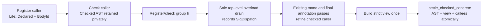

# Checked-body publication and duplicate-definition ownership

> **USER-APPROVED 2026-09-03 — checked-body carrier and state-cleanup basket.**
> Sections 1–11 are the approved typecheck-interior design. Section 9 consumes the same-cluster
> duplicate-definition rule established by `spec/05-definitions.md` §5.13 and
> `spec/08-modules.md` §8.6.4. Section 11 is the approved private cleanup
> basket. No public API or normative-spec change is authorized by that basket.

Owner: `/design`, narrow-deployed to `cranelisp-typecheck`. Audience: the user,
then `/dev` and `/review` maintaining and inspecting the approved carrier.

This design elaborates `typecheck.md` §5 and
`use-site-candidate-selection.md` §§6, 8 and 10. The callable lifecycle and its
public settlement funnels remain exactly those approved in
`design/arch/symbol-table-lifecycle.md` §4. No public item, serialized field,
cache schema, ABI, crate edge or additional overload lifecycle is proposed.

## 1. Decision summary

Typecheck uses one private per-module **body ledger** between Pass 1 and final
publication. The ledger owns checked source bodies and their call-graph facts
while the symbol table remains `Life::Declared`. A strict
`Realization::Body` is constructed only after the existing settlement work has
completed.

The ledger is keyed by **source body occurrence**, not by symbol. A symbol is a
publication target and may not safely identify a body because multi-signature
clauses already share one dispatched name. Section 9's decided rule makes a
second separate direct body for the same canonical target illegal.

The design removes three accidental responsibilities from early symbol-table
settlement:

- storing the annotated AST for later post-passes;
- storing callees before their final canonical set is known; and
- providing a mutable body for monomorphisation rewrites.

It does not create another callable state. `Life::Declared`, `Template` and
`Concrete` retain their approved meanings; the ledger is transient typecheck
work, never a published callable capability.

## 2. Why the carrier is required

The approved candidate design requires every candidate use to have a final
typed verdict before checked-body publication
(`use-site-candidate-selection.md` §8). The approved lifecycle simultaneously
makes `Realization::Body` strict and non-optional
(`symbol-table-lifecycle.md` §4.2–§4.4).

The landed source keeps checked work out of early settlement:

- `program/body.rs::check_form_body_single_defn` checks and annotates a direct
  body, derives its initial callees, and completes the ledger's
  `program/mod.rs::RegisteredBodyHandle` through its `finish` transition;
- `program/finalize.rs::regeneralize_defn_schemes`,
  `regeneralize_only_polymorphic` and `resettle_polymorphic_schemes` derive
  schemes from exact ledger registrations while every body remains declared;
- `program/mono_collect.rs::pass4_monomorphise` reads and rewrites exact checked
  ledger bodies for function-value monomorphisation; and
- `program/finalize.rs::finalize_annotations_and_publish` consumes the ledger,
  adds late edges through `program/callees.rs::harvest_callees`, constructs a
  strict view where required, and publishes the AST and canonical callees
  together.

This avoids building a strict view before forward-reference and deferred
dispatch work has settled. A placeholder view or a `Concrete` body published
and replaced later would weaken the lifecycle invariant. The carrier holds
checked work without creating a new callable state.

### 2.1 Existing transient-state precedents

The ledger follows existing typecheck ownership rather than introducing a new
kind of state:

| Existing carrier | Lifetime and purpose | Why it is precedent |
|---|---|---|
| `CheckState` | One check attempt; owns substitution, lexical scope, span-keyed facts and pending candidate/trait/overload/auto-curry work (`checker.rs::CheckState`). | Inference work may exist before a declaration has a publishable lifecycle. |
| `ModuleCheckAccumulator` | One `check_forms` frame across registration, body checking and finalization (`form.rs::check_forms`; `program/mod.rs::ModuleCheckAccumulator`). | Cross-pass typecheck facts already have a stack-owned module transaction carrier. |
| Cluster staging `SymbolTable` | A fresh orchestrator-owned table, read as staging-over-live and committed only after whole-cluster success (`cluster.rs::SymbolTableAccess`; `src/worker.rs::check_cluster_to_staging`). | Published declarations may be transactionally staged, but incomplete inference facts need not become declaration lifecycle. |
| Scoped body recheck state | A mono recheck temporarily takes resolution, expression-type, auto-curry and overload queues, optionally switches module, drains only its own work, then restores the outer state (`traits/monomorphise.rs::recheck_body_for_mono`). | Narrow body work can be isolated and returned without becoming module-global or adding another global drain. |

These carriers separate **transient inference work** from **published callable
lifecycle**. `Life` answers what a binding can validly expose to consumers;
`CheckState`, the accumulator and scoped recheck frames answer what the current
attempt still needs to infer. The ledger belongs to the latter class.

### 2.2 Why checked work does not belong in `SymbolTable`

There are four real placements inside the table; none preserves all current
boundaries:

| Table placement | Consequence | Disposition |
|---|---|---|
| Add a `Life` variant or fields for checked-but-unpublished work | Changes the public `cranelisp-types` facade and serialized lifecycle schema, gives downstream consumers a state they must understand, and makes transient inference look like a published capability. | Reject. It contradicts the approved three-state lifecycle meaning and dependency direction. |
| Add a typecheck-only `#[serde(skip)]` sidecar to `SymbolTable` | Still changes a public types-owned structure and its clone/default/API obligations. Types would own a consumer-specific cache it cannot interpret; skipped cache restore would also make the field non-authoritative. | Reject. Serialization omission does not restore boundary ownership or lifecycle coherence. |
| Insert synthetic keyed entries | Makes private work visible to keyed resolution and iteration, needs collision-proof non-language keys, and invites consumers to scan or filter artifacts that are not declarations. Atomic commit could publish them accidentally. | Reject. It corrupts canonical identity and publication atomicity. |
| Settle early as `Template` or `Concrete` | Claims callable readiness before candidate and overload work has settled. `Concrete` cannot truthfully carry its strict view yet; `Template` misclassifies a temporarily incomplete concrete body and still exposes it to resolution. | Reject. It weakens lifecycle meaning or requires replacement publication. |

Keeping the ledger in `ModuleCheckAccumulator` changes no crate edge, public
type, serialized field or keyed lookup. The staging table continues to stage
only declarations and completed publication; the accumulator owns the
attempt-local work needed to reach that publication.

### 2.3 Dependency gaps reconstruct the ledger

The active cluster path is retry-from-top, not resumable checking:

```text
original forms
    -> fresh process/check frame + fresh staging + fresh body ledger
    -> Gap(dependency)
    -> drop staging and every stack-local carrier
    -> int drives or waits for dependency publication
    -> retry original forms against larger live state
    -> reconstruct the ledger from Pass 1
```

`check_forms` turns an unresolved cross-module reference into
`CheckError::Gap`; the cluster caller drops the fresh staging table rather than
committing it (`form.rs::check_forms`; `src/worker.rs::check_cluster_to_staging`).
The int orchestration keeps the original forms on the work item, drives or
waits for the named dependency, and invokes the cluster again from the top
(`src/process_form.rs::process_cluster_once`;
`src/worker.rs::handle_typecheck_work_shared`). Consequently the proposed
ledger is dropped with `CheckState`, `ModuleCheckAccumulator`, `working_program`
and staging. It is rebuilt, not resumed, after the dependency enlarges live
state.

`SymbolTableAccess::Live` changes only the destination of table reads and
writes; it does not extend any stack carrier's lifetime
(`cluster.rs::SymbolTableAccess`). Fine-grained and test callers using Live
mode therefore reconstruct the ledger on a fresh `check_forms` call too. Live
mode does not justify table residency for checked work. Its direct-write
semantics also mean it is not the production cluster-atomic retry mechanism:
the orchestrated path uses `Cluster` mode precisely so any gap discards the
entire attempt.

## 3. Smallest complete interior shape

The following is a conceptual shape; private Rust names are not part of the
decision.

```text
BodyId = (top-level form ordinal, clause/body ordinal)

BodyTarget =
    Direct(canonical symbol)
  | MultiSignatureClause(group symbol, clause ordinal)

BodyWork =
    Registered {
        target,
        parameter types,
        return type,
        written-variable scope,
        source span
    }
  | Checked {
        target,
        parameter types,
        return type,
        written-variable scope,
        annotated AST,
        canonical callee set,
        source span
    }
```

`ModuleCheckAccumulator` owns `BodyId -> BodyWork` for one module check.
`BodyId` is structural source identity and remains stable even when a clause's
final mangled publication name is known only after overload settlement.
`BodyTarget` describes a real publication destination; it is not a provisional
symbol-table key. The existing `multi_sig_mangled_names` result resolves a
`MultiSignatureClause` target at the existing post-drain seam.

The ledger owns its target index as a derived access path. A caller asks for a
body by `BodyId` or exact `BodyTarget`; it never scans source forms or symbol
names for a likely match. That index is updated only with the body record and
is not a second authority. Section 9's decided rule permits at most one
`Direct` record per canonical target; multi-signature clauses remain distinct
`BodyId`s beneath their explicit group target.

The ledger owns only facts that must move together:

| Fact | Why it is here |
|---|---|
| Pass-1 parameter and return monotypes | Body checking and every re-generalization must address the same body occurrence. |
| Written-variable scope | It is part of that registered body's inference frame, not a symbol-wide property. |
| Annotated `DefnVariant` | Post-passes need one mutable checked AST before publication. |
| Canonical callees | They are body facts and must be published atomically with that body. |
| Target descriptor and source span | They connect source occurrence, diagnostics and final publication without using a temporary callable state. |

The ledger deliberately does **not** own a scheme, codegen view, slot,
realization, code owner, ownership summary, visibility, documentation or
parameter names. The scheme is derived from the registered monotypes and the
current substitution whenever needed. The view is built once at the settled
publication window. The remaining facts already have one authoritative home on
the declared binding or later concrete callable.

The two-state representation makes an unchecked AST and a checked AST distinct
values. It does not use `Option<view>`, a placeholder `Realization`, or an
extra public lifecycle enum.

## 4. Lifecycle and valid transitions

```mermaid
stateDiagram-v2
    [*] --> Registered: Pass 1 declares signature and body occurrence
    Registered --> Checked: body wrapper succeeds; candidate pending is empty
    Registered --> [*]: body error; staging transaction is discarded
    Checked --> Checked: deterministic post-pass refines AST, scheme facts or callees
    Checked --> PublishedTemplate: final scheme is non-concrete
    Checked --> PublishedConcrete: final scheme is concrete; strict view succeeds
    Checked --> [*]: post-pass or publication error; staging transaction is discarded
    PublishedTemplate --> [*]: ledger entry consumed
    PublishedConcrete --> [*]: ledger entry consumed
```



Only the following transitions are valid:

1. **Registration creates `Registered`.** The symbol table independently holds
   `Life::Declared`; no AST or callable capability is published.
2. **The shared body wrapper creates `Checked`.** It runs inference, candidate
   settlement and the deterministic body-local trait/overload/auto-curry work
   applicable at that seam. Candidate-pending collections must be empty on
   success. A selected group enqueues the existing
   `pending_overload_resolutions`; top-level overload work may remain for the
   sole global drain.
3. **Pre-finalization passes refine `Checked`.** Re-generalization changes the
   declared scheme through `update_declared_scheme`; AST rewrites and new
   callee edges change the private checked record. Neither operation settles a
   callable.
4. **Finalization consumes `Checked`.** It applies the final substitution and
   resolution maps, derives the final scheme and canonical callee vector, then
   chooses exactly one approved settlement funnel:
   `settle_checked_template` for a non-concrete scheme, or strict view
   construction followed by `settle_checked_concrete` for a concrete scheme.
5. **Consumption is one-way.** A successfully published record leaves the
   ledger. Later live-session redefinition starts a new module transaction and
   a new `Registered` body; it does not reopen an old ledger record.

Private construction and transition methods should enforce this ordering. A
symbol-table scan or runtime assertion is not needed for states the private sum
already makes unconstructable.

## 5. Producer and consumer routing

| Stage | Reads | Writes |
|---|---|---|
| Pass 1 registration | immutable `working_program` source order | `Registered` body plus the existing `Life::Declared` binding |
| Per-body check | registered signature facts and source AST | `Checked` AST and initial canonical callees |
| A later sibling's inference | declared binding scheme only | ordinary substitution; any scheme refresh uses `update_declared_scheme` |
| Trait, ambiguity and mono collection post-passes | checked ASTs in body order plus existing resolution maps | existing pending queues/maps; checked AST/callee refinements |
| Same-module mono template lookup | exact selected target in the body ledger | ordinary mono demand and instance paths |
| Function-value mono rewrite | selected `Checked` body by `BodyId` | that body's AST; never `Life::Concrete` |
| Final annotation/publication | checked AST, final substitution/maps, final target | one approved checked settlement call; ledger record consumed |
| Ownership inference | settled symbol table | existing ownership publication funnel, unchanged |

`working_program` remains the immutable syntax and ordering input. It assigns
body identities and supplies non-body top-level forms; once a body reaches
`Checked`, a body-consuming pass reads the ledger rather than a second AST copy
from `working_program` or `Life`. This is one pipeline with one mutable checked
body source.

Same-module monomorphisation reads a checked template body and its current
scheme from the ledger; a selected canonical target therefore does not need an
early `Life::Template`. Imported templates are already committed and continue
to come from their defining module's settled symbol table. The distinction is
transactional residency, not a second monomorphisation algorithm.

Impl/default and mono rechecks use the same concept at narrower scope. Their
caller already owns a cloned body, so the wrapper may return one local checked
body value and publish it after that seam's existing deterministic or scoped
drain. They do not need module-ledger residency, and they do not acquire a
second global overload drain. Mono rechecks preserve their existing isolated
scoped drain; top-level finalization preserves the one global
`resolve_pending_overloads` invocation.

## 6. Failure and rollback

- A body-check failure never installs `Checked`; the module's staging table and
  accumulator are discarded by the existing cluster transaction.
- A post-pass failure leaves the checked record private. Nothing callable has
  been published, so there is no slot, code owner or view to repair.
- Concrete publication builds and validates the strict view before calling the
  atomic table funnel. View failure leaves `Life::Declared` unchanged.
- A settlement-funnel failure leaves both table and slot claims unchanged by
  the approved types contract. The enclosing module transaction then discards
  its staging state.
- Callee canonicalization occurs before settlement. A successful callable
  cannot expose a different callee set from the body that produced its view.

No compensation transition, compatibility shim or `Concrete -> Declared`
rollback is introduced.

## 7. What this replaces

The body ledger replaces, rather than supplements:

- `ModuleCheckAccumulator.defn_type_vars` and `defn_var_scopes` as parallel
  symbol-keyed maps;
- the module-wide `call_graph_edges` list plus eager
  `replace_callees` writeback for bodies still under inference;
- early `settle_checked_template` / `settle_checked_concrete` calls used only
  to retain a checked AST;
- pre-finalization AST reads from `Life`; and
- the function-value rewrite's settle-read-modify-resettle cycle.

The accumulator's resolution maps and warnings remain because they carry
module-wide span-keyed outcomes. The public checked-settlement and callee
funnels remain because they are still the final publication boundary.

## 8. Before and after

```clojure
(defn caller [] (h 7))
(defn h
  ([:Int x] x)
  ([:String x] x))
```

Before this design, `caller` is settled while `(h 7)` may still be represented
by the pending overload result. Strict view construction therefore sees no
final dispatch carrier, while later monomorphisation and annotation expect to
recover and mutate `caller` through its published `Life`.

With this design:



There is no interval in which a published concrete callable lacks its final
dispatch identity or carries a provisional view.

## 9. DECIDED — duplicate same-name forms in one cluster

### 9.1 What the normative sources establish

- `spec/05-definitions.md` §5.13 requires at most one separate `defn` or
  `defn-` form for one canonical function name in a compilation cluster. A
  second form is an illegal redefinition attempt; the cluster commits neither
  form. Multiple bodies use the explicit §5.1.2 multi-signature form.
- `spec/05-definitions.md` §5.1.2 defines multiple callable variants through
  one explicit multi-signature `defn` form. Its clauses are checked as separate
  mutually-recursive functions sharing one dispatched name.
- `spec/03-types.md` §3.5.2 and `spec/05-definitions.md` §5.13.1 require all
  top-level signatures to register before all bodies are checked; §5.13.2 gives
  a `begin` cluster the same atomic treatment.
- `spec/08-modules.md` §8.6.4 cross-references `spec/05-definitions.md` §5.13 for repeated
  same-canonical-name forms, `spec/05-definitions.md` §5.1.2 for multiple variants, and committed REPL
  redefinition for a later cluster.
- `repl/spec.md` §§15.6 and 18 define replacement of an existing **committed
  live-session** symbol: the latest successful definition replaces the previous
  one, with ABI-coherent dependent handling.
- `spec/03-types.md` §3.10 requires a recursive call to use the same monotype as
  the definition whose body is being checked. `spec/05-definitions.md` §5.1.2
  separately defines sibling-clause self-calls for an explicit multi-signature
  form.

Together these passages distinguish one uncommitted compilation cluster from a
later committed-session redefinition. Two separate same-canonical-name forms
in the former are illegal; neither source order nor self-qualification turns
the second form into replacement or augmentation.

### 9.2 Minimal discriminator

```clojure
(begin
  (defn qloop [x] 0)
  (defn qloop [x]
    (if true 0 (user/qloop x))))
```

Before the duplicate-owner guard, the body loop attempted to check both source
occurrences against one symbol-keyed declaration: the first body settled that
declaration and the second called `update_declared_scheme` on an already-settled
binding. The landed registration guard rejects the second direct owner before
body checking.

### 9.3 Established language rule

A second separate `defn` for the same canonical name in one compilation cluster
is an **illegal redefinition attempt**. It is neither replacement nor
augmentation. In particular:

- registration rejects the second direct canonical target before body checking;
- the second body's recursive reference does not bind to the earlier
  definition—the second body is not a valid definition body at all;
- live-session redefinition remains a transaction across successful commit
  boundaries, not a source-order operation inside one uncommitted cluster; and
- the explicit §5.1.2 multi-signature form is the only within-cluster form that
  gives one callable name multiple bodies.

The minimal discriminator above is therefore a compile-time redefinition error
at the second `qloop`, irrespective of whether its body says `qloop` or
`user/qloop`. Rewriting it as an explicit multi-signature form is legal only if
the clauses also satisfy §5.1.2's dispatch-distinguishability rules; two
overlapping same-arity signatures remain an ambiguity error.

The corresponding interior ownership rule is small: a direct canonical target
may index exactly one `BodyId` in a module ledger. Registration detects a
second direct owner and aborts the cluster before Pass 2. An explicit
multi-signature group instead owns several clause `BodyId`s by construction;
that is not a duplicate direct owner.

## 10. Approved boundary and falsifiers

The 2026-09-03 approval authorizes the private carrier refactor in §§1–8 and
the bounded state-cleanup basket in §11 under the established language rule in
§9.

Review should reject:

- a `Life` variant for checked-but-unpublished work;
- an optional or lenient concrete view at publication;
- a second top-level overload drain or candidate-combination search;
- storing checked ASTs in both the ledger and settled `Life` before the final
  window;
- symbol-only body identity;
- a post-pass that scans around a `BodyId` to find a likely body;
- a callee set published before the body is consumed; or
- treating a separate same-canonical-name form as replacement, augmentation or
  an implicit overload inside one compilation cluster.

## 11. USER-APPROVED 2026-09-03 — state-ownership cleanup at the ledger seams

This section answers whether the approved ledger creates a bounded opportunity
to simplify typecheck-only state. It is the approved, source-grounded cleanup
basket. The inclusion test is strict: a cleanup belongs in the ledger change
only when the ledger becomes its new owner or the cleanup must modify the same
registration, body-exit or final-publication seam. Cosmetic regrouping
elsewhere is deferred.

### 11.1 Ownership census

The landed pipeline retains four legitimate lifetimes and gives each fact one
owner appropriate to that lifetime:

| Lifetime | Current carrier | Census result |
|---|---|---|
| Active inference and settlement work | `CheckState` (`checker.rs::CheckState`) | Owns substitution, lexical environment, ordered settlement queues, the active `BodyFrame`, and resolution/expression facts until the settled sweep. |
| One form's pass result | `FormCheckResult` (`program/mod.rs::FormCheckResult`) | Carries only per-form products and warnings; resolution maps, expression-type deltas and callee edges do not transit through it. |
| One module attempt | `ModuleCheckAccumulator` (`program/mod.rs::ModuleCheckAccumulator`) | Owns the body ledger and the one-way final handoff of `MethodResolutions` and expression types. No parallel definition maps or module-wide callee list remain. |
| One isolated recheck | shared `BodyFrame` plus the mono-specific outer save/restore in `recheck_body_for_mono` | Body-local scope has one common contract; mono settlement isolation retains its different, narrower contract rather than being conflated with it. |

The cohesive basket simplifies only registration facts, body scope, final-fact
transport and the obsolete slot stash. It does not split all of `CheckState` or
invent a general-purpose compilation context.

### 11.2 Fold registration facts and callees into the ledger — include

| Decision field | Approved disposition |
|---|---|
| Landed ownership | `program/body.rs::check_form_body_single_defn` reads the ledger registration, receives exact body-local references from the body frame, derives initial callees through `program/callees.rs::harvest_callees`, and completes that record. `program/finalize.rs::finalize_annotations_and_publish` consumes the record, unions late resolution edges and publishes its AST and canonical callees together. The former `defn_type_vars`, `defn_var_scopes`, `call_graph_edges` transports and eager table write are absent. |
| Single owner | The approved `Registered` record owns parameter monotypes, return monotype and written-variable scope. Its `Checked` successor owns the annotated body and canonical callee set. |
| Fields moved or removed | Remove `defn_type_vars`, `defn_var_scopes` and both `call_graph_edges` transports. Remove the eager `replace_callees` write. Retain the public final settlement funnel, which publishes the checked record's final callees with its body. |
| Producer and consumers | Signature registration creates `Registered`; the shared body wrapper reads it and creates `Checked`; re-generalization, multi-signature settlement and same-module mono lookup address the record by `BodyId`/target; final publication consumes it. Impl/default bodies use the same local checked-body value at their direct settlement seam. Mono instances retain the existing deliberate template-grain callee attribution. |
| Invariant gained | Signature facts, written-variable scope, AST and callees cannot disagree on body identity. A body error publishes none of them, and a successful callable cannot expose a callee set from another source occurrence. |
| Touched submodules | `program/register.rs`, `program/body.rs`, `program/callees.rs`, `program/finalize.rs`, `program/mod.rs`, `program/register/multi_sig.rs`, and the `check_forms` construction in `form.rs`. |
| Evidence needed | Single- and multi-signature forward references; written-variable co-reference and clause independence; duplicate-direct-target rejection; call- and value-position callee completeness; impl/default/HKT callees; late overload/auto-curry/mono edges; failure and Gap rollback. |
| Risk and cost | **Medium-high, already intrinsic to the ledger.** Callee starvation would break dependent recompilation, so the final per-body derivation must include late resolutions before settlement. The cost is earned because keeping the old transports would preserve two body authorities. |

Late resolution does not require a new module-wide edge list. During final
annotation, the publisher already walks each exact checked AST with the final
resolution maps (`program/finalize.rs::finalize_annotations_and_publish`). It
derives that record's late resolution edges there and unions them with the
body frame's exact call/value references before calling the settlement funnel.

### 11.3 Delete `redef_slots` — include

| Decision field | Approved disposition |
|---|---|
| Former parallel carrier | Pass 1 formerly wrote `ModuleCheckAccumulator.redef_slots` for single and multi-signature definitions without a production reader. The field and both capture writes are absent. |
| Single owner | Slot conservation belongs to `Life::Declared { prior }`, checked settlement and the integration commit policy under `symbol-table-lifecycle.md` §§4.2–4.4. Packet-A synthesized replacement retains or refuses its provisional slot inside the approved table methods. |
| Fields moved or removed | Delete `redef_slots`, both capture writes and comments claiming a typecheck-side fast path. No replacement typecheck field. |
| Producer and consumers | Typecheck declares and settles; the symbol table rebinds or mints on settlement; integration maps staging slots to the live world at commit. Typecheck no longer transports a slot it does not consume. |
| Invariant gained | There is one slot-transition authority. A stale external stash cannot disagree with `Declared.prior`, provisional synthesized replacement, or commit classification. |
| Touched submodules | `program/register.rs` and `program/mod.rs`, plus directly stale typecheck comments/fixtures. |
| Evidence needed | Zero-reader source census; concrete→concrete, concrete→template and template→concrete redefinition; ABI-preserving reuse and ABI-changing freeze; product accessor/constructor Packet-A replacement; slot uniqueness and rollback. |
| Risk and cost | **Low code volume, high safety consequence.** Deletion is already an explicit consequence of the approved lifecycle design, but redefinition evidence remains mandatory because a missed slot move is a stale-call/UAF class defect. |

### 11.4 One private body frame — include

| Decision field | Approved disposition |
|---|---|
| Former parallel carriers | Ordinary and explicit-type bodies formerly saved/restored independent body-local fields, while module-wide `user_fn_refs` needed span-key snapshots. `program/body.rs::check_defn_body` and `traits/impl_check.rs::check_defn_body_with_types` now install and restore one `BodyFrame`, returning that frame's exact user references. |
| Single owner/type | One private active `BodyFrame` installed by the shared body wrapper. It owns `rigid_vars`, `written_var_scope`, `recursion: Option<RecursionBinding { name, frame }>` as one valid pair, candidate name/pattern pending work, and exact body-local user-function references. |
| Fields moved or removed | Move the six independent body-scope fields out of the flat `CheckState`; replace the two recursion options with one optional value; move `user_fn_refs` into the active frame and delete caller-side before-key snapshots. `ScopeStack` itself remains on `CheckState`; the wrapper owns its body push/pop. |
| Producer and consumers | The ordinary registered-body path seeds rigid/written/recursion facts; impl/default/HKT and mono rechecks seed an explicit-type frame with no recursion carrier. Unification, annotation inference, candidate selection and self-reference classification read the active frame. Successful exit returns exact user references to callee derivation; every exit restores the prior frame and lexical depth together. |
| Invariant gained | A recursion name cannot exist without its frame; candidate work and user references cannot bleed between bodies; every success proves candidate-pending empty; error exits cannot restore only a subset of body state. |
| Touched submodules | `checker.rs`, `infer.rs`, `candidate_selection.rs`, `program/body.rs`, `program/callees.rs`, and `traits/impl_check.rs`; mono consumes the same wrapper through `traits/monomorphise.rs`. |
| Evidence needed | Error exits after inference and candidate settlement; nested lexical shadowing of a recursion name; parameter-equals-function-name; ordinary, multi-signature, impl/default/HKT and mono bodies; candidate ambiguity/success; exact call- and value-position callee attribution. |
| Risk and cost | **Medium.** This removes a demonstrated partial-restore hazard and is required to turn one body into one checked ledger record. It must remain a private structured enter/run/exit operation, not an RAII guard that holds a mutable borrow of `CheckState` across inference. |

### 11.5 Carry `MethodResolutions` whole — include

| Decision field | Approved disposition |
|---|---|
| Former parallel carriers | `FormCheckResult` and `ModuleCheckAccumulator` formerly split the `CheckState` record into four maps. `program/finalize.rs::sweep_post_pass_outputs` now moves one complete `MethodResolutions` into the accumulator, and `FormCheckResult` carries none of those maps. |
| Single owner/type | Reuse the existing published semantic type `MethodResolutions` unchanged. `CheckState` owns it through inference and all deterministic post-passes; the final sweep moves it once into `ModuleCheckAccumulator.resolutions` for publication. |
| Fields moved or removed | Remove all four resolution fields from `FormCheckResult`; replace the four accumulator fields with one `resolutions: MethodResolutions`. A body-local checkpoint may extract an ephemeral delta to annotate its checked AST, but no second long-lived resolution carrier is retained. |
| Producer and consumers | Inference and candidate/trait/overload/auto-curry/mono settlement write `CheckState.method_resolutions`; final sweep transfers the complete record; final annotation and strict-view construction read `accumulator.resolutions`. |
| Invariant gained | A transfer cannot omit `pattern_ctors`, `var_refs` or `apply_refs`; one move defines the settled window, and partial per-form clones cannot hide late post-pass carriers. |
| Touched submodules | `program/mod.rs`, `program/body.rs`, `program/finalize.rs`, `program/support.rs`, and impl/mono annotation call sites that currently accept split maps. |
| Evidence needed | Total `VarRef`/`ApplyRef` production, constructor-pattern identity, ordinary and trait dispatch, deferred overload/auto-curry, fn-value mono rewrite, and strict-view failure on a deliberately absent carrier. |
| Risk and cost | **Medium-low.** The semantic type already exists and has the exact lifecycle; most work is mechanical plumbing. Risk concentrates at the final view builder, so tests must discriminate each of its four map populations. |

### 11.6 `expr_types` — remove one duplicate, retain the meaningful map

| Decision field | Approved disposition |
|---|---|
| Former parallel carriers | Expression types formerly also crossed a per-form `FormCheckResult.expr_types` delta. They now remain in `CheckState.expr_types` for dispatch, monomorphisation, ambiguity and unresolved-dispatch work, then move once to `ModuleCheckAccumulator.expr_types` (`traits/dispatch.rs`; `program/mono_collect.rs`; `program/finalize/ambiguity.rs`). |
| Single owner/type | Keep the span map in `CheckState` while inference and settlement are active, then move it once to `ModuleCheckAccumulator.expr_types` for final substitution/publication. The checked AST is the body carrier, not a replacement query index during unsettled inference. |
| Fields moved or removed | Remove `FormCheckResult.expr_types`. The body wrapper may derive a temporary delta for initial AST annotation, but it is not stored after the checked record is updated. Do not remove `CheckState.expr_types` or the final accumulator field in this change. |
| Producer and consumers | `record_expr_type` and rechecks write the active map; trait/overload/mono/ambiguity consumers query it through settlement; final sweep transfers it; final publication applies the last substitution and annotates the ledger AST. |
| Invariant gained | There is one active query map and one one-way final handoff, rather than per-form copies plus a final copy. AST publication cannot be mistaken for proof that all post-settlement queries are complete. |
| Touched submodules | `program/mod.rs`, `program/body.rs`, `program/finalize.rs`, and local annotation helpers. |
| Evidence needed | Final substitution across forward references; unused annotated parameters; return-type dispatch and ambiguity; multi-signature back-flow; mono/impl recheck annotation; concrete-view construction. |
| Risk and cost | **Medium-low for removing the form transport; high for deleting the map entirely.** Only the former belongs in this basket. Eliminating the active span index would require redesigning several post-passes and is explicitly deferred. |

### 11.7 Dispatch settlement queues — do not group in this change

`pending_auto_curry`, `deferred_auto_curry`,
`pending_overload_resolutions` and `deferred_self_call_dispatch` look similar
only because they are collections. Their ownership and drains differ:

- candidate pending is body-local and moves into `BodyFrame`;
- auto-curry has a pre-settlement deferrable drain and one settled retry;
- top-level overload work survives body exit to the sole global drain, while a
  mono recheck isolates and drains only its own overload work; and
- deferred self-call dispatch is an internal second phase of overload
  settlement, not peer module work.

A `SettlementQueues` field bag would add a name without preventing an illegal
drain order. Keep the queues explicit. A later aggregate is earned only if it
owns the drain operations and makes the permitted transitions structural. Its
producer/consumer surface would span `infer.rs`, `program/mono_collect.rs`,
`program/register/multi_sig.rs`, `program/finalize.rs` and
`traits/monomorphise.rs`; that cost and regression matrix are disproportionate
to the ledger change.

### 11.8 Mono and impl recheck isolation — share the body frame, defer a sandbox

The shared body frame applies to ordinary, impl and mono inference. Their outer
isolation is not the same:

- impl/default checking contributes resolution and expression facts to the
  module attempt and may temporarily use the trait's defining module;
- mono rechecking must isolate outer `MethodResolutions`, expression types,
  auto-curry and overload pending work, optionally switch defining module, and
  return per-instance facts (`traits/monomorphise.rs::recheck_body_for_mono`);
  `mono_recheck_self` also has its own narrower instantiation lifetime.

Therefore this change removes duplicated **body-scope** save/restore through
`BodyFrame` but retains the mono-specific outer sandbox as-is. A future private
`MonoRecheckSandbox` may bundle that exact save/restore set if implementation
work shows another consumer with the same isolation contract. Do not make a
generic recheck frame with optional fields, and do not make impl checking
discard facts merely to resemble mono.

### 11.9 Smallest cohesive cleanup basket

The landed basket follows this order:

1. add the ledger and `BodyFrame`, then route ordinary, multi-signature and
   impl/default/HKT body success through exact checked-body values;
2. fold registered signature/scope facts and canonical callees into those
   records, removing their parallel maps and eager callee publication;
3. remove per-form resolution/expression transports, move the complete
   `MethodResolutions` and expression-type map once at the settled sweep, and
   publish from those final facts; and
4. delete the unread `redef_slots` stash while the same registration and
   settlement seams are open.

Keep separate evidence attribution for ledger lifecycle, body-frame isolation,
resolution-carrier completeness, callee completeness and slot redefinition.
The following are explicit deferrals: a grand `CheckState` decomposition;
dispatch-queue grouping; a general mono/impl recheck sandbox; deletion of the
active `expr_types` map; cleanup of the remaining `FormCheckResult` vectors or
constraint marker without a separate consumer census; and any public type,
schema, ABI or crate-boundary change.
