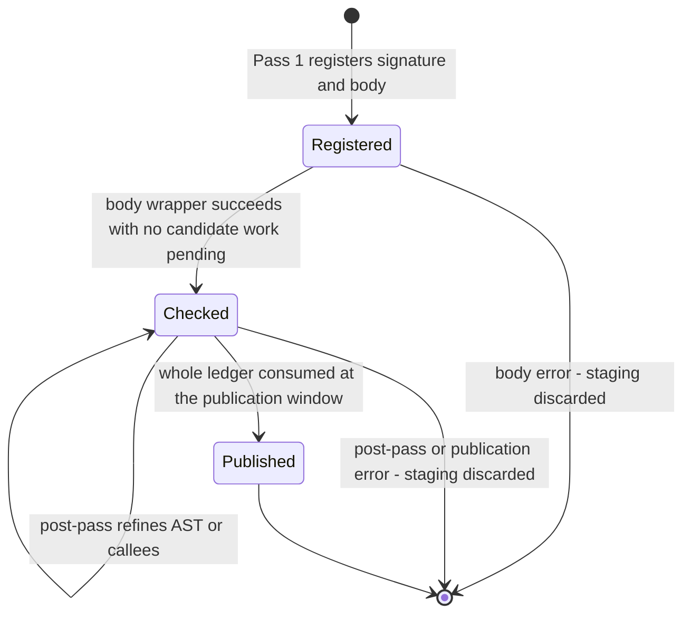

# Checked-body publication and duplicate-definition ownership

Owner: `design`, narrow-deployed to `cranelisp-typecheck`. Readers: `dev` and
`review` maintaining the checked-body carrier. Subordinate to
[`typecheck.md`](typecheck.md) §5; elaborates
`use-site-candidate-selection.md` §§6, 8 and 10.

Standing: user-approved 2026-09-03 and implemented. No public item, serialized
field, cache schema, ABI or crate edge belongs to this design. The callable
lifecycle and its settlement funnels are `design/arch/symbol-table-lifecycle.md`
§4's.

## 1. Decision

- Between Pass 1 and final publication, typecheck holds each source body in a
  private per-module **body ledger** (`crates/cranelisp-typecheck/src/program/mod.rs::BodyLedger`, owned by
  `ModuleCheckAccumulator`).
- The ledger owns the checked AST and its callees while the symbol-table
  binding stays `Life::Declared`. A strict `Realization::Body` is built only
  after settlement, once, at the publication window.
- Early symbol-table settlement therefore no longer stores the annotated AST
  for post-passes, stores callees before the final set is known, or provides a
  mutable body for monomorphisation rewrites.
- The ledger is transient inference work, not a callable state. `Declared`,
  `Template` and `Concrete` keep their approved meanings.

The need: every candidate use has a final typed verdict before publication
(`use-site-candidate-selection.md` §8), and `Realization::Body` is strict and
non-optional (`symbol-table-lifecycle.md` §4.2–§4.4). Settling a body before
forward-reference and deferred-dispatch work finishes would force either a
placeholder view or a replacement publication.

## 2. Placement

The ledger lives in `ModuleCheckAccumulator`, beside the other transient
carriers (`CheckState`, the cluster staging table, mono recheck save/restore).
`Life` answers what a binding exposes to consumers; those carriers answer what
the current attempt still has to infer.

Considered and rejected placements inside `SymbolTable`:

| Placement | Rejected because |
|---|---|
| A `Life` variant or fields for checked-but-unpublished work | Changes the public types facade and serialized lifecycle, and presents transient inference as a published capability. |
| A `#[serde(skip)]` typecheck sidecar on `SymbolTable` | Still a public types-owned structure holding a cache types cannot interpret; skipped restore makes it non-authoritative. |
| Synthetic keyed entries | Visible to keyed resolution and iteration, needs non-language keys, and can be committed by accident. |
| Early `Template` or `Concrete` settlement | Claims readiness before candidate and overload work settles; `Concrete` cannot yet carry a truthful strict view. |

A dependency gap rebuilds the ledger rather than resuming it: `check_forms`
returns `CheckError::Gap`, the cluster caller drops staging and every
stack-local carrier, and `int` retries the original forms from Pass 1
(`form.rs::check_forms`; `src/worker.rs::check_cluster_to_staging`;
`src/process_form.rs::process_cluster_once`). `SymbolTableAccess::Live` changes
only where table reads and writes land; it extends no carrier's lifetime and
does not justify table residency for checked work.

## 3. Ledger shape

- One record per registered body. Its identity is its private insertion slot,
  not a symbol.
- A record holds:
  - its **target**: `BodyTarget::Direct(symbol)` or
    `BodyTarget::MultiSignatureClause { group, clause }`;
  - its current **publication name**;
  - Pass-1 parameter and return monotypes;
  - its written-variable scope; and
  - its source span.
- A record's state is `Registered`, or `Checked { annotated DefnVariant,
  canonical callees }`. An unchecked and a checked AST are distinct values;
  no `Option<view>`, placeholder `Realization` or extra lifecycle enum exists.
- Two derived indexes, target and publication name, each resolve to at most
  one record. `register` rejects a collision in either
  (`BodyLedger::reject_duplicate`). A multi-signature clause registers under a
  private clause label and is re-keyed once to its mangled name after overload
  settlement (`rekey_publication`, which also rejects a collision).
- Callers address a record by exact target or publication name. No caller scans
  source forms or symbol names for a likely body.
- The ledger does not own a scheme, codegen view, slot, realization, code
  owner, ownership summary, visibility, documentation or parameter names. The
  scheme is derived from the registered monotypes and current substitution
  when needed; the view is built once at publication; the rest belong to the
  declared binding or the settled callable.

## 4. Lifecycle



1. **Registration creates `Registered`.** The table independently holds
   `Life::Declared`; nothing callable is published.
2. **The shared body wrapper creates `Checked`**, only through the borrowed
   `RegisteredBodyHandle::finish` capability. It runs inference, candidate
   settlement and the body-local trait, overload and auto-curry work applicable
   at that seam; candidate-pending work is empty on success. A selected
   overload group enqueues `pending_overload_resolutions` for the sole global
   drain.
3. **Pre-finalization passes refine `Checked`.** Re-generalization changes the
   declared scheme through `update_declared_scheme`; AST rewrites and new
   callee edges change the private record. Neither settles a callable.
4. **Finalization consumes the whole ledger** (`BodyLedger::into_checked`, which
   takes the ledger by value). For each record it applies the final
   substitution and resolution maps, unions late edges (§7.1), then calls
   exactly one funnel: `settle_checked_template` for a non-concrete scheme, or
   strict view construction then `settle_checked_concrete`. A record still
   `Registered` at that point is an internal error, not an omission.
5. **Consumption is one-way.** A later live-session redefinition starts a new
   module attempt and a new `Registered` record.

Invariant: no published ledger-sourced concrete callable lacks its final
dispatch identity or carries a provisional view. For example, a caller that
calls a later multi-signature group is published only after the one top-level
overload drain has recorded its `SigDispatch`. Impl and default-method bodies
are outside the ledger; see §10.

Ordering is carried by the private sum and the handle, so no symbol-table scan
or runtime assertion is needed for states they make unconstructable.

## 5. Producer and consumer routing

| Stage | Reads | Writes |
|---|---|---|
| Pass 1 registration | `working_program` source order | `Registered` record and `Life::Declared` binding |
| Per-body check | registered signature facts, source AST | `Checked` AST and initial canonical callees |
| A later sibling's inference | declared binding scheme only | substitution; scheme refresh via `update_declared_scheme` |
| Trait, ambiguity and mono-collection post-passes | checked ASTs in ledger order, resolution maps | pending queues and maps; checked AST and callee refinements |
| Same-module mono template lookup | the exact selected record | ordinary mono demand and instance paths |
| Function-value mono rewrite | the selected `Checked` record | that record's AST, never `Life::Concrete` |
| Final annotation and publication | checked AST, final substitution and maps | one settlement funnel call per record |
| Ownership inference | settled symbol table | its existing publication funnel |

- `working_program` stays the immutable syntax and ordering input. Once a body
  is `Checked`, body-consuming passes read the ledger, never a second AST copy
  from `working_program` or `Life`.
- Same-module mono reads a checked template body from the ledger, so a selected
  target needs no early `Life::Template`. Imported templates come from their
  defining module's settled table. The difference is transactional residency,
  not a second monomorphisation algorithm.
- Impl, default-method and mono rechecks own a cloned body and use the same
  body frame (§7.3) at narrower scope, without ledger residency and without a
  second global overload drain. Mono rechecks keep their isolated scoped drain;
  finalization keeps the one global `resolve_pending_overloads` call.

## 6. Failure and rollback

- A body-check failure never installs `Checked`; the cluster transaction
  discards staging and the accumulator.
- A post-pass failure leaves the record private; there is no slot, code owner
  or view to repair.
- Concrete publication builds and validates the strict view before the atomic
  table funnel; a view failure leaves `Life::Declared` unchanged.
- A funnel failure leaves table and slot claims unchanged under the types
  contract; the module transaction then discards staging.
- Callees are canonicalized before settlement, so a published callable cannot
  expose callees from a different body than its view.
- No compensation transition, compatibility shim or `Concrete -> Declared`
  rollback exists.

## 7. Adjacent state ownership

Each typecheck fact touched by the ledger has one owner for its lifetime:

| Lifetime | Carrier | Owns |
|---|---|---|
| Active inference and settlement | `CheckState` | substitution, lexical scope, settlement queues, the active `BodyFrame`, resolution and expression facts until the final sweep |
| One form's pass | `FormCheckResult` | per-form products and warnings only |
| One module attempt | `ModuleCheckAccumulator` | the body ledger and the one-way final handoff of `MethodResolutions` and expression types |
| One isolated recheck | `BodyFrame` plus mono's outer save/restore in `recheck_body_for_mono` | body scope, and separately mono settlement isolation |

The removed parallel carriers must not return: symbol-keyed `defn_type_vars`
and `defn_var_scopes`, a module-wide `call_graph_edges` list, an eager
`replace_callees` write for bodies under inference, early settlement to retain
an AST, pre-finalization AST reads from `Life`, the function-value
settle-read-modify-resettle cycle, per-form resolution and expression-type
transports, and `redef_slots`.

### 7.1 Registration facts and callees

- The `Registered` record owns parameter and return monotypes and the written
  scope; `Checked` adds the annotated body and canonical callees. They cannot
  disagree on body identity, and a body error publishes none of them.
- Initial callees come from `program/callees.rs::harvest_callees` over the body
  frame's exact user-function references.
- Late edges need no module-wide list: during final annotation the publisher
  walks each record's AST with the final resolution maps, harvests the edges in
  that body's spans and unions them before settlement
  (`program/finalize.rs::finalize_annotations_and_publish`). Missing a late edge
  starves dependent recompilation.
- Mono instances keep their deliberate template-grain callee attribution.

### 7.2 Slot conservation

Typecheck carries no slot. Slot conservation belongs to `Life::Declared {
prior }`, checked settlement and the integration commit policy
(`symbol-table-lifecycle.md` §§4.2–4.4); synthesized product-accessor
replacement retains or refuses its provisional slot inside the table methods.
A typecheck-side slot stash could disagree with that single authority; a missed
slot move is a stale-call or use-after-free defect class.

### 7.3 Body frame

- One private `BodyFrame` is installed by the shared body wrapper
  (`program/body.rs::check_defn_body`;
  `traits/impl_check.rs::check_defn_body_with_types`). It owns rigid variables,
  written-variable scope, `recursion: Option<RecursionBinding { name, frame }>`,
  pending name and pattern candidate uses, and exact body-local user-function
  references. `ScopeStack` stays on `CheckState`; the wrapper owns the body's
  push and pop.
- Registered bodies seed rigid, written and recursion facts; impl, default,
  HKT and mono rechecks seed an explicit-types frame with no recursion binding.
- Every exit restores the prior frame and lexical depth together; success
  returns the exact user references for callee harvest.
- It is a structured enter/run/exit operation, not an RAII guard: a guard would
  hold a mutable borrow of `CheckState` across inference.
- Gains: a recursion name cannot exist without its frame; candidate work and
  user references cannot leak between bodies; an error exit cannot restore a
  subset of body state.

### 7.4 Resolutions travel whole

- `CheckState.method_resolutions` is written through inference and every
  deterministic post-pass. `program/finalize.rs::sweep_post_pass_outputs` moves
  the complete `MethodResolutions` once into `ModuleCheckAccumulator.resolutions`;
  final annotation and strict-view construction read it there.
- A body-local checkpoint may extract an ephemeral delta to annotate its AST; no
  second long-lived resolution carrier exists.
- One move cannot omit `pattern_ctors`, `var_refs` or `apply_refs`. The risk
  concentrates at the view builder, whose evidence must discriminate each map
  population.

### 7.5 Expression types

- `CheckState.expr_types` is the active span index for dispatch,
  monomorphisation, ambiguity and unresolved-dispatch work; the final sweep
  moves it once to `ModuleCheckAccumulator.expr_types`, where final publication
  applies the last substitution and annotates ledger ASTs.
- The checked AST is the body carrier, not a query index during unsettled
  inference. Deleting the active map would require redesigning several
  post-passes.

### 7.6 Kept separate, with triggers

- **Dispatch settlement queues** (`pending_auto_curry`, `deferred_auto_curry`,
  `pending_overload_resolutions`, `deferred_self_call_dispatch`) stay explicit.
  Their drains differ: candidate work is body-local; auto-curry has a deferrable
  pre-settlement drain and one settled retry; top-level overload work survives
  to the sole global drain while mono rechecks drain only their own; deferred
  self-call dispatch is an internal phase of overload settlement. A field bag
  would add a name without preventing an illegal drain order. An aggregate is
  earned only if it owns the drain operations and makes permitted transitions
  structural.
- **Mono recheck isolation** stays mono-specific: it isolates outer resolutions,
  expression types, auto-curry and overload work, may switch defining module,
  and returns per-instance facts; `mono_recheck_self` has a narrower
  instantiation lifetime. Impl and default checking instead contribute facts to
  the module attempt. A private mono sandbox type is earned when a second
  consumer needs the same isolation contract. Do not build a generic recheck
  frame with optional fields, or make impl checking discard facts to resemble
  mono.
- Not undertaken without a separate consumer census: a general `CheckState`
  decomposition, deleting the active `expr_types` map, and removing the
  remaining `FormCheckResult` vectors or constraint marker.

## 8. Duplicate direct targets

The language rule is `spec/05-definitions.md` §5.13: a second separate `defn`
or `defn-` for one canonical name in a compilation cluster is an illegal
redefinition, and the cluster commits neither form. The explicit §5.1.2
multi-signature form is the only within-cluster way to give one name several
bodies. Committed live-session redefinition
(`repl/spec/15-session-persistence.md` §15.6; `repl/spec/18-redefinition.md`;
`spec/08-modules.md` §8.6.4) is a transaction across commits, not a
source-order operation inside one cluster.

```clojure
(begin
  (defn qloop [x] 0)
  (defn qloop [x]
    (if true 0 (user/qloop x))))
```

- Registration rejects the second direct target before any body is checked,
  whether the body says `qloop` or `user/qloop`; the second body is not a
  definition body, so its recursive reference binds to nothing.
- Interior rule: a direct target owns at most one ledger record. A
  multi-signature group owns one record per clause target by construction; that
  is not a duplicate.

## 9. Review rejects

- a `Life` variant for checked-but-unpublished work;
- an optional or lenient concrete view at publication;
- a second top-level overload drain or candidate-combination search;
- a checked AST held in both the ledger and a settled `Life` before the
  publication window;
- a ledger index that can resolve one key to two records, or a post-pass that
  scans for a likely body instead of an exact target or publication name;
- a callee set published before its record is consumed; or
- a separate same-canonical-name form treated as replacement, augmentation or
  an implicit overload inside one cluster.

## 10. Open items

- **Default-method re-settlement.** Impl method bodies settle at the impl seam
  (`traits/impl_check.rs`, `settle_checked_concrete`/`settle_checked_template`),
  and final publication re-annotates each generated default method from its
  settled `Life`, rebuilds its view and settles it again
  (`program/finalize.rs::finalize_annotations_and_publish`). That is a
  published-then-refreshed callable outside the ledger, so §4's invariant does
  not cover it, and the shape resembles the provisional-record-plus-repair form
  Principle 26 rules out. Whether the first view can be provisional, and
  whether default methods should enter the ledger, is undecided. This is part of
  the Principle 26 classification in [`typecheck.md` §9.7](typecheck.md#97-record-from-settled-state-principle-26).
  Source-read only; not executed.

## Former section numbers

| Former | Now |
|---|---|
| §1 | §1 |
| §2, §2.1–§2.3 | §2 (the need is in §1) |
| §3 | §3 |
| §4 | §4 |
| §5 | §5 |
| §6 | §6 |
| §7 (what this replaces) | §7 (removed carriers) |
| §8 (before and after) | §4 (invariant and example) |
| §9, §9.1–§9.3 | §8 |
| §10 | §9 |
| §11, §11.1 | §7 |
| §11.2 | §7.1 |
| §11.3 | §7.2 |
| §11.4 | §7.3 |
| §11.5 | §7.4 |
| §11.6 | §7.5 |
| §11.7, §11.8, §11.9 | §7.6 |
