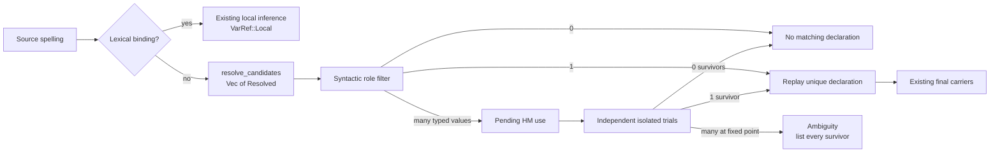
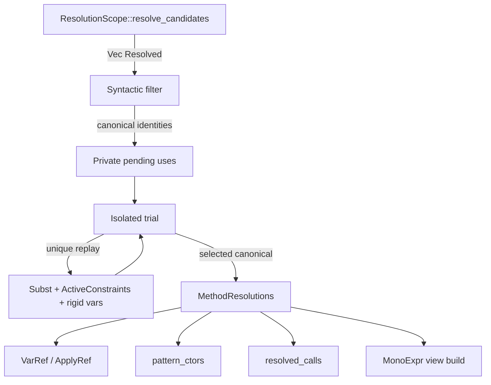

# Use-site candidate selection

> **APPROVED — user decision 2026-09-02.** Sprint 121 W3
> executing-falsifier reopen. This is the implementation authority for
> `cranelisp-typecheck` use-site candidate selection.

Owner: `/design` narrow-deployed to `cranelisp-typecheck`. Audience: the user
reviewing the interior choice, then `/dev` and `/review` on this crate.

This document designs how typecheck consumes the already-approved
`ResolutionScope::resolve_candidates` result. It holds the approved candidate public API,
crate graph, cache schema, platform ABI, language semantics, and the
product-only accessor rule fixed. It is subordinate to `typecheck.md` and
elaborates `inference.md`, `traits.md`, and `adt.md` only for candidate
selection.

Governing requirements are `spec/03-types.md` §3.5.3, §3.9.3 and §3.10;
`spec/08-modules.md` §8.6.4–§8.6.5; the pattern specialization in
`spec/06-pattern-matching.md` §6.2.1; and trait dispatch in
`spec/07-traits.md` §7.4.1. The types-owned representation and approved facade
are canonical in `design/arch/symbol-table-lifecycle.md` §§3 and 4.4; approval
provenance is retained in `sprints/archive/sprint-121.md` §Phase approvals.

## 1. Outcome and boundary

One unqualified module-scope spelling may yield several terminal declarations.
Typecheck must preserve them until the use supplies enough ordinary information
to select exactly one. It must never turn the set into first-wins lookup, a
runtime union, or a global overload search.

The complete interior outcome is:

1. lexical scope still shadows the complete module candidate set;
2. syntactic role filters the complete set before any cardinality decision;
3. typed uses get one monotype anchor and independent candidate trials;
4. only a uniquely surviving candidate is replayed into real inference state;
5. uniquely forced settlements propagate normally and are revisited to a fixed
   point;
6. unresolved peers at the fixed point are an ambiguity, not an invitation to
   try combinations; and
7. the selected terminal identity is written into the existing resolved-stage
   carriers before any checked body can be published.

All of this is inside `cranelisp-typecheck`. `cranelisp-types` continues to own
`NameCandidate`, `Resolved`, `ResolutionScope`, `VarRef`, `ApplyRef`, and
`MethodResolutions`; typecheck consumes those types unchanged. No new public
typecheck item, cross-crate edge, serialized field, cache-schema change, or ABI
change is proposed.



## 2. Current source gap

The Packet-B candidate store and resolver are present, but typecheck still
collapses the set too early:

- `crates/cranelisp-typecheck/src/infer.rs::infer_var` calls the unique-only
  `lookup`, then immediately rejects `scope_resolve_candidates(...).len() > 1`.
  No argument, result, annotation, or surrounding type can eliminate a
  candidate first.
- `crates/cranelisp-typecheck/src/checker.rs::lookup` obtains a scheme through
  unique resolution, so the candidate identity used to type a successful
  reference is unavailable for later settlement and writeback.
- `crates/cranelisp-typecheck/src/infer.rs::check_constructor_pattern` first
  tries unique resolution and later uses a special determined-scrutinee probe;
  its final ambiguity branch again checks only raw cardinality.
- `crates/cranelisp-typecheck/src/checker.rs::resolve_type_expr_ctx` supplies
  `TypeExprCtx` with an `Option<Binding<C>>` leaf resolver. That loses both the
  full candidate set and canonical identities before the §3.9.3
  type-before-trait rule can be applied.
- accessor-specific reconstruction in
  `crates/cranelisp-typecheck/src/adt.rs::synthesise_one_accessor` and
`crates/cranelisp-typecheck/src/infer.rs::reconstruct_accessor_alternatives`
  cannot report a surviving ordinary function, constructor, or trait method.
- `crates/cranelisp-typecheck/src/checker.rs::record_reference_target` resolves
  the spelling again after typing. With multiple candidates, there is no
  selected canonical identity for it to record as `VarRef::Global`.

These are one failure: candidate discovery exists, but selection has no
typecheck-owned lifecycle from collection through final identity writeback.

## 3. Syntactic filtering precedes cardinality

Typecheck projects each `Resolved` entry into the role allowed at the use. It
does not ask whether the raw vector is unique first.

| Use role | Retained declarations | Settlement rule |
|---|---|---|
| Concrete type head | intrinsic type records and `type_def_view_of` facets, including the product dual facet | exactly one type; several types are ambiguous |
| Trait head or bound | trait declarations | exactly one trait |
| Single annotation head | concrete types first; traits only when no type remains | §3.9.3; no HM contest between a type and a trait |
| Constructor pattern | callable declarations whose origin is a constructor | scrutinee, binding arity, and binder constraints trial each constructor |
| Value or call | callable values, constructor values, trait-method declarations, and ordinary overload groups | HM candidate lifecycle in §5 |
| First-class value | the value subset legal outside direct invocation | existing constrained-value and overload-value restrictions still apply |

Macro invocation does not enter this table. Expansion precedes typecheck, and
`spec/09-macros.md` requires pre-type syntactic resolution. Special forms are
likewise already represented by `Expr` variants; a special-form declaration is
not a value candidate.

Canonical module-qualified and canonical dotted references select directly.
They still pass the applicable kind check, but never enter the unqualified
contest. A non-canonical re-export qualifier whose local spelling exposes
several terminals still produces the complete set, as §8.6.5 requires.

The candidate roles derive from the resolved `Binding`; they are not a second
namespace or a new stored tag. In particular, a product binding may answer as a
type through `type_def_view_of` and as its constructor in value position. Sum
payload labels answer in no role: only product fields mint accessors, and this
design does not synthesize or infer a partial sum accessor.

### 3.1 Annotation heads

The one `TypeExpr` walk in `crates/cranelisp-typecheck/src/resolve.rs::resolve_type_expr`
remains the only structural walk. Its crate-private leaf callback must preserve
candidate results and resolution errors long enough for `resolve_named` and
`resolve_applied` to select type facets by the table above. It must not reduce a
multi-type result to `None`, because the caller would then incorrectly fall
through to a trait.

For an annotation head `T`:

```text
type candidates(T) = 2, trait candidates(T) = 1  => ambiguous type name
type candidates(T) = 1, trait candidates(T) = 3  => the one concrete type
type candidates(T) = 0, trait candidates(T) = 1  => the one trait constraint
type candidates(T) = 0, trait candidates(T) = 2  => ambiguous trait name
```

The arbitrary-module variants use the same `ResolutionScope` construction as
`scope_resolve_in`; this is a crate-private projection over the approved
`resolve_candidates` facade, not a new public resolver.

## 4. The transient carrier

Neither an existing public candidate type nor an existing final carrier can
truthfully represent an unsettled typed use:

- `NameCandidate` is the symbol-table exposure fact: source identity plus
  visibility. It deliberately has no scheme, use span, or HM lifecycle.
- `Resolved<C>` is exactly one terminal identity plus its `Binding<C>`. It is
  ideal for initial classification, but retaining a vector of it would put the
  code-store generic into the currently non-generic public `CheckState` and
  retain snapshot bindings across later scheme settlement.
- `MethodResolutions` carries resolved-stage answers. `VarRef` and `ApplyRef`
  intentionally have no Pending variant; adding one would cross crates, enter
  serialized codegen views, and weaken their total final-verdict invariant.

A crate-private, transient pending-use carrier is therefore earned. Its
conceptual payload is:

```rust
// Conceptual crate-private shape, not a public API proposal.
PendingNameUse {
    written_name,
    source_span,
    use_context,       // value, application, or constructor pattern
    type_anchors,      // value/result/scrutinee/binder monotypes as applicable
    survivors,        // terminal FQ identities only
}
```

`survivors` stores canonical identities extracted from the initial
`Vec<Resolved<C>>`, not `Binding<C>` snapshots. Each trial re-reads the binding
by that canonical key through the staging-aware keyed probe. This preserves one
identity source without making the pending state generic or persistent.

The carrier is a private field of `CheckState` or an equivalently scoped private
body-run object. Adding a private field does not alter `public-api.txt`; it is
taken and restored at the two body-check funnels just like `rigid_vars` and
`written_var_scope`:

- `crates/cranelisp-typecheck/src/program/body.rs::check_defn_body`; and
- `crates/cranelisp-typecheck/src/traits/impl_check.rs::check_defn_body_with_types`.

Both funnels must use one shared settlement wrapper so an impl/default/mono
recheck cannot omit the drain. Pending state is empty on every success and is
discarded on every error; it never crosses a form, definition, cluster, cache,
or public boundary.

## 5. Typed value inference

### 5.1 Collection

`infer_var` keeps the lexical-local fast path. For a module-scope spelling it
obtains all candidates once through
`crates/cranelisp-typecheck/src/checker.rs::scope_resolve_candidates`, applies
the value-role filter, and then:

- zero eligible candidates: report no matching value declaration;
- one: instantiate and record it through the ordinary selected-reference path;
- several: allocate one fresh monotype anchor, register a pending use, record
  that anchor as the expression type, and return it to ordinary inference.

The anchor lets existing `let`, `if`, annotation, result, collection, and HOF
unification propagate constraints without choosing a declaration. A source
reference owns one candidate instantiation. If it is bound by monomorphic
`let`, every local use constrains that same pending monotype; distinct source
references remain distinct sites and instantiate independently, preserving
§3.5.3 and the no-let-generalisation boundary.

### 5.2 Application constraints, including auto-curry

An application whose callee is backed by a pending name use must not eagerly
bind the candidate anchor to `Fn([supplied_args], result)`. That would silently
exclude a valid longer-arity candidate before the existing auto-curry rule can
consider it.

Instead, inference records the ordinary application facts on that use: argument
anchors, result anchor, call span, supplied arity, and whether the candidate
flowed directly or through a monomorphic local alias. The trial uses the same
call compatibility as the existing ordinary path:

- exact arity uses ordinary function unification;
- fewer arguments uses the existing auto-curry prefix rule;
- overload-group candidates use the existing clause compatibility;
- trait-method candidates use their declaration scheme first, then the existing
  implementation-dispatch step after declaration settlement.

Candidate provenance follows the monotype through a `let` alias. Thus both
forms preserve existing behavior:

```clojure
(v box)                         ; direct pending callee
(let [project v] (project box)) ; the same monotype constrained through a local
```

All other applications keep the current
`crates/cranelisp-typecheck/src/infer.rs::infer_apply` path. The Apply epilogue
does not insert `ApplyRef::ViaCallee` for an unsettled candidate-backed call;
settlement writes either `ViaCallee` or the selected dispatch identity.

### 5.3 Isolated candidate trials

For each survivor, a trial:

1. clones only the current substitution and active trait constraints;
2. uses the current rigid-variable set read-only;
3. instantiates that candidate's scheme with a trial-local fresh-ID allocator;
4. applies every ordinary constraint recorded for that one use; and
5. checks any now-concrete trait obligation through existing keyed impl lookup.

The trial mutates no global substitution, fresh-ID counter, environment,
warning list, expression map, candidate set, method resolution, monomorphisation
queue, symbol table, or callee edge. An unresolved trait obligation remains
viable; a concrete unsatisfied obligation is incompatible. The only output is
compatible or incompatible.

When exactly one survivor remains, typecheck freshly instantiates that scheme
and replays the same constraints into the real state. Replay, not a saved trial
substitution, commits the result. This keeps trial IDs and candidate-local
constraint mutations out of real inference.

### 5.4 Declaration settlement and existing dispatch

Selection chooses a declaration, not necessarily the final callable body:

- an ordinary callable, accessor, or constructor records its terminal identity
  on the Var; a direct call normally uses `ApplyRef::ViaCallee`;
- a selected trait-method declaration is passed by its selected binding and
  canonical trait identity to the existing trait implementation lookup. The
  bare-name `method_to_trait_with_state` re-resolution is not used for this
  path;
- a selected overload group enters the existing clause-selection and
  monomorphisation machinery under its selected canonical group identity; and
- a selected builtin retains the existing paired storage/JIT resolution and
  records the existing dispatch carrier.

Consequently, name selection does not duplicate trait dispatch, signature
dispatch, auto-curry, or monomorphisation. It supplies each mechanism the
canonical declaration that the old unique-name assumption supplied implicitly.

## 6. Fixed-point settlement without overload search

The body-run settlement wrapper alternates candidate filtering with the
existing deterministic deferrals that may strengthen the ordinary
substitution. In stable source-span order it performs:

```text
repeat
    changed = false
    for each unsettled use
        independently trial every current survivor against current HM state
        remove incompatible survivors
        zero survivors  => no-matching-declaration error
        one survivor    => replay it into real state; record identity; changed
    run already-scheduled deterministic trait/overload/auto-curry settlement
    changed |= substitution or resolution advanced
until not changed

if any use remains unsettled
    report ambiguity from that use's surviving canonical identities
```

Survivor sets only shrink, and a settled site is never reconsidered. A normal
later constraint conflicting with a settled choice is an ordinary type error;
typecheck does not backtrack to a former survivor.

```mermaid
stateDiagram-v2
    [*] --> Collected
    Collected --> NoMatch: syntactic survivors = 0
    Collected --> Settled: syntactic survivors = 1
    Collected --> PendingHM: syntactic survivors > 1
    PendingHM --> NoMatch: trial survivors = 0
    PendingHM --> Settled: trial survivors = 1; replay succeeds
    PendingHM --> PendingHM: survivors shrink or HM state advances
    PendingHM --> Ambiguous: fixed point and survivors > 1
    Settled --> [*]
    NoMatch --> [*]
    Ambiguous --> [*]
```



### 6.1 Why this terminates

Let `S` be the number of pending sites and `C` the total number of their current
survivors. Candidate progress strictly decreases `C` or settles a site;
ordinary HM/dispatch progress is already finite under rank-1 monomorphic
recursion. A pass with neither kind of progress is the fixed point. The
candidate work is therefore bounded by the finite source sites and finite
candidate exposures, with independent unification cost per survivor.

### 6.2 Why this is not global overload backtracking

No trial invokes another site's candidate trial, and no trial substitution is
committed merely because it would help another site. Only a site that is unique
under already-committed ordinary constraints may add constraints to the real
state. This deliberately rejects a program whose only solution emerges by
trying combinations.

For example, suppose the visible declarations are:

```text
a/f : Fn [Int] Int       b/f : Fn [Bool] Int
c/g : Fn [Bool] Int      d/g : Fn [String] Int
```

Then this is ambiguous without another ordinary constraint on `x`:

```clojure
(defn h [x] (+ (f x) (g x)))
```

Trying four `(f, g)` pairs would discover the shared `Bool` combination. The
language forbids that search, so neither site is unique and the source must
qualify or annotate. If another ordinary use independently pins `x` to `Bool`,
both sites filter normally and the fixed point settles them without branching.

## 7. Constructor patterns

Pattern selection is the same lifecycle with a pattern-specific context. After
constructor-role filtering, each pending pattern owns:

- the match scrutinee monotype;
- one provisional monotype per pattern binder;
- binding count and pattern span; and
- the surviving constructor canonical identities.

The provisional binder types are installed in the arm's lexical frame before
the arm body is inferred. This lets ordinary body constraints contribute
without selecting a constructor. A constructor trial instantiates its scheme,
checks field arity, unifies its result with the scrutinee clone, and unifies its
field types with the binder anchors. It performs no real binder or carrier
write.

On unique replay, the real state receives those unifications and
`MethodResolutions.pattern_ctors[pattern_span]` receives the selected
`Resolved::canonical`. `crates/cranelisp-typecheck/src/infer.rs::instantiate_ctor`
continues to instantiate the constructor scheme; it consumes the selected
constructor identity instead of reconstructing one from the scrutinee's bare
type name.

Match exhaustiveness runs only after every constructor site in that match has
settled. A small transient match record may retain the scrutinee anchor,
wildcard flag, and pattern spans until then; the selected `pattern_ctors`
identities provide the parent types and tags. Exhaustiveness must not consume
the as-written bare names.

```clojure
(deftype (Maybe a) None (Some [:a v]))
(deftype (Option a) None (Some [:a v]))

(defn unwrap-maybe [:Maybe m]
  (match m [(Some x) x])) ; scrutinee selects Maybe.Some
```

If the scrutinee and binder/body constraints still admit both constructors,
the diagnostic lists both canonical constructors. No arm order or constructor
iteration order is a tiebreaker.

## 8. Final identity writeback

Pending is an inference-internal state only. A body is successfully checked
only after every use has reached a final verdict:

| Selected use | Existing final carrier |
|---|---|
| Module value reference | `MethodResolutions.var_refs[span] = VarRef::Global(selected_canonical)` |
| Lexical reference | existing `VarRef::Local`; never a candidate site |
| Ordinary call through selected callee | existing `ApplyRef::ViaCallee` |
| Trait, builtin, signature, or auto-curry dispatch | existing `resolved_calls` plus `ApplyRef::Dispatch(selected_storage)` |
| Constructor pattern | existing `pattern_ctors[span] = selected_canonical` |
| Type annotation | the resolved `Type`/`FQTypeName`; no codegen identity carrier is needed |
| Trait bound | existing `FQTraitName` in active/generalized constraints |

`record_reference_target` must consume the selected canonical identity; it must
not resolve the written spelling again. Its existing user-function edge is
derived from the same selected binding and identity. This preserves the
resolve-once rule for both `VarRef` and `Def.callees`.

The current totality rule remains intact: an unsettled Var has no `VarRef`
temporarily because its body has not successfully checked. Settlement fills the
entry before annotation or codegen-view construction. A missing entry after a
successful settlement remains the existing `ViewBuildError::Unresolved`
phase-boundary failure. No Pending variant is added to `VarRef` or `ApplyRef`.

## 9. Diagnostics and failure behavior

Ambiguity diagnostics are constructed from the surviving canonical identities
on the pending use. They are deduplicated by identity and sorted only for stable
display; sorting never selects a winner. This replaces accessor-owner
reconstruction as the source of truth and necessarily includes surviving
ordinary functions, trait methods, constructors, and accessors together.

Examples:

```text
ambiguous bare name 'v'; surviving declarations:
  user/Box.v
  user/HasV.v
qualify the intended declaration or add a concrete selecting annotation
```

```text
no matching constructor 'Some' for the inferred scrutinee and binder types;
considered: maybe/Maybe.Some, option/Option.Some
```

The exact prose remains an implementation choice, but the following facts are
load-bearing:

- ambiguity names every and only surviving canonical alternative;
- no-match distinguishes zero compatible candidates from an unknown spelling;
- annotation ambiguity identifies whether the contested retained category is
  type or trait;
- location is the use or pattern span, not a synthesized accessor span; and
- diagnostics never expose candidate iteration order as precedence.

The diagnostic contains source-declared canonical names, inferred type shapes,
and source spans only. It carries no runtime values, code owner, cache payload,
or host data; it has the same compiler-user audience and retention as existing
type errors. Suppressing non-accessor alternatives would lose safe corrective
information and is not justified.

## 10. Collaboration with existing state



- `Resolved` is used at discovery and immediate-unique selection. Its
  `canonical` field is the only identity copied into pending state.
- `NameCandidate` is not read directly by inference. It remains the public
  symbol-table exposure/import/cache projection used by the types and
  integration layers.
- `CheckState.subst`, `active_constraints`, and `rigid_vars` remain the one HM
  truth. Trials clone or read them; they do not create a competing inference
  graph.
- `MethodResolutions` remains the one resolved-stage sidecar. Candidate
  selection adds no sibling result map.
- `VarRef`, `ApplyRef`, `resolved_calls`, and `pattern_ctors` carry only settled
  answers and continue through existing annotation/codegen-view paths.
- Existing overload, trait, auto-curry, monomorphisation, and exhaustiveness
  mechanisms are invoked after declaration selection; they are not copied into
  the candidate unit.

A cohesive crate-private candidate-selection unit owns pending-state
transitions, trial isolation, fixed-point driving, and candidate diagnostics.
`infer.rs`, `resolve.rs`, and the body funnels provide/consume its facts; they
must not grow separate filtering loops. Category predicates such as “entry as a
type” continue to route through existing single sources such as
`type_def_view_of`.

## 11. Risks, controls, and falsifiers

| Risk | Constructive control | Named falsifier |
|---|---|---|
| declaration/import order selects a winner | candidates are an unordered identity set; commit requires unique compatibility | reversing candidate insertion changes selected FQ or acceptance |
| a failed trial pollutes later inference | narrow cloned trial state and replay-only commit | an incompatible candidate changes final substitution, fresh-ID counter, constraint set, warning, or carrier |
| global overload search slips in | trials never call or commit across candidate sites | the §6.2 `f`/`g` program is accepted without another ordinary constraint |
| a selected identity is re-derived incorrectly | final carriers consume the stored canonical identity | renamed/imported candidate records the local spelling or wrong home |
| patterns remain order-sensitive | provisional binder anchors plus post-settlement exhaustiveness | swapping match arms changes constructor selection |
| diagnostics omit a declaration category | diagnostics read the survivor identity set | accessor + trait-method ambiguity lists only the accessor |
| a body publishes with pending uses | shared body-run settlement wrapper; existing strict view gate remains a backstop | a successful checked/codegen view lacks a real-span Var/Apply/pattern verdict |

The carrier and fixed point are constructive controls for a material
correctness risk. No repeated runtime detector is proposed. QA owns the exact
test allocation and detection proofs; `/dev` must not weaken the existing
strict `ViewBuildError::Unresolved` backstop while implementing this design.

## 12. Approved implementation boundary

The user approved this interior package on 2026-09-02:

- one transient canonical-identity/anchor carrier scoped to a body run;
- category-first syntactic filtering;
- isolated replay-only HM trials;
- monotone fixed-point settlement with no combination search;
- provisional pattern binder anchors and post-settlement exhaustiveness; and
- final writeback exclusively through existing resolution carriers.

No language, public API, schema/ABI, or cross-crate question remains open in
this proposal. After approval, the recommended next role is `/dev`
narrow-deployed to `cranelisp-typecheck`, followed by a fresh `/review`; QA then
evaluates the approved W3 evidence allocation.
